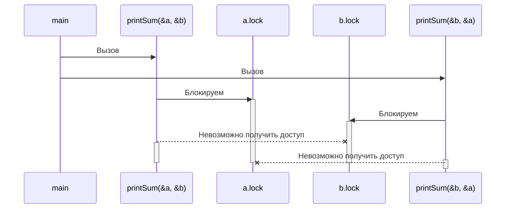

# Конкурентность в Go <!-- omit in toc -->

## Содержание <!-- omit in toc -->

- [Введение в конкурентность](#введение-в-конкурентность)
  - [Состояния гонки (Race Conditions)](#состояния-гонки-race-conditions)
  - [Атомарность (Atomicity)](#атомарность-atomicity)
  - [Синхронизация доступа к памяти](#синхронизация-доступа-к-памяти)
  - [Взаимные блокировки Deadlock, Livelock и Starvation (ресурсное голодание)](#взаимные-блокировки-deadlock-livelock-и-starvation-ресурсное-голодание)
    - [Deadlock](#deadlock)
    - [Livelock](#livelock)
    - [Starvation (Ресурсное голодание)](#starvation-ресурсное-голодание)
  - [Определение безопасности конкурентности](#определение-безопасности-конкурентности)
  - [Простота перед лицом сложности](#простота-перед-лицом-сложности)
- [Взаимодействующие последовательные процессы (Communicating Sequential Processes)](#взаимодействующие-последовательные-процессы-communicating-sequential-processes)
  - [Разница между конкурентностью и параллелизмом](#разница-между-конкурентностью-и-параллелизмом)

## Введение в конкурентность

"Concurrency" обычно переводится с английского как "параллелизм", но в контексте
программирования правильнее переводить это слово как "конкурентность".

### Состояния гонки (Race Conditions)

Состояние гонки возникает когда две или более операции должны исполняться в
правильной последовательности, но программа написана не гарантируя этот порядок.

В большинстве случаев это проявляется в так называемой *гонке данных* (*data
race*), когда одна конкурентная операция пытается прочитать переменную, пока в
это же неопределённое время другая конкурентная операция пытается записать
значение в эту же переменную.

Пример ([`code-samples/race-cond-1.go`](code-samples/race-cond-1.go)):

```go
var data int
go func() {
    data++
}()
if data == 0 {
    fmt.Printf("the value is %d.\n", data)
}
```

Существуют 3 возможных исхода:

- Ничего не распечатается. В этом случае строчка 3 выполнилась раньше строчки 5.
- Распечатается `the value is 0`. В этом случае, строчки 5 и 6 выполнились
  раньше строчки 3.
- Распечатается `the value is 1`. В этом случае, строчка 5 выполнилась раньше
  строчки 3, но строчка 3 выполнилась позже строчки 6.

> Полезно представлять, что между операциями проходит большой промежуток
> времени.
>
> *Что, если между вызовом горутины и её запуском проходит час?*
>
> *Что, если пройдёт час между успешным выполнением горутины и достижением
> программой оператора `if`?*
<!-- markdownlint-disable MD028 -->
> Конечно же, выражения наподобие `time.Sleep()` никак не решают проблему. Они
> лишь делают её возникновение менее вероятным, но от этого программа не
> становится логически более корректной.
<!-- markdownlint-enable MD028 -->

### Атомарность (Atomicity)

*Атомарное* — неделимое, непрерывное в текущем контексте (context) или области
(scope).

> Операции, которые являются атомарными в контексте запущенного процесса, могут
> не быть атомарными в контексте операционной системы; операции, которые
> являются атомарными в контексте операционной системы, могут не быть атомарными
> в контексте машины; операции, которые являются атомарными в контексте машины,
> могут не быть атомарными в контексте приложения. Другими словами, атомарность
> операции может меняться в зависимости от текущей области.
>
> Этот факт может работать как на нас, так и против нас!

Понятия «неделимое» и «непрерывное» означают, что в определённом нами контексте
произойдёт действие, и никакое другое действие не произойдёт в этом контексте
одновременно.

Пример:

```go
i++
```

Эта операция может показаться атомарной, однако при более детальном анализе её
можно разбить на несколько операций:

- Получить значение `i`;
- Инкрементировать значение `i`;
- Сохранить значение `i`.

Каждая из этих отдельных операций атомарная, но их комбинация может не быть
атомарной. Всё зависит от контекста. Это показывает интересное свойство
атомарных операций: их комбинация необязательно производит более крупную
атомарную операцию. Получится ли из комбинации атомарная операция зависит от
того, в каком контексте мы хотим, чтобы она была атомарной. Если наш контекст
представляет собой программу без конкурентных процессов, тогда этот код
атомарный в этом контексте. Если наш контекст — это горутина, которая не
предоставляет `i` другим горутинам, в этом случае код тоже будет атомарным.

> Если что-то атомарно, то это безопасно в конкурентных контекстах.

Большинство операторов не атомарны, не говоря уже о функциях и методах. Но если
атомарность является ключом к составлению логически верных программ, а
большинство операторов не являются атомарными, то как нам согласовать эти два
утверждения? Мы можем добиться атомарности, используя различные способы. Затем
уже, самое важное — понять, какие области кода должны быть атомарными.

### Синхронизация доступа к памяти

Пусть имеется гонка данных: 2 конкурентных процесса пытаются получить доступ к
одной области памяти, и способ, с помощью которого они получают доступ к
памяти, не атомарный
([`code-samples/race-cond-2.go`](code-samples/race-cond-2.go)):

```go
var data int
go func() {
  data++
}()
if data == 0 {
  fmt.Println("the value is 0.")
} else {
  fmt.Printf("the value is %d.\n", data)
}
```

Сейчас вывод полностью неопределённый (недетерминированный).

*Критическая секция* (*critical section*) — секция программы, которой требуются
исключительные права на общий (shared) ресурс.

У нас в примере 3 критические секции:

- Горутина, которая инкрементирует переменную `data`;
- Выражение `if`, которое проверяет, равно ли значение `data` нулю;
- Выражение `fmt.Printf`, которое получает значение `data` для вывода.

Существуют различные способы защитить критические секции программы, и Go имеет
несколько лучших идей, как это сделать. Но один из способов — синхронизировать
доступ к памяти между критическими секциями.

Следующий код
([`code-samples/mem-access-sync.go`](code-samples/mem-access-sync.go)) не
идиоматичен для Go, но он очень просто демонстрирует синхронизацию доступа к
памяти:

```go
// Переменная, которая будет разрешать/запрещать доступ к памяти переменной data
var memoryAccess sync.Mutex
var data int
go func() {
  // Объявляем, что пока мы не объявим обратное, горутина должна иметь
  // исключительный доступ к этой памяти
  memoryAccess.Lock()
  data++
  // Объявляем, что горутина завершила работу с этой памятью
  memoryAccess.Unlock()
}()
// Снова объявляем, что следующие условные выражения должны иметь исключительный
// доступ к памяти переменной data
memoryAccess.Lock()
if data == 0 {
  fmt.Printf("the value is %d.\n", data)
} else {
  fmt.Printf("the value is %d.\n", data)
}
// Снова объявляем, что работа с памятью переменной data завершена
memoryAccess.Unlock()
```

Здесь мы создали конвенцию для разработчиков, которой следует придерживаться:
каждый раз, когда разработчик хочет получить доступ к памяти переменной `data`,
он должен сначала вызвать `Lock`, а как только он закончит работу с этой
памятью, вызвать `Unlock`. Код между двумя этими выражениями будет иметь
исключительный доступ к памяти переменной `data`.

> Конвенции — это хорошо, но их также легко игнорировать — особенно в разработке
> ПО, где требования бизнеса иногда перевешивают благоразумие.

Хотя мы и решили проблему гонки данных, мы всё ещё не избежали состояния гонки.
Порядок операций в программе всё ещё недетерминирован. Мы лишь немного сузили
рамки неопределённости. В этом примере либо горутина будет выполнена
первой, либо блоки `if` и `else`.

Синхронизация доступа к памяти таким образом влияет на производительность
программы. Вызов `Lock` делает программу *медленной*. Каждый раз, когда мы
выполняем одну из таких операций, программа приостанавливается на некоторый
период времени. Встают два вопроса:

- Являются ли мои критические секции многократными входами/выходами?
- Какого размера должны быть мои критические секции?

Ответить на эти 2 вопроса в контексте вашей программы — это искусство, и это
добавляет сложности в синхронизацию доступа к памяти.

### Взаимные блокировки Deadlock, Livelock и Starvation (ресурсное голодание)

#### Deadlock

Программа с deadlock'ом — это программа, в который все конкурентные процессы
ожидают друг друга. В этом состоянии программа никогда не восстановит свою
работу без вмешательства извне.

Среда выполнения Go способна обнаружить некоторые deadlock'и (все горутины
должны быть заблокироваными или «спящими» ("asleep")), но это не сильно помогает
предотвратить их.

Пример deadlock'а ([`code-samples/deadlock.go`](code-samples/deadlock.go)):

```go
type value struct {
  mu    sync.Mutex
  value int
}

var wg sync.WaitGroup
printSum := func(v1, v2 *value) {
  defer wg.Done()
  // Попытка войти в критическую секцию для входящего значения
  v1.mu.Lock()
  // Выход из критической секции, когда произойдёт return
  defer v1.mu.Unlock()

  // Спим для симуляции работы (это спровоцирует deadlock)
  time.Sleep(2 * time.Second)
  v2.mu.Lock()
  defer v2.mu.Unlock()

  fmt.Printf("sum=%d\n", v1.value+v2.value)
}

var a, b value
wg.Add(2)
go printSum(&a, &b)
go printSum(&b, &a)
wg.Wait()
```

После запуска этого кода мы можем увидеть следующую ошибку:

<!-- markdownlint-disable MD040 -->
```
fatal error: all goroutines are asleep - deadlock!
```
<!-- markdownlint-enable MD040 -->

Так происходит потому, что код имеет проблему с таймингом:



> Это как будто 2 шестерёнки, которые не могут вращаться вместе.
<!-- markdownlint-disable MD028 -->
> В этом примере используется `time.Sleep()` для того, чтобы спровоцировать
> deadlock. Однако, таким образом возникает и состояние гонки.
>
> В этом примере порядок запуска горутин не гарантирован и мы не можем знать,
> сколько времени потребуется для их запуска. Вполне возможно, хотя и
> маловероятно, что одна горутина может получить и снять обе блокировки до того,
> как запустится другая. Таким образом, deadlock может не случиться.
<!-- markdownlint-enable MD028 -->

Существуют несколько условий, которые необходимы для возникновения взаимных
блокировок — они были перечислены Эдгаром Коффманом и получили его имя — условия
Коффмана:

1. **Условие взаимного исключения** (**Mutual Exclusion**). Конкурентный процесс
   в любой момент времени обладает исключительными правами на ресурс;
2. **Условие удержания и ожидания** (**Wait For Condition**). Конкурентный
   процесс должен одновременно удерживать ресурс и ожидать дополнительные
   ресурсы;
3. **Условие отсутствия принудительной выгрузки ресурсов** (**No Preemption**).
   Ресурс, удерживаемый конкурентным процессом может быть освобождён только этим
   процессом;
4. **Условие циклического ожидания** (**Circular Wait**). Конкурентный процесс
   (`P1`) должен ожидать цепочку других конкурентных процессов (`P2`), которые,
   в свою очередь, ожидают его (`P1`).

<!-- TODO: Диаграмма с P1 и P2 -->

> Перечисленные условия являются необходимыми. То есть, если хоть одно из них не
> выполняется, то взаимных блокировок никогда не возникнет.
>
> Достаточность не имеет места быть: если выполняются все четыре условия,
> блокировка может и не произойти, например, если в системе нет процессов,
> претендующих на одновременное использование одних и тех же ресурсов.

Рассмотрим код из примера и определим, удовлетворяет ли он всем 4-м условиям:

1. Функция `printSum()` требует исключительные права как на `a`, так и на `b`,
   поэтому она удовлетворяет этому условию;
2. Поскольку `printSum()` содержит либо `a`, либо `b` и ожидает другого, это
   условие также выполняется;
3. Мы не предоставили никаких возможностей для выгрузки ресурсов, условие
   выполняется;
4. Первый вызов `printSum()` ожидает второго вызова, и наоборот, условие
   выполняется.

Для кода из примера выполнены все 4 условия.

#### Livelock

Программа с livelock'ом — это программа, которая активно выполняет конкурентные
операции, но эти операции не делают ничего, чтобы продвинуть состояние
программы вперёд.

> Процессы становятся «вежливыми» и позволяют другим процессам выполнять свою
> работу: они начинают изменять свои состояния в ответ на изменения в других
> процессах без какой-либо полезной работы.

Жизненные примеры таких ситуаций:

- Двое встречаются лицом к лицу. Каждый пытается посторониться, но они не могут
  разойтись, несколько секунд сдвигаясь в одну и ту же сторону.
- Мы совершаем телефонный звонок, и человек на другом конце тоже пытается нам
  позвонить. Мы оба повесим трубку и попробуем снова через одно и то же время,
  что снова приведёт к такой ситуации. Это может продолжаться вечно.

Пример программы с livelock'ом
([`code-samples/livelock.go`](code-samples/livelock.go):

```go
cadence := sync.NewCond(&sync.Mutex{})
go func() {
  for range time.Tick(1 * time.Millisecond) {
    cadence.Broadcast()
  }
}()

takeStep := func() {
  cadence.L.Lock()
  cadence.Wait()
  cadence.L.Unlock()
}

// Каждое направление представляется названием (left/right) и числом людей,
// пытающихся переместиться в этом направлении (dir)
type direction struct {
  name  string
  value *int32
}

// tryDirection позволяет человеку совершить попытку переместиться в
// заданном направлении и возвращает булево значение успешности этого
// перемещения.
tryDirection := func(d direction, out *bytes.Buffer) bool {
  fmt.Fprintf(out, " %s", d.name)
  // Во-первых, мы заявляем о нашем намерении переместиться в данном
  // направлении увеличением значения этого направления на 1.
  // Всё, что сейчас необходимо знать про atomic — то, что операции в этом
  // пакете атомарные.
  atomic.AddInt32(d.value, 1)
  // Чтобы продемонстрировать livelock, каждый человек должен двигаться с
  // одинаковым показателем скорости (ритмом).
  // takeStep() симулирует постоянный ритм для всех сторон.
  takeStep()
  if atomic.LoadInt32(d.value) == 1 {
    fmt.Fprint(out, ". Success!\n")
    return true
  }
  takeStep()
  // Здесь человек понимает, что он не сможет пройти и сдаётся. Мы
  // показываем это уменьшением значения этого направления на 1.
  atomic.AddInt32(d.value, -1)
  return false
}

var left, right int32
tryLeft := func(out *bytes.Buffer) bool {
  return tryDirection(direction{"left", &left}, out)
}
tryRight := func(out *bytes.Buffer) bool {
  return tryDirection(direction{"right", &right}, out)
}

walk := func(walking *sync.WaitGroup, name string) {
  var out bytes.Buffer
  defer func() {
    fmt.Printf(out.String())
  }()
  defer walking.Done()
  fmt.Fprintf(&out, "%s is trying to scoot:", name)
  // Искусственное ограничение на число попыток для того, чтобы программа
  // в конечном итоге завершилась. В программе с livelock'ом такого
  // ограничения может и не быть, вот почему это проблема!
  for i := 0; i < 5; i++ {
    // Сначала человек пытается пройти влево, и если это движение
    // завершается неудачей, он пытается пройти вправо.
    if tryLeft(&out) || tryRight(&out) {
      return
    }
  }
  fmt.Fprintf(&out, "\n%s tosses her hands up in exasperation!\n", name)
}

// Эта переменная предоставляет программе способ подождать до тех пор, пока
// оба человека не смогут пройти или сдаться.
var peopleInHallway sync.WaitGroup
peopleInHallway.Add(2)
go walk(&peopleInHallway, "Alice")
go walk(&peopleInHallway, "Barbara")
peopleInHallway.Wait()
```

Этот код может вывести:

<!-- markdownlint-disable MD040 -->
```
Barbara is trying to scoot: left right left right left right left right left right
Barbara tosses her hands up in exasperation!
Alice is trying to scoot: left right left right left right left right left right
Alice tosses her hands up in exasperation!
```
<!-- markdownlint-enable MD040 -->

> Этот пример демонстрирует очень распространённую причину возникновения
> livelock'а: 2 или более конкурентных процесса пытаются предотвратить deadlock
> без координации.
>
> Если бы люди в коридоре договорились друг с другом о том, что будет двигаться
> только один из них, то livelock бы не случился: 1 человек бы стоял на месте,
> а другой перешёл бы в другую сторону и тогда бы они продолжили идти.

Livelock'и — это подмножество более крупного набора проблем, называемых
ресурсным голоданием (starvation).

#### Starvation (Ресурсное голодание)

Ресурсное голодание (Starvation) — это любая ситуация, когда конкурентный
процесс не может получить все ресурсы, необходимые ему для выполнения работы.

<!-- TODO: что было ресурсом? -->
При livelock'ах ресурсом, из-за которого голодала каждая горутина, была общая
взаимная блокировка. Livelock'и обсуждаются отдельно, поскольку при них все
процессы равно голодают, и никакая работа не выполняется. В более же широком
смысле, ресурсное голодание обычно подразумевает наличие одного или нескольких
жадных конкурентных процессов, которые несправедливо мешают одному или
нескольким конкурирующим процессам выполнять свою работу максимально эффективно
или вообще.

Код сравнения жадной и вежливой горутин
([`code-samples/greedy-and-polite.go`](code-samples/greedy-and-polite.go):

```go
var wg sync.WaitGroup
var sharedLock sync.Mutex
const runtime = 1 * time.Second

greedyWorker := func() {
  defer wg.Done()

  var count int
  for begin := time.Now(); time.Since(begin) <= runtime; {
    sharedLock.Lock()
    time.Sleep(3 * time.Nanosecond)
    sharedLock.Unlock()
    count++
  }

  fmt.Printf("Greedy worker was able to execute %d work loops.\n", count)
}

politeWorker := func() {
  defer wg.Done()

  var count int
  for begin := time.Now(); time.Since(begin) <= runtime; {
    sharedLock.Lock()
    time.Sleep(1 * time.Nanosecond)
    sharedLock.Unlock()

    sharedLock.Lock()
    time.Sleep(1 * time.Nanosecond)
    sharedLock.Unlock()

    sharedLock.Lock()
    time.Sleep(1 * time.Nanosecond)
    sharedLock.Unlock()

    count++
  }

  fmt.Printf("Polite worker was able to execute %d work loops.\n", count)
}

wg.Add(2)
go greedyWorker()
go politeWorker()
wg.Wait()
```

Этот код может вывести:

<!-- markdownlint-disable MD040 -->
```
Greedy worker was able to execute 749797 work loops.
Polite worker was able to execute 481832 work loops.
```
<!-- markdownlint-enable MD040 -->

`greedyWorker` жадно удерживает общую блокировку на всё время рабочего цикла,
тогда как `politeWorker` пытается блокировать его только при необходимости. Обе
горутины выполняют одинаковое количество имитационной работы (спят по 3
наносекунды), но, как можно видеть, за одинаковый промежуток времени жадная
горутина выполняет значительно больше работы.

<!-- TODO: про медленность Lock и Unlock -->
Если предположить, что у обеих горутин одинаково большие критические секции,
тогда вместо того, чтобы заключить, что жадная горутина более эффективная (или
что вызовы `Lock` и `Unlock` медленные — это не так), мы заключаем, что жадная
горутина без необходимости расширяет удерживание общей блокировки за пределы
критической секции и мешает (через ресурсное голодание) вежливой горутине
выполнять работу эффективно.

> Этот код может служить примером влияния синхронизации доступа к памяти на
> производительность. Поскольку синхронизация доступа к памяти требует больших
> затрат, может оказаться выгодным расширить блокировку за пределы критических
> секций. С другой стороны, делая это, мы рискуем заставить голодать другие
> конкурентные процессы.
>
> При использовании синхронизации доступа к памяти придётся найти баланс между
> грубой синхронизацией для повышения производительности и точной синхронизацией
> для справедливого распределения ресурсов. При настройке производительности
> приложения рекомендуется для начала ограничить синхронизацию доступа к памяти
> только критическими секциями; если синхронизация становится проблемой для
> производительности, уже можно расширить границы за пределы критических секций.
> Использовать другой способ настройки сложнее.

Также не стоит забывать про случаи, когда ресурсное голодание провоцируется за
пределами процесса Go. Голодание может относиться к CPU, памяти, обработчикам
файлов, соединениям с БД: любой ресурс, который должен использоваться совместно,
является кандидатом на провоцирование голодания.

### Определение безопасности конкурентности

> За каждой строчкой кода стоит по крайней мере один человек.

Разработчику, работающему с существующим кодом, не всегда очевидно, какой код
использует конкурентность и как использовать этот код безопасно.

> Если готового решения нет и нужно построить осмысленную модель конкретной
> предметной области с использованием конкурентности, может быть трудно найти
> правильный уровень абстракции.
>
> Возникают вопросы:
>
> - Как представить конкурентность вызывающему коду?
> - Какие техники использовать для решения, которое одинаково просто для
>   использования и модификации?
>
> Хотя и существуют структурированные пути решения этих проблем, это остаётся
> искусством.

Рассмотрим, например, сигнатуру функции вычисления «пи»:

```go
func CalculatePi(begin, end int64, pi *Pi)
```

Вычисление «пи» с высокой точностью лучше производить конкурентно, но этот
пример поднимает много вопросов:

- Как это сделать с помощью данной функции?
- Необходимо создавать несколько конкурентных вызовов этой функции?
- Похоже, все экземпляры функции будут напрямую работать с экземпляром `Pi`,
  адрес которого передаётся в функцию. Пользователь должен самостоятельно
  синхронизировать доступ к этой памяти или тип `Pi` сам позаботиться об этом?

Комментарии могут очень помочь. Например:

```go
// CalculatePi вычисляет знаки Pi между позициями begin и end.
//
// Внутри CalculatePi будет создано FLOOR((end-begin)/2) конкурентных процессов,
// которые рекурсивно вызывают CalculatePi. Синхронизация записи в pi
// осуществляется внутри структуры Pi.
func CalculatePi(begin, end int64, pi *Pi)
```

Так становится понятно, что можно просто вызвать функцию и не беспокоиться о
конкурентности и синхронизации. **Важно, что комментарий охватывает следующие
аспекты**:

- Кто отвечает за конкурентность?
- Как предметная область отображается на примитивы конкурентности?
- Кто отвечает за синхронизацию?

Также следует учитывать, что, возможно, неопределённость в этой функции
указывает на то, что она неправильно смоделирована. Может быть, вместо этого
стоит использовать функциональный подход и гарантировать, что функция не
имеет побочных эффектов:

```go
func CalculatePi(begin, end int64) []uint
```

Сама по себе сигнатура функции уже устраняет вопросы синхронизации, но остаётся
вопрос, используется ли конкурентность. Можно ещё раз изменить сигнатуру, чтобы
подчеркнуть, что происходит:

```go
func CalculatePi(begin, end int64) <-chan uint
```

<!-- TODO: сослаться на причины -->
Это первое использование так называемого *канала*. По причинам, которые будут
рассмотрены позже, предполагается, что у функции `CalculatePi()` будет по
крайней мере одна горутина и беспокоиться о создании собственной не следует.

<!-- TODO: стоит ли заменить "ясности" на "читабельности"? -->
Эти модификации имеют последствия для производительности, которые должны быть
учтены, снова возникает проблема баланса ясности и производительности. Ясность
необходима для максимального увеличения вероятности того, что люди, работающие
с этим кодом в будущем, делают всё правильно. Производительность же важна по
очевидным причинам. Эти два аспекта не являются взаимоисключающими, но их сложно
совместить.

Go совершил прогресс в упрощении таких типов проблем. Сам язык способствует
читабельности и простоте. Способ, которым он поощряет моделирование
конкурентного кода, способствует правильности, компонуемости и масштабируемости.
Фактически, способ, которым Go работает с конкурентностью, может помочь выразить
предметные области более ясно.

<!-- TODO: разобраться с "проблемными" и "предметными" областями -->

### Простота перед лицом сложности

Среда выполнения Go выполняет б*о*льшую часть тяжёлой работы и обеспечивает
основу для большинства тонкостей конкурентности в Go.

<!-- TODO: детерминированный профиль производительности? -->
Сборщик мусора в Go обеспечивает конкурентную работу и малую задержку. Среди
разработчиков часто ведутся дискуссии о том, являются ли сборщики мусора хорошей
вещью для языка программирования. Критики утверждают, что сборщики мусора мешают
работе в любой предметной области, где требуется реальная производительность по
времени или детерминированный профиль производительности, и что остановка всей
активности в программе для сборка мусора неприемлема. Это справедливое
утверждение, однако, благодаря отличной работе, проделанной над сборщиком мусора
в Go, значительно уменьшила круг пользователей, которым действительно необходимо
беспокоиться о мелочах работы сборщика мусора в Go. Начиная с версии Go 1.8,
паузы при сборке мусора обычно составляют от от 10 до 100 микросекунд.

<!-- TODO: проблемная область подойдет лучше? -->
Управление памятью может быть ещё одной сложной предметной областью в Computer
Science, и в сочетании с конкурентностью может стать чрезвычайно сложно написать
правильный код.

Если вы относитесь к большинству разработчиков, которым не нужно беспокоиться о
паузах в 10 микросекунд, Go значительно упрощает использование конкурентности в
программе, не заставляя заниматься управлением памятью, не говоря уже о
управлением памятью между конкурентными процессами.

<!-- TODO: сослаться на место в тексте -->
Среда выполнения Go также автоматически выполняет мультиплексирование
конкурентных операций в потоки операционной системы. Это сложно, это будет
рассмотрено далее. Всё что сейчас нужно знать — это позволяет напрямую
отображать конкурентные проблемы на конкурентные конструкции вместо работы с
мелочами запуска и управления потоками, а также равномерным отображением логики
на доступные потоки.

Например, мы пишем веб-сервер и хотим, чтобы каждое соединение обрабатывалось
конкурентно с любым другим соединением. В некоторых языках, прежде чем
веб-сервер начнёт принимать соединения, вероятно, придётся создать набор
потоков, обычно называемый пулом потоков, а затем отобразить входящие соединения
на потоки. Затем в каждом созданном потоке нужно перебрать все соединения, чтобы
убедиться, что все они получают некоторое время процессора. Кроме того, придётся
написать свою логику обработки соединения так, чтобы её можно было
приостановить со справедливым распределением ресурсов с другими соединениями.

В Go же нужно лишь написать функцию, а затем написать ключевое слово `go` перед
её вызовом. Всё остальное, о чём мы говорили ранее, среда выполнения обработает
автоматически.

<!-- TODO: компоновка и компонуемый? -->
Примитивы конкурентности в Go также упрощают компоновку более крупным задач.
Примитив канала Go предоставляет компонуемый, безопасный для конкурентности
способ взаимодействия между конкурентными процессами.

## Взаимодействующие последовательные процессы (Communicating Sequential Processes)

### Разница между конкурентностью и параллелизмом

> Тот факт, что конкурентность отличается от параллелизма, часто упускается из
> виду или неправильно понимается. В разговорах между многими разработчиками эти
> два термина часто используется взаимозаменяемо и означают «что-то, что
> одновременно работает с чем-то другим». Иногда слово «параллельный» будет
> правильным в этом контексте, но обычно, если разработчики обсуждают код, им =
> следует использовать слово «конкурентный».

Причина дифференциации этих понятий не просто формальность. Разница между
конкурентностью и параллелизмом оказывается очень мощной абстракцией при
моделировании кода, и Go в полной мере использует преимущество этого.

Утверждение, которое способствует пониманию разницы:

> Конкурентность — это свойство *кода*; а параллелизм — это свойство *работающей
> программы*.

Но обычно мы думаем об этих вещах одинаково. Мы пишем код, чтобы он выполнялся
параллельно. Представим, что мы пишем код с намерением, чтобы два фрагмента
программы выполнялись параллельно, но есть ли какие-то гарантии, что они
действительно запустятся параллельно? Например, если запустить код на машине
только с одним ядром, он не будет работать параллельно.

В случае с одним ядром может показаться, что фрагменты программы действительно
выполняются параллельно, но на самом деле они выполняются последовательно
настолько быстро, что это сложно отличить от параллельного выполнения. Процессор
переключает контексты для разделения времени между разными программами, и если
не вникать в детали глубоко, задачи кажутся выполняемыми параллельно. Если бы мы
запускали этот же бинарный файл на машине с двумя ядрами, фрагменты программы
*могли бы* выполняться «по-настоящему» параллельно.

<!-- TODO: возможно, слово runtime следует перевести не как "среда выполнения" -->
Это раскрывает несколько интересных фактов. Во-первых, мы не пишем параллельный
код, а только конкурентный код, который, как мы надеемся, будет выполнятся
параллельно. Опять же, параллелизм — это свойство среды выполнения программы, а
не кода.

Вторым интересным фактом является возможность (или даже желательность) не знать,
а действительно ли наш код выполняется параллельно. Это становится возможным
благодаря слоям абстракции, лежащим в основе модели нашей программы: примитивам
конкурентности, среде выполнения, платформе, где работает операционная система
(в случае гипервизоров, контейнеров и виртуальных машин), и в конечном счёте,
процессору. Именно эти абстракции позволяют проводить различие между
конкурентностью и параллелизмом, предоставляя возможность и гибкость
самовыражения.

Третий и последний интересный факт заключается в том, что параллелизм является
функцией времени или контекста. В разделе
[Атомарность (Atomicity)](#атомарность-atomicity) обсуждалась концепция
контекста как границ, в которых операция считается атомарной. Здесь же контекст
определяется как границы, в пределах которых две или более операции могут
считаться параллельными.

Например, если нашим контекстом является промежуток в пять секунд, и мы
запустили две операции, каждая из которых занимает одну секунду для выполнения,
мы бы считали, что операции выполнялись параллельно. Если нашим контекстом
является промежуток в одну секунду, мы бы считали, что операции выполнялись
последовательно.

Возможно, нам не очень полезно переопределять контекст в терминах временных
промежутков, но стоит помнить, что контекст не ограничивается временем. Можно
определить контекст как процесс, в котором выполняется программа, его поток
операционной системы или его машина. Это важно, потому что определённый нами
контекст тесно связан с концепцией конкурентности и корректности. Точно так же,
как атомарные операции могут считаться таковыми в зависимости от определяемого
нами контекста, конкурентные операции корректны в зависимости от определяемого
нами контекста. *Всё относительно*.

Это немного абстрактно, поэтому рассмотрим пример. Допустим, контекст,
обсуждаемый нами, — это наш компьютер. Если оставить в стороне теоретическую
физику, мы можем резонно ожидать, что процесс, выполняемый на чьём-то
компьютере, не повлияет на логику процесса на нашем компьютере. Если кто-то
запустит процесс калькулятора и начнёт выполнять некоторую простую арифметику на
своём компьютере, его вычисления не должны повлиять на вычисления на нашем
компьютере.

Это глупый пример, но если его разобрать, можно увидеть все части в нашей игре:
компьютеры — это контекст, процессы — это конкурентные операции. В этом случае
мы решили моделировать наши конкурентные операции, думая о мире в терминах
отдельных компьютеров, операционных систем и процессов. Эти абстракции позволяют
уверенно утверждать о корректности.

<!-- TODO: что было общим контекстом? -->
> **Действительно ли это глупый пример?**
>
> Использование отдельных компьютеров может показаться выдуманным примером, но
> *персональные* компьютеры не всегда были таким вездесущим явлением. Вплоть до
> конца 1970-х годов главной практикой было использование громоздких
> мэйнфреймов, и общим контекстом, который разработчики использовали при
> обдумывании задач конкурентно, был процесс программы.
>
> Теперь, когда многие разработчики работают с распределёнными системами,
> ситуация меняется в обратную сторону. Сейчас мы начинаем мыслить в терминах
> гипервизоров, контейнеров и виртуальных машинах как наших конкурентных
> процессов.

Мы можем резонно ожидать, что один процесс на одной машине останется
незатронутым процессом на другой машине (предполагая, что они не являются частью
одной распределённой системы), но можем ли мы ожидать, что два процесса на одной
машине не повлияют на логику друг друга? Процесс A может перезаписать некоторые
файлы, которые читает процесс B, или в небезопасной операционной системе процесс
A может изменить память, которую читает процесс B. Так работают многие
эксплойты.

Тем не менее, на уровне процесса, думать об этом относительно легко. Если мы
вернёмся к примеру с калькулятором, всё равно резонно ожидать, что два
пользователя, выполняющие два вычислительных процесса на одном компьютере,
должны резонно ожидать, что их операции будут логически изолированы друг от
друга. К счастью, границы процесса и операционная система помогают мыслить об
этих проблемах логически. Но мы видим, что разработчик начинает обременяться
некоторыми проблемами конкурентности, и эта проблема только усугубляется.

Что, если мы спустимся ещё на один уровень — до границ потоков операционной
системы? Именно здесь такие проблемы, как состояния гонки, взаимные блокировки,
ресурсное голодание и т.д. становятся действительно актуальными. Если бы у нас
был один процесс калькулятора, к которому все пользователи на компьютере имели
бы доступ, было бы куда сложнее правильно использовать конкурентную логику. Нам
бы пришлось беспокоиться о синхронизации доступа к памяти и получении правильных
результатов для правильного конкретного пользователя.

То, что происходит, заключается в том, что по мере того, как мы начинаем
спускаться по стеку абстракций, проблема моделирования вещей конкурентно
становится более сложной для рассуждений и при этом более важной. В то же время
наши абстракции становятся всё более важными для нас. Другими словами, чем более
сложнее обеспечить правильную конкурентность, тем важнее иметь доступ к
примитивам конкурентности, которые легко сочетать. К сожалению, б*о*льшая часть
конкурентной логики в нашей отрасли написана на одном из самых высоких уровней
абстракции — потоках операционной системы.

До того, как Go был впервые представлен публике, именно на этом заканчивалась
цепочка абстракций для большинства популярных языков программирования. Если бы
мы хотели написать конкурентный код, мы бы смоделировали программу в терминах
потоков и синхронизировали доступ к памяти между ними. Если бы у нас было много
вещей, которые приходилось моделировать конкурентно, и наша машина не могла бы
обрабатывать такое количество потоков, мы бы создавали *пул потоков* и
мультиплексировали свои операции в пул потоков.

Go добавил ещё одно звено в эту цепочку абстракций — *горутины*. Кроме того, Go
позаимствовал несколько концепций из работ известного учёного в области Computer
Science Тони Хоара и ввёл новые примитивы для нашего использования, а именно
*каналы*.

Если продолжить логическую цепочку, которой мы следовали, можно было бы
предположить, что введение следующего уровня абстракции после потоков
операционной системы повлекло бы за собой ещё больше трудностей, но интересно
то, что это не так. Это, на самом деле, всё упрощает. Так происходит потому,
что, в действительности, мы не добавили ещё один уровень абстракции поверх
потоков операционной системы, а заменили их.

Потоки, разумеется, всё ещё существуют, но мы обнаруживаем, что нам редко
приходится думать о нашей предметной области с точки зрения потоков операционной
системы. Вместо этого мы моделируем вещи в горутинах и каналах, а иногда и в
общей памяти.
