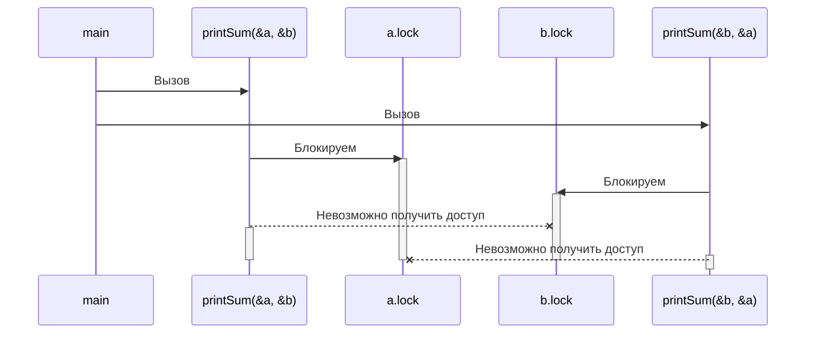
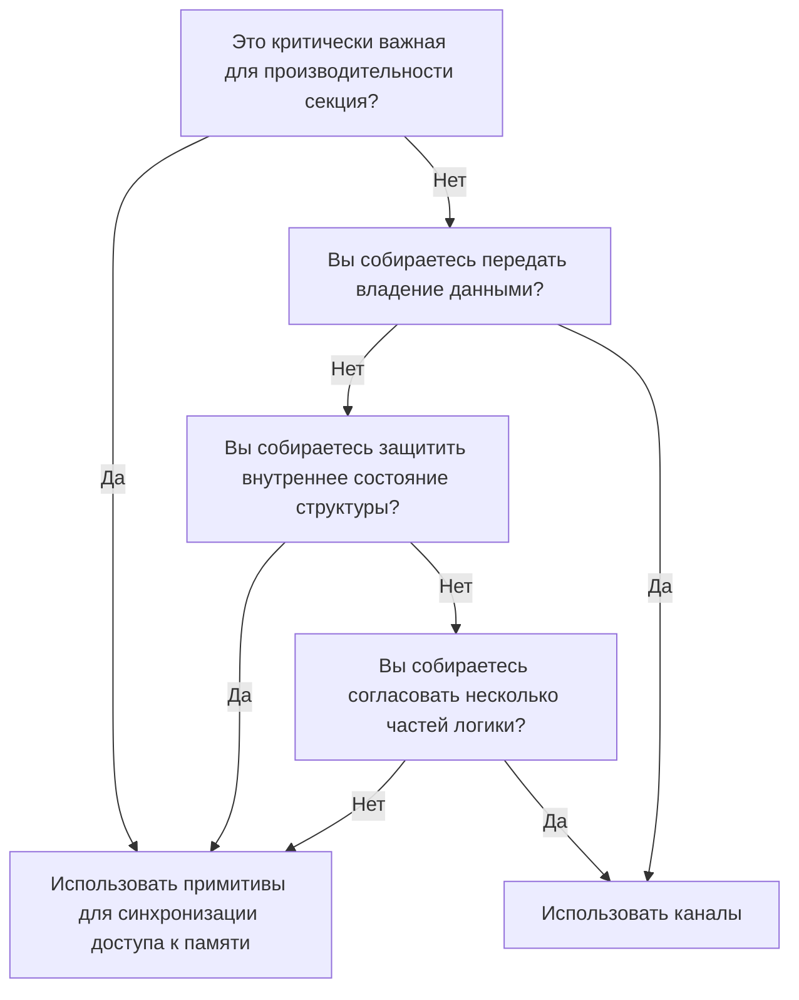
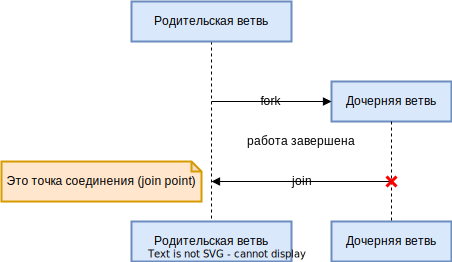

# Конкурентность в Go <!-- omit in toc -->

## Содержание <!-- omit in toc -->

- [Введение в конкурентность](#введение-в-конкурентность)
  - [Состояния гонки (Race Conditions)](#состояния-гонки-race-conditions)
  - [Атомарность (Atomicity)](#атомарность-atomicity)
  - [Синхронизация доступа к памяти](#синхронизация-доступа-к-памяти)
  - [Взаимные блокировки Deadlock, Livelock и Starvation (ресурсное голодание)](#взаимные-блокировки-deadlock-livelock-и-starvation-ресурсное-голодание)
    - [Deadlock](#deadlock)
    - [Livelock](#livelock)
    - [Starvation (Ресурсное голодание)](#starvation-ресурсное-голодание)
  - [Определение безопасности конкурентности](#определение-безопасности-конкурентности)
  - [Простота перед лицом сложности](#простота-перед-лицом-сложности)
- [Взаимодействующие последовательные процессы (Communicating Sequential Processes)](#взаимодействующие-последовательные-процессы-communicating-sequential-processes)
  - [Разница между конкурентностью и параллелизмом](#разница-между-конкурентностью-и-параллелизмом)
  - [Что такое CSP?](#что-такое-csp)
  - [Как это помогает](#как-это-помогает)
  - [Философия конкурентности Go](#философия-конкурентности-go)
- [Строительные блоки конкурентности Go](#строительные-блоки-конкурентности-go)
  - [Горутины](#горутины)

## Введение в конкурентность

"Concurrency" обычно переводится с английского как «параллелизм», но в контексте
программирования правильнее переводить это слово как «конкурентность».

### Состояния гонки (Race Conditions)

Состояние гонки возникает когда две или более операции должны исполняться в
правильной последовательности, но программа написана не гарантируя этот порядок.

В большинстве случаев это проявляется в так называемой _гонке данных_ (_data
race_), когда одна конкурентная операция пытается прочитать переменную, пока в
это же неопределённое время другая конкурентная операция пытается записать
значение в эту же переменную.

Пример ([`code-samples/race-cond-1.go`](code-samples/race-cond-1.go)):

```go
var data int
go func() {
    data++
}()
if data == 0 {
    fmt.Printf("the value is %d.\n", data)
}
```

Существуют 3 возможных исхода:

- Ничего не распечатается. В этом случае строчка 3 выполнилась раньше строчки 5.
- Распечатается `the value is 0`. В этом случае, строчки 5 и 6 выполнились
  раньше строчки 3.
- Распечатается `the value is 1`. В этом случае, строчка 5 выполнилась раньше
  строчки 3, но строчка 3 выполнилась позже строчки 6.

> Полезно представлять, что между операциями проходит большой промежуток
> времени.
>
> _Что, если между вызовом горутины и её запуском проходит час?_
>
> _Что, если пройдёт час между успешным выполнением горутины и достижением
> программой оператора `if`?_

<!-- markdownlint-disable MD028 -->

> Конечно же, выражения наподобие `time.Sleep()` никак не решают проблему. Они
> лишь делают её возникновение менее вероятным, но от этого программа не
> становится логически более корректной.

<!-- markdownlint-enable MD028 -->

### Атомарность (Atomicity)

_Атомарное_ — неделимое, непрерывное в текущем контексте (context) или области
(scope).

> Операции, которые являются атомарными в контексте запущенного процесса, могут
> не быть атомарными в контексте операционной системы; операции, которые
> являются атомарными в контексте операционной системы, могут не быть атомарными
> в контексте машины; операции, которые являются атомарными в контексте машины,
> могут не быть атомарными в контексте приложения. Другими словами, атомарность
> операции может меняться в зависимости от текущей области.
>
> Этот факт может работать как на нас, так и против нас!

Понятия «неделимое» и «непрерывное» означают, что в определённом нами контексте
произойдёт действие, и никакое другое действие не произойдёт в этом контексте
одновременно.

Пример:

```go
i++
```

Эта операция может показаться атомарной, однако при более детальном анализе её
можно разбить на несколько операций:

- Получить значение `i`;
- Инкрементировать значение `i`;
- Сохранить значение `i`.

Каждая из этих отдельных операций атомарная, но их комбинация может не быть
атомарной. Всё зависит от контекста. Это показывает интересное свойство
атомарных операций: их комбинация необязательно производит более крупную
атомарную операцию. Получится ли из комбинации атомарная операция зависит от
того, в каком контексте мы хотим, чтобы она была атомарной. Если наш контекст
представляет собой программу без конкурентных процессов, тогда этот код
атомарный в этом контексте. Если наш контекст — это горутина, которая не
предоставляет `i` другим горутинам, в этом случае код тоже будет атомарным.

> Если что-то атомарно, то это безопасно в конкурентных контекстах.

Большинство операторов не атомарны, не говоря уже о функциях и методах. Но если
атомарность является ключом к составлению логически верных программ, а
большинство операторов не являются атомарными, то как нам согласовать эти два
утверждения? Мы можем добиться атомарности, используя различные способы. Затем
уже, самое важное — понять, какие области кода должны быть атомарными.

### Синхронизация доступа к памяти

Пусть имеется гонка данных: 2 конкурентных процесса пытаются получить доступ к
одной области памяти, и способ, с помощью которого они получают доступ к памяти,
не атомарный ([`code-samples/race-cond-2.go`](code-samples/race-cond-2.go)):

```go
var data int
go func() {
  data++
}()
if data == 0 {
  fmt.Println("the value is 0.")
} else {
  fmt.Printf("the value is %d.\n", data)
}
```

Сейчас вывод полностью неопределённый (недетерминированный).

_Критическая секция_ (_critical section_) — секция программы, которой требуются
исключительные права на общий (shared) ресурс.

У нас в примере 3 критические секции:

- Горутина, которая инкрементирует переменную `data`;
- Выражение `if`, которое проверяет, равно ли значение `data` нулю;
- Выражение `fmt.Printf`, которое получает значение `data` для вывода.

Существуют различные способы защитить критические секции программы, и Go имеет
несколько лучших идей, как это сделать. Но один из способов — синхронизировать
доступ к памяти между критическими секциями.

Следующий код
([`code-samples/mem-access-sync.go`](code-samples/mem-access-sync.go)) не
идиоматичен для Go, но он очень просто демонстрирует синхронизацию доступа к
памяти:

```go
// Переменная, которая будет разрешать/запрещать доступ к памяти переменной data
var memoryAccess sync.Mutex
var data int
go func() {
  // Объявляем, что пока мы не объявим обратное, горутина должна иметь
  // исключительный доступ к этой памяти
  memoryAccess.Lock()
  data++
  // Объявляем, что горутина завершила работу с этой памятью
  memoryAccess.Unlock()
}()
// Снова объявляем, что следующие условные выражения должны иметь исключительный
// доступ к памяти переменной data
memoryAccess.Lock()
if data == 0 {
  fmt.Printf("the value is %d.\n", data)
} else {
  fmt.Printf("the value is %d.\n", data)
}
// Снова объявляем, что работа с памятью переменной data завершена
memoryAccess.Unlock()
```

Здесь мы создали конвенцию для разработчиков, которой следует придерживаться:
каждый раз, когда разработчик хочет получить доступ к памяти переменной `data`,
он должен сначала вызвать `Lock`, а как только он закончит работу с этой
памятью, вызвать `Unlock`. Код между двумя этими выражениями будет иметь
исключительный доступ к памяти переменной `data`.

> Конвенции — это хорошо, но их также легко игнорировать — особенно в разработке
> ПО, где требования бизнеса иногда перевешивают благоразумие.

Хотя мы и решили проблему гонки данных, мы всё ещё не избежали состояния гонки.
Порядок операций в программе всё ещё недетерминирован. Мы лишь немного сузили
рамки неопределённости. В этом примере либо горутина будет выполнена первой,
либо блоки `if` и `else`.

Синхронизация доступа к памяти таким образом влияет на производительность
программы. Вызов `Lock` делает программу _медленной_. Каждый раз, когда мы
выполняем одну из таких операций, программа приостанавливается на некоторый
период времени. Встают два вопроса:

- Являются ли мои критические секции многократными входами/выходами?
- Какого размера должны быть мои критические секции?

Ответить на эти 2 вопроса в контексте вашей программы — это искусство, и это
добавляет сложности в синхронизацию доступа к памяти.

### Взаимные блокировки Deadlock, Livelock и Starvation (ресурсное голодание)

#### Deadlock

Программа с deadlock'ом — это программа, в который все конкурентные процессы
ожидают друг друга. В этом состоянии программа никогда не восстановит свою
работу без вмешательства извне.

Среда выполнения Go способна обнаружить некоторые deadlock'и (все горутины
должны быть заблокироваными или «спящими» ("asleep")), но это не сильно помогает
предотвратить их.

Пример deadlock'а ([`code-samples/deadlock.go`](code-samples/deadlock.go)):

```go
type value struct {
  mu    sync.Mutex
  value int
}

var wg sync.WaitGroup
printSum := func(v1, v2 *value) {
  defer wg.Done()
  // Попытка войти в критическую секцию для входящего значения
  v1.mu.Lock()
  // Выход из критической секции, когда произойдёт return
  defer v1.mu.Unlock()

  // Спим для симуляции работы (это спровоцирует deadlock)
  time.Sleep(2 * time.Second)
  v2.mu.Lock()
  defer v2.mu.Unlock()

  fmt.Printf("sum=%d\n", v1.value+v2.value)
}

var a, b value
wg.Add(2)
go printSum(&a, &b)
go printSum(&b, &a)
wg.Wait()
```

После запуска этого кода мы можем увидеть следующую ошибку:

<!-- markdownlint-disable MD040 -->

```
fatal error: all goroutines are asleep - deadlock!
```

<!-- markdownlint-enable MD040 -->

Так происходит потому, что код имеет проблему с таймингом:



> Это как будто 2 шестерёнки, которые не могут вращаться вместе.

<!-- markdownlint-disable MD028 -->

> В этом примере используется `time.Sleep()` для того, чтобы спровоцировать
> deadlock. Однако, таким образом возникает и состояние гонки.
>
> В этом примере порядок запуска горутин не гарантирован и мы не можем знать,
> сколько времени потребуется для их запуска. Вполне возможно, хотя и
> маловероятно, что одна горутина может получить и снять обе блокировки до того,
> как запустится другая. Таким образом, deadlock может не случиться.

<!-- markdownlint-enable MD028 -->

Существуют несколько условий, которые необходимы для возникновения взаимных
блокировок — они были перечислены Эдгаром Коффманом и получили его имя — условия
Коффмана:

1. **Условие взаимного исключения** (**Mutual Exclusion**). Конкурентный процесс
   в любой момент времени обладает исключительными правами на ресурс;
2. **Условие удержания и ожидания** (**Wait For Condition**). Конкурентный
   процесс должен одновременно удерживать ресурс и ожидать дополнительные
   ресурсы;
3. **Условие отсутствия принудительной выгрузки ресурсов** (**No Preemption**).
   Ресурс, удерживаемый конкурентным процессом может быть освобождён только этим
   процессом;
4. **Условие циклического ожидания** (**Circular Wait**). Конкурентный процесс
   (`P1`) должен ожидать цепочку других конкурентных процессов (`P2`), которые,
   в свою очередь, ожидают его (`P1`).

<!-- TODO: Диаграмма с P1 и P2 -->

> Перечисленные условия являются необходимыми. То есть, если хоть одно из них не
> выполняется, то взаимных блокировок никогда не возникнет.
>
> Достаточность не имеет места быть: если выполняются все четыре условия,
> блокировка может и не произойти, например, если в системе нет процессов,
> претендующих на одновременное использование одних и тех же ресурсов.

Рассмотрим код из примера и определим, удовлетворяет ли он всем 4-м условиям:

1. Функция `printSum()` требует исключительные права как на `a`, так и на `b`,
   поэтому она удовлетворяет этому условию;
2. Поскольку `printSum()` содержит либо `a`, либо `b` и ожидает другого, это
   условие также выполняется;
3. Мы не предоставили никаких возможностей для выгрузки ресурсов, условие
   выполняется;
4. Первый вызов `printSum()` ожидает второго вызова, и наоборот, условие
   выполняется.

Для кода из примера выполнены все 4 условия.

#### Livelock

Программа с livelock'ом — это программа, которая активно выполняет конкурентные
операции, но эти операции не делают ничего, чтобы продвинуть состояние программы
вперёд.

> Процессы становятся «вежливыми» и позволяют другим процессам выполнять свою
> работу: они начинают изменять свои состояния в ответ на изменения в других
> процессах без какой-либо полезной работы.

Жизненные примеры таких ситуаций:

- Двое встречаются лицом к лицу. Каждый пытается посторониться, но они не могут
  разойтись, несколько секунд сдвигаясь в одну и ту же сторону.
- Мы совершаем телефонный звонок, и человек на другом конце тоже пытается нам
  позвонить. Мы оба повесим трубку и попробуем снова через одно и то же время,
  что снова приведёт к такой ситуации. Это может продолжаться вечно.

Пример программы с livelock'ом
([`code-samples/livelock.go`](code-samples/livelock.go):

```go
cadence := sync.NewCond(&sync.Mutex{})
go func() {
  for range time.Tick(1 * time.Millisecond) {
    cadence.Broadcast()
  }
}()

takeStep := func() {
  cadence.L.Lock()
  cadence.Wait()
  cadence.L.Unlock()
}

// Каждое направление представляется названием (left/right) и числом людей,
// пытающихся переместиться в этом направлении (dir)
type direction struct {
  name  string
  value *int32
}

// tryDirection позволяет человеку совершить попытку переместиться в
// заданном направлении и возвращает булево значение успешности этого
// перемещения.
tryDirection := func(d direction, out *bytes.Buffer) bool {
  fmt.Fprintf(out, " %s", d.name)
  // Во-первых, мы заявляем о нашем намерении переместиться в данном
  // направлении увеличением значения этого направления на 1.
  // Всё, что сейчас необходимо знать про atomic — то, что операции в этом
  // пакете атомарные.
  atomic.AddInt32(d.value, 1)
  // Чтобы продемонстрировать livelock, каждый человек должен двигаться с
  // одинаковым показателем скорости (ритмом).
  // takeStep() симулирует постоянный ритм для всех сторон.
  takeStep()
  if atomic.LoadInt32(d.value) == 1 {
    fmt.Fprint(out, ". Success!\n")
    return true
  }
  takeStep()
  // Здесь человек понимает, что он не сможет пройти и сдаётся. Мы
  // показываем это уменьшением значения этого направления на 1.
  atomic.AddInt32(d.value, -1)
  return false
}

var left, right int32
tryLeft := func(out *bytes.Buffer) bool {
  return tryDirection(direction{"left", &left}, out)
}
tryRight := func(out *bytes.Buffer) bool {
  return tryDirection(direction{"right", &right}, out)
}

walk := func(walking *sync.WaitGroup, name string) {
  var out bytes.Buffer
  defer func() {
    fmt.Printf(out.String())
  }()
  defer walking.Done()
  fmt.Fprintf(&out, "%s is trying to scoot:", name)
  // Искусственное ограничение на число попыток для того, чтобы программа
  // в конечном итоге завершилась. В программе с livelock'ом такого
  // ограничения может и не быть, вот почему это проблема!
  for i := 0; i < 5; i++ {
    // Сначала человек пытается пройти влево, и если это движение
    // завершается неудачей, он пытается пройти вправо.
    if tryLeft(&out) || tryRight(&out) {
      return
    }
  }
  fmt.Fprintf(&out, "\n%s tosses her hands up in exasperation!\n", name)
}

// Эта переменная предоставляет программе способ подождать до тех пор, пока
// оба человека не смогут пройти или сдаться.
var peopleInHallway sync.WaitGroup
peopleInHallway.Add(2)
go walk(&peopleInHallway, "Alice")
go walk(&peopleInHallway, "Barbara")
peopleInHallway.Wait()
```

Этот код может вывести:

<!-- markdownlint-disable MD040 -->

```
Barbara is trying to scoot: left right left right left right left right left right
Barbara tosses her hands up in exasperation!
Alice is trying to scoot: left right left right left right left right left right
Alice tosses her hands up in exasperation!
```

<!-- markdownlint-enable MD040 -->

> Этот пример демонстрирует очень распространённую причину возникновения
> livelock'а: 2 или более конкурентных процесса пытаются предотвратить deadlock
> без координации.
>
> Если бы люди в коридоре договорились друг с другом о том, что будет двигаться
> только один из них, то livelock бы не случился: 1 человек бы стоял на месте, а
> другой перешёл бы в другую сторону и тогда бы они продолжили идти.

Livelock'и — это подмножество более крупного набора проблем, называемых
ресурсным голоданием (starvation).

#### Starvation (Ресурсное голодание)

Ресурсное голодание (Starvation) — это любая ситуация, когда конкурентный
процесс не может получить все ресурсы, необходимые ему для выполнения работы.

<!-- TODO: что было ресурсом? -->

При livelock'ах ресурсом, из-за которого голодала каждая горутина, была общая
взаимная блокировка. Livelock'и обсуждаются отдельно, поскольку при них все
процессы равно голодают, и никакая работа не выполняется. В более же широком
смысле, ресурсное голодание обычно подразумевает наличие одного или нескольких
жадных конкурентных процессов, которые несправедливо мешают одному или
нескольким конкурирующим процессам выполнять свою работу максимально эффективно
или вообще.

Код сравнения жадной и вежливой горутин
([`code-samples/greedy-and-polite.go`](code-samples/greedy-and-polite.go):

```go
var wg sync.WaitGroup
var sharedLock sync.Mutex
const runtime = 1 * time.Second

greedyWorker := func() {
  defer wg.Done()

  var count int
  for begin := time.Now(); time.Since(begin) <= runtime; {
    sharedLock.Lock()
    time.Sleep(3 * time.Nanosecond)
    sharedLock.Unlock()
    count++
  }

  fmt.Printf("Greedy worker was able to execute %d work loops.\n", count)
}

politeWorker := func() {
  defer wg.Done()

  var count int
  for begin := time.Now(); time.Since(begin) <= runtime; {
    sharedLock.Lock()
    time.Sleep(1 * time.Nanosecond)
    sharedLock.Unlock()

    sharedLock.Lock()
    time.Sleep(1 * time.Nanosecond)
    sharedLock.Unlock()

    sharedLock.Lock()
    time.Sleep(1 * time.Nanosecond)
    sharedLock.Unlock()

    count++
  }

  fmt.Printf("Polite worker was able to execute %d work loops.\n", count)
}

wg.Add(2)
go greedyWorker()
go politeWorker()
wg.Wait()
```

Этот код может вывести:

<!-- markdownlint-disable MD040 -->

```
Greedy worker was able to execute 749797 work loops.
Polite worker was able to execute 481832 work loops.
```

<!-- markdownlint-enable MD040 -->

`greedyWorker` жадно удерживает общую блокировку на всё время рабочего цикла,
тогда как `politeWorker` пытается блокировать его только при необходимости. Обе
горутины выполняют одинаковое количество имитационной работы (спят по 3
наносекунды), но, как можно видеть, за одинаковый промежуток времени жадная
горутина выполняет значительно больше работы.

<!-- TODO: про медленность Lock и Unlock -->

Если предположить, что у обеих горутин одинаково большие критические секции,
тогда вместо того, чтобы заключить, что жадная горутина более эффективная (или
что вызовы `Lock` и `Unlock` медленные — это не так), мы заключаем, что жадная
горутина без необходимости расширяет удерживание общей блокировки за пределы
критической секции и мешает (через ресурсное голодание) вежливой горутине
выполнять работу эффективно.

> Этот код может служить примером влияния синхронизации доступа к памяти на
> производительность. Поскольку синхронизация доступа к памяти требует больших
> затрат, может оказаться выгодным расширить блокировку за пределы критических
> секций. С другой стороны, делая это, мы рискуем заставить голодать другие
> конкурентные процессы.
>
> При использовании синхронизации доступа к памяти придётся найти баланс между
> грубой синхронизацией для повышения производительности и точной синхронизацией
> для справедливого распределения ресурсов. При настройке производительности
> приложения рекомендуется для начала ограничить синхронизацию доступа к памяти
> только критическими секциями; если синхронизация становится проблемой для
> производительности, уже можно расширить границы за пределы критических секций.
> Использовать другой способ настройки сложнее.

Также не стоит забывать про случаи, когда ресурсное голодание провоцируется за
пределами процесса Go. Голодание может относиться к CPU, памяти, обработчикам
файлов, соединениям с БД: любой ресурс, который должен использоваться совместно,
является кандидатом на провоцирование голодания.

### Определение безопасности конкурентности

> За каждой строчкой кода стоит по крайней мере один человек.

Разработчику, работающему с существующим кодом, не всегда очевидно, какой код
использует конкурентность и как использовать этот код безопасно.

> Если готового решения нет и нужно построить осмысленную модель конкретной
> предметной области с использованием конкурентности, может быть трудно найти
> правильный уровень абстракции.
>
> Возникают вопросы:
>
> - Как представить конкурентность вызывающему коду?
> - Какие техники использовать для решения, которое одинаково просто для
>   использования и модификации?
>
> Хотя и существуют структурированные пути решения этих проблем, это остаётся
> искусством.

Рассмотрим, например, сигнатуру функции вычисления «пи»:

```go
func CalculatePi(begin, end int64, pi *Pi)
```

Вычисление «пи» с высокой точностью лучше производить конкурентно, но этот
пример поднимает много вопросов:

- Как это сделать с помощью данной функции?
- Необходимо создавать несколько конкурентных вызовов этой функции?
- Похоже, все экземпляры функции будут напрямую работать с экземпляром `Pi`,
  адрес которого передаётся в функцию. Пользователь должен самостоятельно
  синхронизировать доступ к этой памяти или тип `Pi` сам позаботиться об этом?

Комментарии могут очень помочь. Например:

```go
// CalculatePi вычисляет знаки Pi между позициями begin и end.
//
// Внутри CalculatePi будет создано FLOOR((end-begin)/2) конкурентных процессов,
// которые рекурсивно вызывают CalculatePi. Синхронизация записи в pi
// осуществляется внутри структуры Pi.
func CalculatePi(begin, end int64, pi *Pi)
```

Так становится понятно, что можно просто вызвать функцию и не беспокоиться о
конкурентности и синхронизации. **Важно, что комментарий охватывает следующие
аспекты**:

- Кто отвечает за конкурентность?
- Как предметная область отображается на примитивы конкурентности?
- Кто отвечает за синхронизацию?

Также следует учитывать, что, возможно, неопределённость в этой функции
указывает на то, что она неправильно смоделирована. Может быть, вместо этого
стоит использовать функциональный подход и гарантировать, что функция не имеет
побочных эффектов:

```go
func CalculatePi(begin, end int64) []uint
```

Сама по себе сигнатура функции уже устраняет вопросы синхронизации, но остаётся
вопрос, используется ли конкурентность. Можно ещё раз изменить сигнатуру, чтобы
подчеркнуть, что происходит:

```go
func CalculatePi(begin, end int64) <-chan uint
```

<!-- TODO: сослаться на причины -->

Это первое использование так называемого _канала_. По причинам, которые будут
рассмотрены позже, предполагается, что у функции `CalculatePi()` будет по
крайней мере одна горутина и беспокоиться о создании собственной не следует.

<!-- TODO: стоит ли заменить "ясности" на "читабельности"? -->

Эти модификации имеют последствия для производительности, которые должны быть
учтены, снова возникает проблема баланса ясности и производительности. Ясность
необходима для максимального увеличения вероятности того, что люди, работающие с
этим кодом в будущем, делают всё правильно. Производительность же важна по
очевидным причинам. Эти два аспекта не являются взаимоисключающими, но их сложно
совместить.

Go совершил прогресс в упрощении таких типов проблем. Сам язык способствует
читабельности и простоте. Способ, которым он поощряет моделирование
конкурентного кода, способствует правильности, компонуемости и масштабируемости.
Фактически, способ, которым Go работает с конкурентностью, может помочь выразить
предметные области более ясно.

<!-- TODO: разобраться с "проблемными" и "предметными" областями -->

### Простота перед лицом сложности

Среда выполнения Go выполняет б*о*льшую часть тяжёлой работы и обеспечивает
основу для большинства тонкостей конкурентности в Go.

<!-- TODO: детерминированный профиль производительности? -->

Сборщик мусора в Go обеспечивает конкурентную работу и малую задержку. Среди
разработчиков часто ведутся дискуссии о том, являются ли сборщики мусора хорошей
вещью для языка программирования. Критики утверждают, что сборщики мусора мешают
работе в любой предметной области, где требуется реальная производительность по
времени или детерминированный профиль производительности, и что остановка всей
активности в программе для сборка мусора неприемлема. Это справедливое
утверждение, однако, благодаря отличной работе, проделанной над сборщиком мусора
в Go, значительно уменьшила круг пользователей, которым действительно необходимо
беспокоиться о мелочах работы сборщика мусора в Go. Начиная с версии Go 1.8,
паузы при сборке мусора обычно составляют от от 10 до 100 микросекунд.

<!-- TODO: проблемная область подойдет лучше? -->

Управление памятью может быть ещё одной сложной предметной областью в Computer
Science, и в сочетании с конкурентностью может стать чрезвычайно сложно написать
правильный код.

Если вы относитесь к большинству разработчиков, которым не нужно беспокоиться о
паузах в 10 микросекунд, Go значительно упрощает использование конкурентности в
программе, не заставляя заниматься управлением памятью, не говоря уже о
управлением памятью между конкурентными процессами.

<!-- TODO: сослаться на место в тексте -->

Среда выполнения Go также автоматически выполняет мультиплексирование
конкурентных операций в потоки операционной системы. Это сложно, это будет
рассмотрено далее. Всё что сейчас нужно знать — это позволяет напрямую
отображать конкурентные проблемы на конкурентные конструкции вместо работы с
мелочами запуска и управления потоками, а также равномерным отображением логики
на доступные потоки.

Например, мы пишем веб-сервер и хотим, чтобы каждое соединение обрабатывалось
конкурентно с любым другим соединением. В некоторых языках, прежде чем
веб-сервер начнёт принимать соединения, вероятно, придётся создать набор
потоков, обычно называемый пулом потоков, а затем отобразить входящие соединения
на потоки. Затем в каждом созданном потоке нужно перебрать все соединения, чтобы
убедиться, что все они получают некоторое время процессора. Кроме того, придётся
написать свою логику обработки соединения так, чтобы её можно было приостановить
со справедливым распределением ресурсов с другими соединениями.

В Go же нужно лишь написать функцию, а затем написать ключевое слово `go` перед
её вызовом. Всё остальное, о чём мы говорили ранее, среда выполнения обработает
автоматически.

<!-- TODO: "компоновка" и "компонуемый"? возможно, следует использовать "совместимый" -->

Примитивы конкурентности в Go также упрощают компоновку более крупным задач.
Примитив канала Go предоставляет компонуемый, безопасный для конкурентности
способ взаимодействия между конкурентными процессами.

## Взаимодействующие последовательные процессы (Communicating Sequential Processes)

### Разница между конкурентностью и параллелизмом

> Тот факт, что конкурентность отличается от параллелизма, часто упускается из
> виду или неправильно понимается. В разговорах между многими разработчиками эти
> два термина часто используется взаимозаменяемо и означают «что-то, что
> одновременно работает с чем-то другим». Иногда слово «параллельный» будет
> правильным в этом контексте, но обычно, если разработчики обсуждают код, им =
> следует использовать слово «конкурентный».

Причина дифференциации этих понятий не просто формальность. Разница между
конкурентностью и параллелизмом оказывается очень мощной абстракцией при
моделировании кода, и Go в полной мере использует преимущество этого.

Утверждение, которое способствует пониманию разницы:

> Конкурентность — это свойство _кода_; а параллелизм — это свойство _работающей
> программы_.

Но обычно мы думаем об этих вещах одинаково. Мы пишем код, чтобы он выполнялся
параллельно. Представим, что мы пишем код с намерением, чтобы два фрагмента
программы выполнялись параллельно, но есть ли какие-то гарантии, что они
действительно запустятся параллельно? Например, если запустить код на машине
только с одним ядром, он не будет работать параллельно.

В случае с одним ядром может показаться, что фрагменты программы действительно
выполняются параллельно, но на самом деле они выполняются последовательно
настолько быстро, что это сложно отличить от параллельного выполнения. Процессор
переключает контексты для разделения времени между разными программами, и если
не вникать в детали глубоко, задачи кажутся выполняемыми параллельно. Если бы мы
запускали этот же бинарный файл на машине с двумя ядрами, фрагменты программы
_могли бы_ выполняться «по-настоящему» параллельно.

<!-- TODO: возможно, слово runtime следует перевести не как "среда выполнения" -->

Это раскрывает несколько интересных фактов. Во-первых, мы не пишем параллельный
код, а только конкурентный код, который, как мы надеемся, будет выполнятся
параллельно. Опять же, параллелизм — это свойство среды выполнения программы, а
не кода.

Вторым интересным фактом является возможность (или даже желательность) не знать,
а действительно ли наш код выполняется параллельно. Это становится возможным
благодаря слоям абстракции, лежащим в основе модели нашей программы: примитивам
конкурентности, среде выполнения, платформе, где работает операционная система
(в случае гипервизоров, контейнеров и виртуальных машин), и в конечном счёте,
процессору. Именно эти абстракции позволяют проводить различие между
конкурентностью и параллелизмом, предоставляя возможность и гибкость
самовыражения.

Третий и последний интересный факт заключается в том, что параллелизм является
функцией времени или контекста. В разделе
[Атомарность (Atomicity)](#атомарность-atomicity) обсуждалась концепция
контекста как границ, в которых операция считается атомарной. Здесь же контекст
определяется как границы, в пределах которых две или более операции могут
считаться параллельными.

Например, если нашим контекстом является промежуток в пять секунд, и мы
запустили две операции, каждая из которых занимает одну секунду для выполнения,
мы бы считали, что операции выполнялись параллельно. Если нашим контекстом
является промежуток в одну секунду, мы бы считали, что операции выполнялись
последовательно.

Возможно, нам не очень полезно переопределять контекст в терминах временных
промежутков, но стоит помнить, что контекст не ограничивается временем. Можно
определить контекст как процесс, в котором выполняется программа, его поток
операционной системы или его машина. Это важно, потому что определённый нами
контекст тесно связан с концепцией конкурентности и корректности. Точно так же,
как атомарные операции могут считаться таковыми в зависимости от определяемого
нами контекста, конкурентные операции корректны в зависимости от определяемого
нами контекста. _Всё относительно_.

Это немного абстрактно, поэтому рассмотрим пример. Допустим, контекст,
обсуждаемый нами, — это наш компьютер. Если оставить в стороне теоретическую
физику, мы можем резонно ожидать, что процесс, выполняемый на чьём-то
компьютере, не повлияет на логику процесса на нашем компьютере. Если кто-то
запустит процесс калькулятора и начнёт выполнять некоторую простую арифметику на
своём компьютере, его вычисления не должны повлиять на вычисления на нашем
компьютере.

Это глупый пример, но если его разобрать, можно увидеть все части в нашей игре:
компьютеры — это контекст, процессы — это конкурентные операции. В этом случае
мы решили моделировать наши конкурентные операции, думая о мире в терминах
отдельных компьютеров, операционных систем и процессов. Эти абстракции позволяют
уверенно утверждать о корректности.

<!-- TODO: что было общим контекстом? -->

> **Действительно ли это глупый пример?**
>
> Использование отдельных компьютеров может показаться выдуманным примером, но
> _персональные_ компьютеры не всегда были таким вездесущим явлением. Вплоть до
> конца 1970-х годов главной практикой было использование громоздких
> мэйнфреймов, и общим контекстом, который разработчики использовали при
> обдумывании задач конкурентно, был процесс программы.
>
> Теперь, когда многие разработчики работают с распределёнными системами,
> ситуация меняется в обратную сторону. Сейчас мы начинаем мыслить в терминах
> гипервизоров, контейнеров и виртуальных машинах как наших конкурентных
> процессов.

Мы можем резонно ожидать, что один процесс на одной машине останется
незатронутым процессом на другой машине (предполагая, что они не являются частью
одной распределённой системы), но можем ли мы ожидать, что два процесса на одной
машине не повлияют на логику друг друга? Процесс A может перезаписать некоторые
файлы, которые читает процесс B, или в небезопасной операционной системе процесс
A может изменить память, которую читает процесс B. Так работают многие
эксплойты.

Тем не менее, на уровне процесса, думать об этом относительно легко. Если мы
вернёмся к примеру с калькулятором, всё равно резонно ожидать, что два
пользователя, выполняющие два вычислительных процесса на одном компьютере,
должны резонно ожидать, что их операции будут логически изолированы друг от
друга. К счастью, границы процесса и операционная система помогают мыслить об
этих проблемах логически. Но мы видим, что разработчик начинает обременяться
некоторыми проблемами конкурентности, и эта проблема только усугубляется.

Что, если мы спустимся ещё на один уровень — до границ потоков операционной
системы? Именно здесь такие проблемы, как состояния гонки, взаимные блокировки,
ресурсное голодание и т.д. становятся действительно актуальными. Если бы у нас
был один процесс калькулятора, к которому все пользователи на компьютере имели
бы доступ, было бы куда сложнее правильно использовать конкурентную логику. Нам
бы пришлось беспокоиться о синхронизации доступа к памяти и получении правильных
результатов для правильного конкретного пользователя.

То, что происходит, заключается в том, что по мере того, как мы начинаем
спускаться по стеку абстракций, проблема моделирования вещей конкурентно
становится более сложной для рассуждений и при этом более важной. В то же время
наши абстракции становятся всё более важными для нас. Другими словами, чем более
сложнее обеспечить правильную конкурентность, тем важнее иметь доступ к
примитивам конкурентности, которые легко сочетать. К сожалению, б*о*льшая часть
конкурентной логики в нашей отрасли написана на одном из самых высоких уровней
абстракции — потоках операционной системы.

До того, как Go был впервые представлен публике, именно на этом заканчивалась
цепочка абстракций для большинства популярных языков программирования. Если бы
мы хотели написать конкурентный код, мы бы смоделировали программу в терминах
потоков и синхронизировали доступ к памяти между ними. Если бы у нас было много
вещей, которые приходилось моделировать конкурентно, и наша машина не могла бы
обрабатывать такое количество потоков, мы бы создавали _пул потоков_ и
мультиплексировали свои операции в пул потоков.

Go добавил ещё одно звено в эту цепочку абстракций — _горутины_. Кроме того, Go
позаимствовал несколько концепций из работ известного учёного в области Computer
Science Тони Хоара и ввёл новые примитивы для нашего использования, а именно
_каналы_.

Если продолжить логическую цепочку, которой мы следовали, можно было бы
предположить, что введение следующего уровня абстракции после потоков
операционной системы повлекло бы за собой ещё больше трудностей, но интересно
то, что это не так. Это, на самом деле, всё упрощает. Так происходит потому,
что, в действительности, мы не добавили ещё один уровень абстракции поверх
потоков операционной системы, а заменили их.

Потоки, разумеется, всё ещё существуют, но мы обнаруживаем, что нам редко
приходится думать о нашей предметной области с точки зрения потоков операционной
системы. Вместо этого мы моделируем вещи в горутинах и каналах, а иногда и в
общей памяти.

### Что такое CSP?

Когда люди обсуждают Go, часто можно услышать аббревиатуру _CSP_. Часто CSP
превозносят как причину успеха Go или панацею для конкурентного
программирования. Этого достаточно, чтобы люди, которые не знают, что такое CSP
на самом деле, начали думать, что в Computer Science открыли какую-то новую
технику, которая волшебным образом делает программирование конкурентных программ
таким же простым, как написание процедурных. Хотя CSP действительно упрощает
работу, а программы становятся более надёжными, к сожалению, это не чудо.

CSP расшифровывается как "Communicating Sequential Processes"
(«Взаимодействующие последовательные процессы»), что является одновременно и
техникой, и названием статьи, в которой она была представлена. В 1978 году
Чарльз Энтони Ричард Хоар опубликовал статью в Ассоциации вычислительной техники
(Association for Computing Machinery, ACM).

В этой статье Хоар предполагает, что ввод и вывод — это два упускаемых из виду
примитива программирования, особенно в конкурентном коде. В то время, когда Хоар
написал эту статью, всё ещё проводились исследования о том, как структурировать
программы, но большая часть этих усилий была направлена на методы
последовательного кода: обсуждалось использование выражения `goto`, и
ООП-парадигма начинала укореняться. Конкурентным операциям не уделялось особого
внимания. Хоар решил исправить это, и таким образом на свет появились его статья
и CSP.

В статье 1978 года CSP был всего лишь простым языком программирования, созданным
исключительно для демонстрации возможностей взаимодействующих последовательных
процессов. На самом деле, он говорит в статье:

> Таким образом, концепции и обозначения, представленные в этой статье, не
> следует … рассматривать как подходящие для использования в качестве языка
> программирования, ни для абстрактного, ни для конкретного программирования.

Хоар был глубоко обеспокоен тем, что техники, которые он представил, никак не
способствовали дальнейшему изучению корректности программ, и что эти техники
могут оказаться неэффективными на реальном языке, основанном на его собственном.
В течение следующих шести лет идея CSP была усовершенствована и в попытке начать
рассуждать о корректности программ превратилась в формальное представление того,
что называется _исчислением процессов_. Исчисление процессов — это способ
математического моделирования конкурентных систем, предоставляющий
алгебраические законы для выполнения преобразований в этих системах с целью
анализа их различных свойств, например, эффективности и корректности.

Для подкрепления своего утверждения, что входы и выходы должны рассматриваться
как языковые примитивы, Хоар включил примитивы для корректного моделирования
ввода и вывода, или коммуникации, между процессами (отсюда и название статьи) в
язык программирования CSP. Хоар применял термин "процессы" к любой
инкапсулированной части логики, требующей ввода для запуска и производящей
вывод, который будет использоваться другими процессами. Хоар, вероятно, мог бы
использовать термин «функция», если бы не происходившая в то время в сообществе
дискуссия о том, как организовывать программы.

Для коммуникации между процессами Хоар создал команды ввода и вывода: `!` для
отправки входных данных в процесс и `?` для чтения выходных данных процесса.
Каждая команда должна была указывать выходную переменную (в случае считывания
переменной из процесса), либо место назначения (в случае отправки входных данных
процессу). Иногда эти два понятия могут относиться к одному и тому же, и в этом
случае можно утверждать, что эти два процесса соответствуют друг другу. Друими
словами, выходные данные одного процесса будут непосредственно поступать на вход
другого процесса.

| Операция                           | Пояснение                                                                                                                                 |
| ---------------------------------- | ----------------------------------------------------------------------------------------------------------------------------------------- |
| `cardreader?cardimage`             | Из `cardreader` прочитать карту и назначить переменной `cardimage` её значение (массив символов).                                         |
| `lineprinter!lineimage`            | В `lineprinter` отправить значение `lineimage` для печати.                                                                                |
| `X?(x, y)`                         | Из процесса с именем `X` прочитать пару значений и назначить их переменным `x` и `y`.                                                     |
| `DIV!(3*a+b, 13)`                  | В процесс `DIV` ввести два указанных значения.                                                                                            |
| `*[c:character; west?c -> east!c]` | Прочитать все символы, выведенные `west`, и вывести их один за другим в `east`. Повторение завершается, когда завершается процесс `west`. |

Сходство с каналами Go очевидно. Следует обратить внимание, как в последнем
примере выходные данные с `west` были отправлены в переменную `c`, а входные
данные в `east` были получены из той же переменной `c`. Эти два процесса
соответствуют друг другу. В первой статье Хоара о CSP процессы могли
взаимодействовать только через именованные источники и пункты назначения. Он
признал, что это вызвало бы проблемы с написанием библиотек, поскольку
пользователи библиотеки должны будут знать названия входов и выходов. Он
вскользь упомянул о возможности регистрации того, что он назвал «именами
портов», в которых имена могли бы быть объявлены в заголовке параллельной
команды, что мы, вероятно, восприняли бы как именованные параметры и
возвращаемые значения с именами.

Язык также использовал так называемую защищённую команду, которую Эдгар Дейкстра
представил в предыдущей статье, написанной в 1974 году, "Guarded commands,
non-determinacy and formal derivation for programs". Защищённая команда — это
просто операнд с левой и правой частями, разделённый символом `→`. Левая сторона
служила условным обозначением или защитой для правой стороны в том смысле, что
если левая сторона была ложной или, в случае команды, возвращала ложное значение
или завершала выполнение, правая сторона никогда не выполнялась. Объединение их
с командами ввода-вывода Хоара заложило основу для взаимодействующих процессов
Хоара и, следовательно, Go.

Используя эти примитивы, Хоар привёл несколько примеров и продемонстрировал, как
язык с первоклассной поддержкой моделирования взаимодействия упрощает решение
задач и облегчает их понимание. Некоторые обозначения, которые он использует,
немногословны, но проблемы, которые он представляет, имеют необычайно ясные
решения. Аналогичные решения в Go немного длиннее, но также обладают этой
ясностью.

История признала предложение Хоара правильным: однако, до выхода Go лишь
немногие языки включали поддержку этих примитивов в язык. Популярные языки
предпочитают совместное использование и синхронизацию доступа к памяти стилю
передачи сообщений CSP. Есть исключения, но, к сожалению, они ограничиваются
языками, которые не получили широкого распространения. Go — один из первых
языков, который включил принципы CSP в своё ядро и донёс этот стиль
конкурентного программирования до широких масс. Его успех побудил разработчиков
других языков также попытаться добавить в них эти примитивы.

Синхронизация доступа к памяти по своей сути не так уж плоха. Позже мы увидим,
что иногда совместное использование памяти уместно в определённых ситуациях,
даже в Go. Однако модель общей памяти может быть трудной для правильного
использования — особенно в больших и сложных программах. Именно поэтому
конкурентность считается одной из сильных сторон Go: в нём с самого начала были
учтены принципы CSP, и поэтому его легко читать, писать на нём и рассуждать о
нём.

### Как это помогает

Почему всё это имеет значение? Что такого особенного делает Go, что отличает его
от других популярных языков, когда речь идёт о конкурентности?

Как мы обсуждали в разделе
[Разница между конкурентностью и параллелизмом](#разница-между-конкурентностью-и-параллелизмом),
посвящённом моделированию конкурентных задач, языки обычно завершают свою
цепочку абстракции на уровне потока операционной системы и синхронизации доступа
к памяти. Go использует другой путь и заменяет его концепцией горутин и каналов.

Если бы нам нужно было провести сравнение концепций в двух способах
абстрагирования конкурентного кода, мы бы, вероятно, сравнили горутину с
потоком, а канал — с мьютексом (эти примитивы имеют лишь поверхностное сходство,
но это сравнение поможет сориентироваться). Что эти различные абстракции делают
для нас?

Горутины освобождают нас от необходимости думать о нашей предметной области в
терминах параллелизма и вместо этого позволяют моделировать проблемы ближе к их
естественному уровню конкурентности. Хотя мы рассмотрели разницу между
конкурентностью и параллелизмом, может быть неясно, как эта разница влияет на
то, как мы моделируем решения. Следует рассмотреть пример.

Допустим, нужно разработать веб-сервер, который отправляет запросы на эндпоинт.
Отложив в сторону фреймворки, на языке, который предлагает только абстракцию
потоков, мы бы, вероятно, задумались над следующими вопросами:

- Поддерживает ли язык потоки нативно, или придётся использовать библиотеку?
- Где должны быть установлены границы изоляции потоков?
- Насколько велики потоки в конкретной операционной системе?
- Как и насколько по-разному различные операционные системы, на которых будет
  выполняться программа, будут обрабатывать потоки?
- Нужно ли создавать пул воркеров, чтобы ограничить количество потоков, которые
  создаются? Как найти оптимальное число потоков?

Всё это важные моменты, которые следует учитывать, но ни один из них напрямую не
касается проблемы, которую нужно решить. Так приходится сразу углубляться в
технические тонкости того, как решить проблему параллелизма.

Если вернуться назад и подумать о задаче разработки веб-сервера, мы бы могли
сформулировать её следующим образом: отдельные пользователи подключаются к
эндпоинту и открывают сессию. Сессия должна обработать их запросы и вернуть
ответы. В Go мы можем практически напрямую отобразить естественное состояние
этой задачи в коде: создать горутину для каждого входящего подключения,
обработать в ней запрос (возможно, обмениваясь данными/сервисами с другими
горутинами), а затем вернуться из функции горутины. То, как мы естественно
мыслим о проблеме, прямым образом отображается на естественный способ написания
кода на Go.

Это достигается благодаря гарантии, которую даёт Go: горутины легковесны, и нам
обычно не придётся беспокоиться об их создании. Существуют подходящие моменты,
чтобы обратить внимание на количество работающих в системе горутин, но делать
это заранее — ненужная оптимизация, в отличие от потоков, где было бы разумно
обдумать такие вопросы заранее.

То, что для языка доступен фреймворк, который абстрагирует от проблем
параллелизма, не означает, что естественный для языка способ моделирования
конкурентных проблем не имеет значения. Фреймворк написан кем-то и наш код всё
равно под собой будет иметь те сложности, с которыми авторам фреймворка пришлось
столкнуться. Тот факт, что сложность скрыта от нас, не значит, что её нет, а
сложность порождает ошибки и баги. В случае Go, язык был разработан с учётом
конкурентности, поэтому язык не противоречит предоставляемым им примитивам
конкурентности. Это значит меньше разногласий и меньше багов.

Более естественное отображение предметной области является огромным
преимуществом, но у него также есть несколько побочных эффектов. Среда
выполнения Go автоматически мультиплексирует горутины в потоки операционной
системы и управляет их планированием за нас. Это означает, что оптимизация среды
выполнения может быть произведена без необходимости изменять способ
моделирования нашей задачи — это классическое разделение забот. По мере
улучшения в области параллелизма, среда выполнения Go будет совершенствоваться,
а производительность нашей программы будет улучшаться. Время от времени следя за
примечаниями к релизам Go, можно заметить такие вещи:

> In Go 1.5, the order in which goroutines are scheduled has been changed.
>
> (_В Go 1.5 порядок, в котором горутины планируются, был изменён._)

Авторы Go за кулисами вносят улучшения, чтобы сделать нашу программу быстрее.

<!-- TODO: ссылка на поговорим позже -->

Это разделение конкурентности и параллелизма имеет ещё одно преимущество:
поскольку среда выполнения Go управляет планированием горутин за нас, она может
проанализировать горутины, заблокированные в ожидании операций ввода-вывода, и
разумно перераспределить потоки операционной системы между незаблокированными
горутинами. Это также повышает производительность нашего кода. Подробнее о том,
что делает для нас среда выполнения Go, мы поговорим позже.

Ещё одним преимуществом более естественного отображения предметных областей на
код Go является вероятное увеличение объёма проблемных областей, смоделированных
конкурентным образом. Поскольку проблемы, над которыми мы работает как
разработчики, чаще всего являются естественного конкурентными, мы естественным
образом пишем конкурентный код на более тонком уровне детализации, чем на других
языка программирования. Например, если вернуться к примеру веб-сервера, у нас
будет одна горутина вместо множества соединений на пуле потоков. Этот более
тонкий уровень детализации позволяет программе динамически масштабироваться до
того уровня параллелизма, который возможен на хосте — закон Амдала в действии.

И горутины — это только одна часть пазла. Другие концепции CSP, такие как каналы
и выражения `select` также вносят свой вклад.

Каналы, например, по своей сути, могут быть объединены с другими каналами. Это
упрощает написание больших систем, поскольку мы можем координировать входные
данные из нескольких подсистем, легко объединяя выходные данные. Можно
комбинировать входные каналы с таймаутами, отменами (cancellations) или
сообщениями для других подсистем. Координация мьютексов — гораздо более сложная
задача.

Оператор `select` является дополнением к каналам Go и позволяет реализовывать
все сложные моменты создания каналов. Инструкции `select` позволяют эффективно
ожидать события, выбирать сообщения из конкурирующих каналом равномерным
случайным образом, продолжать работу, если нет процессов, ожидающих сообщений, и
т.д.

### Философия конкурентности Go

Go был и остаётся значительной частью того, на основе чего был построен Go.
Однако Go также поддерживает более традиционные средства написания конкурентного
кода через синхронизацию доступа к памяти и примитивы, которые следуют этой
технике. Структуры и методы в `sync` и других пакетах позволяют производить
блокировки, создавать пулы ресурсов, вытеснять горутины и т.д.

Эта возможность выбирать между примитивами CSP и синхронизацией доступа к памяти
полезна для нас, поскольку даёт немного больше контроля над тем, какой стиль
конкурентного кода мы используем для решения задач, но это может также немного
сбивать с толку. У новичков в языке часто складывается впечатление, что
конкурентность в стиле CSP считается единственным способом написания
конкурентного кода в Go. Например, в документации к пакету `sync` говорится:

> Пакет `sync` предоставляет базовые примитивы синхронизации, такие как
> взаимоисключающая блокировка. За исключением типов `Once` и `WaitGroup`,
> большинство из них предназначены для использования низкоуровневыми
> библиотечными процедурами. Более высокоуровневую синхронизацию лучше выполнять
> с помощью каналов и коммуникации.
>
> (_Package `sync` provides basic synchronization primitives such as mutual
> exclusion locks. Other than the `Once` and `WaitGroup` types, most are
> intended for use by low-level library routines. Higher-level synchronization
> is better done via channels and communication._)
>
> **Примечание**: _Мьютекс — это другое название взаимоисключающей блокировки_.
> [Статья на Википедии](https://ru.wikipedia.org/wiki/Мьютекс).

В [FAQ языка](https://golang.org/doc/faq) говорится:

> Что касается мьютексов, пакет `sync` их реализует, но мы надеемся, что стиль
> программирования Go будет вдохновлять людей пробовать более высокоуровневые
> техники. В частности, рассмотрите структуризацию программы таким образом,
> чтобы только одна горутина в определённый момент времени отвечала за
> конкретный кусок данных.
>
> Не осуществляйте коммуникацию путём совместного использования памяти. Вместо
> этого разделяйте память с помощью коммуникации.
>
> (_Regarding mutexes, the `sync` package implements them, but we hope Go
> programming style will encourage people to try higher-level techniques. In
> particular, consider structuring your program so that only one goroutine at a
> time is ever responsible for a particular piece of data._
>
> _Do not communicate by sharing memory. Instead, share memory by
> communicating._)

Существует также множество статей, лекций и интеврью, в которых различные члены
основной команды Go придерживаются стиля CSP вместо примитивов, таких как
`sync.Mutex`.

Вполне понятно недоумение относительно того, почему команда Go вообще решила
предоставить примитивы синхронизации доступа к памяти. Ещё более запутывают
частое использование примитивов синхронизации доступа к памяти в практике,
жалобы на избыточное использование каналов и заявления членов команды Go о том,
что использование примитивов синхронизации доступа к памяти в порядке вещей.
[Цитата](https://github.com/golang/go/wiki/MutexOrChannel#use-a-syncmutex-or-a-channel)
из Wiki Go по этому вопросу:

> Один из девизов Go — это «Делитесь память коммуникацией, не общайтесь
> разделением памяти».
>
> Тем не менее, Go действительно предоставляет традиционные механизмы блокировки
> в пакете `sync`. Большинство проблем с блокировками можно решить, используя
> либо каналы, либо традиционные замки.
>
> Так что следует использовать?
>
> Используйте то, что наиболее выразительно и/или наиболее просто.
>
> (_One of Go's mottos is "Share memory by communicating, don't communicate by
> sharing memory."_
>
> _That said, Go does provide traditional locking mechanisms in the `sync`
> package. Most locking issues can be solved using either channels or
> traditional locks._
>
> _So which should you use?_
>
> _Use whichever is most expressive and/or most simple._)

Это хороший совет, и это рекомендация, которую часто можно встретить при работе
с Go, но она несколько расплывчатая. Как понять, что более выразительнее и/или
проще? Какие критерии мы можем использовать? К счастью, есть несколько
ориентиров, которые помогают поступать правильно. Как мы увидим далее, основное
различие заключается в том, где мы пытаемся управлять конкурентностью: внутри
узкой области или внешне во всей системе. На рисунке ниже эти ориентиры
перечислены в дереве решений:



- _Вы собираетесь передать владение данными?_

  Если у нас есть фрагмент кода, который производит результат, и мы хотим
  поделиться этим результатом с другим фрагментом кода, то на самом деле мы
  хотим передать право владения этими данными. Если посмотреть на концепцию
  владения памятью в языках, не поддерживающих сборку мусора, это та же идея: у
  данных есть владелец, и один из способов обеспечить безопасность конкурентных
  программ — гарантировать, что только один конкурентный контекст владеет
  данными в определённый момент времени. Каналы помогают нам донести эту
  концепцию, закодировав намерение в типе канала.

  <!-- TODO: как перевести слово cheap в "cheap in-memory queue" -->

  Одно из больших преимуществ состоит в том, что мы можем создавать
  буферизированные каналы для реализации простенькой in-memory очереди и, таким
  образом, отделять производителя данных от потребителя. Ещё одно преимущество
  заключается в том, что, используя каналы, мы неявно делаем конкурентный код
  совместимым с другим конкурентным кодом.

- _Вы собираетесь защитить внутреннее состояние структуры?_

  Это отличный кандидат для примитивов синхронизации доступа к памяти и довольно
  сильный показатель того, что нам не следует использовать каналы. Используя
  примитивы синхронизации доступа к памяти, мы можем скрыть детали реализации
  блокировки нашей критической секции от вызывающих этого кода.

  Небольшой пример типа, который является потокобезопасным, но не раскрывает эту
  сложность вызывающим объектам:

  ```go
  type Counter struct {
    value int
    mu    sync.Mutex
  }

  func (c *Counter) Increment() {
    c.mu.Lock()
    defer c.mu.Unlock()
    c.value++
  }
  ```

  Если вспомнить концепцию атомарность, можно сказать, что мы здесь определили
  область атомарности для типа `Counter`. Вызовы `Increment()` можно считать
  атомарными.

  Следует помнить, что ключевое слово здесь — _внутреннее_. Если мы ловим себя
  на том, что расширяем блокировки за пределы типа, это должно вызывать тревогу.
  Нужно постараться ограничить блокировки в небольшой лексической области
  видимости.

- _Вы собираетесь согласовать несколько частей логики?_

  Следует помнить, что каналы по своей сути более совместимы, чем примитивы
  синхронизации доступа к памяти. Наличие блокировок, разбросанных по всему
  графу объектов, звучит как кошмар, но наличие каналов везде ожидается и
  рекомендуется! Мы можем легко создавать каналы, но не можем легко создавать
  блокировки или методы, возвращающие значения.

  Будет гораздо легче управлять возникающей сложностью в программном
  обеспечении, если мы используем каналы благодаря инструкции Go `select` и её
  способности служить в качестве очередей и безопасно передаваться. Если мы
  испытываем трудности с пониманием работы нашего конкурентного кода, причин
  возникновения взаимоблокировок или состояний гонок, и мы используем примитивы,
  это, вероятно, является хорошим сигналом для перехода на каналы.

- _Это критически важная для производительности секция?_

  Это абсолютно не означает «Я хочу, чтобы моя программа была производительной,
  поэтому я буду использовать только мьютексы». Скорее, если в нашей программе
  есть секция, которую мы профилировали, и она оказывается основным узким
  местом, которое на порядки медленнее, чем остальная часть программы,
  использование примитивов синхронизации доступа к памяти может помочь этой
  критической секции обрабатывать нагрузку. Это связано с тем, что каналы
  используют синхронизацию доступа к памяти для своей работы, и следовательно,
  они могут быть медленнее. Однако, прежде чем принимать такое решение, следует
  подумать над следующим: наличие критической секции, важной для
  производительности может указывать на необходимость реструктуризации
  программы.

Существуют и другие паттерны и практики, которые полезны в языках, использующих
потоки операционной системы в качестве абстракции конкурентности. Например,
часто возникают такие вещи, как пулы потоков. Поскольку большинство из этих
абстракций ориентированы на сильные и слабые стороны потоков операционной
системы, хорошим эмпирическим правилом при работе с Go является отказ от этих
паттернов. Это не значит, что они вообще бесполезны, но варианты использования в
Go, безусловно, гораздо более ограничены. Следует придерживаться моделирования
предметной области с помощью горутин, использовать их для представления
конкурентных частей нашего рабочего процесса и не бояться быть свободными при их
запуске. Гораздо более вероятно, что нам потребуется реструктурировать
программу, чем столкнуться с ограничением по количеству горутин, которое наше
«железо» поддерживает.

Философию конкурентности Go можно резюмировать так: стремитесь к простоте, по
возможности используйте каналы и относитесь к горутинам как к бесплатному
ресурсу.

## Строительные блоки конкурентности Go

### Горутины

Горутины — это одна одна из самых основных единиц организации программы Go,
поэтому важно понимать, что это такое и как они работают. Фактически, в каждой
программе Go есть по крайней мере одна горутина: _основная (main) горутина_,
которая автоматически создаётся и запускается, когда запускается процесс.
Практически в любой программе, вероятно, придётся рано или поздно прибегнуть к
использованию горутин для решения задачи.

Проще говоря, горутина — это функция, которая выполняется конкурентно (не
обязательно параллельно!) с другим кодом. Мы можем запустить её просто добавив
ключевое слово `go` перед функцией:

```go
func main() {
  go sayHello()
  // продолжаем делать другие вещи
}

func sayHello() {
  fmt.Println("hello")
}
```

Анонимные функции тоже сработают. Пример, который делает то же самое, но вместо
создания горутины из обычной функции мы создаём горутину из анонимной функции:

```go
go func() {
  fmt.Println("hello")
}() // мы должны сразу же вызывать анонимную функцию при ключевом слове go
// продолжаем делать другие вещи
```

В качестве альтернативы мы можем присвоить функцию переменной и вызывать
анонимную функцию следующим образом:

```go
sayHello := func() {
  fmt.Println("hello")
}
go sayHello()
// продолжаем делать другие вещи
```

Замечательно! Мы можем создавать конкурентный блок логики с помощью функции и
единственного ключевого слова. Это всё, что нужно знать, чтобы запустить
горутину. Конечно, многое можно сказать о том, как правильно использовать
горутины, синхронизировать, организовать, но это действительно всё, что нужно
знать, чтобы начать их использовать.

Но что происходит за кулисами? Как горутины работают на самом деле? Это потоки
операционной системе? Это
[_зелёные потоки_](https://ru.wikipedia.org/wiki/Green_threads)? Как много мы
можем создать?

Горутины уникальны для Go (хотя в некоторых языках есть похожие примитивы
конкурентности). Это не потоки операционной системы, и это не совсем зелёные
потоки — потоки, управляемые средой выполнения языка. Они представляют собой
более высокий уровень абстракции, известный как сопрограммы (**к**орутины,
coroutines). Сопрограммы — это просто конкурентные подпрограммы (функции,
замыкания или методы в Go), которые не являются вытесняющими, то есть их нельзя
прервать. Вместо этого сопрограммы имеют несколько точек, в которых возможна
приостановка или возврат к исполнению.

Что делает горутины уникальными для Go — так это их глубокая интеграция в среду
выполнения Go. Горутины не определяют свои собственные точки приостановки или
повторного кода, а сама среда выполнения Go наблюдает за поведением горутин во
время выполнения и автоматически приостанавливает их, когда они блокируются, а
затем возобновляет их, когда они разблокируются. В некотором смысле это делает
их доступными для вытеснения, но только в тех точках, где они заблокированы. Это
элегантное партнёрство между средой выполнение и логикой горутины. Таким
образом, горутины можно рассматривать как особый класс сопрограмм.

Корутины и, следовательно, горутины являются неявно конкурентными конструкциями,
но конкурентность не является свойством сопрограммы: что-то должно одовременно
размещать несколько корутин и предоставлять каждой возможность выполнения —
иначе они бы не были конкурентными. Следует обратить внимание, что это не
означает, что программы неявно _параллельны_. Вполне возможно, что несколько
корутин будут выполняться последовательно, создавая иллюзию параллелизма, и на
самом деле это происходит в Go.

<!-- // TODO: ссылка на "позже" -->

Механизм Go для размещения горутин — это реализация так называемого _M:N
планировщика_ (_M:N scheduler_), что означает, что он отображает M зелёных
потоков на N потоков операционной системы. Затем горутины планируются на зелёные
потоки. Когда горутин больше, чем доступных зелёных потоков, планировщик
распределяет горутины по доступным потокам операционной системы и гарантирует,
что при блокировке этих горутин могут быть запущены другие горутины. То, как это
работает, будет рассмотрено позже.

Go следует модели конкурентности, называемой fork-join. Слово fork означает, что
в любой точке программы, она может отделить дочернюю ветвь выполнения для
конкурентного запуска с родительской. Слово join означает, что в какой-то точке
в будущем эти конкурентные ветви выполнения снова соединятся вместе. Место, где
дочерняя ветвь соединяется с родительской, называется точкой соединения (join
point). Графическое изображение этого:

<!-- TODO: добавить перевод сноски -->



Оператор `go` — это то, как Go выполняет fork, а форкнутые потоки выполнения —
это горутины. Вернёмся к нашему примеру с горутиной:

```go
sayHello := func() {
  fmt.Println("hello")
}
go sayHello()
// продолжаем делать другие вещи
```

Здесь функция `sayHello` будет запущена в своей собственной горутине, а
остальная часть программы продолжит выполнение. В этом примере нет точки
соединения. Горутина, выполняющая `sayHello`, просто завершит работу в какое-то
неопределённое время в будущем, а остальная часть программы уже будет продолжать
выполнение.

Однако в этом примере есть одна проблема: код написан так, что неизвестно, будет
ли функция `sayHello` вообще выполнена. Горутина будет создана и запланирована
средой выполнения Go, но она может не получить возможность запуститься до того,
как основная горутина завершится.

Действительно, поскольку для простоты мы опускаем остальную часть функции
`main`, при запуске этого примера, почти наверняка программа завершит выполнение
до того, как будет запущена горутина с вызовом `sayHello`. В результате мы можем
не увидеть `hello` в stdout. Мы могли бы указать `time.Sleep` после создания
горутины. _Но следует помнить, что на самом деле это не создаёт точку
соединения, а только состояние гонки_. Мы лишь увеличим вероятность того, что
горутина будет запущена перед завершением программы, но не гарантируем этого.
_Точка соединения — это то, что гарантирует корректность программы и устраняет
состояние гонки_.

Для создания точки соединения мы должны синхронизировать горутину `main`, а
затем горутину `sayHello`. Это можно сделать несколькими способами, но мы
воспользуемся `sync.WaitGroup`:

```go
var wg sync.WaitGroup
sayHello := func() {
  defer wg.Done()
  fmt.Println("hello")
}
wg.Add(1)
go sayHello()
wg.Wait() // это точка соединения
```

Этот код гарантированно выведет `hello`.

В этом примере горутина `main` будет детерминированно блокироваться до тех пор,
пока горутина с вызовом `sayHello` не завершит работу.

> В этом разделе для точек соединения будет использоваться `sync.WaitGroup` без
> объяснения работы. Существует множество способов создания точек соединения,
> они будут рассмотрены позже.

В наших примерах мы использовали много анонимных функций для быстрого создания
примеров горутин. Давайте обратим внимания на замыкания. Замыкания замыкаются
вокруг лексической области, в которой они созданы, тем самым захватывая
переменные. Если мы запустим замыкание в горутине, замыкание будет работать с
копией переменных или с их исходными ссылками? Проверим:

```go
var wg sync.WaitGroup
salutation := "hello"
wg.Add(1)
go func() {
  defer wg.Done()
  salutation = "welcome" // горутина меняет значение переменной salutation
}()
wg.Wait()
fmt.Println(salutation)
```

Результат:

<!-- markdownlint-disable MD040 -->

```
welcome
```

<!-- markdownlint-enable MD040 -->

Оказывается, горутины выполняются в том же адресном пространстве, где они были
созданы, и поэтому наша программа выводит `welcome`. Попробуем другой пример
([`code-samples/salutation-1.go`](code-samples/salutation-1.go)):

```go
var wg sync.WaitGroup
for _, salutation := range []string{"hello", "greetings", "good day"} {
  wg.Add(1)
  go func() {
    defer wg.Done()
    fmt.Println(salutation)
  }()
}
wg.Wait()
```

Кажется, что результатом будет `hello`, `greetings`, `good day` в
недетерминированном порядке. Но на самом деле:

<!-- markdownlint-disable MD040 -->

```
good day
good day
good day
```

<!-- markdownlint-enable MD040 -->

В этом примере горутина выполняет замыкание, которое замкнуто на итерационной
переменной `salutation` строкового типа. По мере итерации по циклу переменной
`salutation` присваивается следующее значение из среза. Поскольку
запланированные горутины могут запускаться _в любой момент в будущем_,
неопределённо, какие значения будут выведены из горутины. Существует большая
вероятность того, что цикл успеет завершиться до начала выполнения какой-либо из
горутин. В таком случае переменная `salutation` выйдет из области видимости. Что
произойдёт в этом случае? Могут ли горутины всё ещё ссылаться на то, что вышло
из области видимости? Не будут ли горутины обращаться к памяти, которая
потенциально может быть очищена сборщиком мусора?

Среда выполнения Go достаточно наблюдательна, чтобы понимать, что ссылка на
переменную приветствия всё ещё сохраняется, и поэтому перенесёт память в кучу,
чтобы горутины могли продолжить обращаться к ней.

Обычно цикл завершается до того, как начинают выполняться какие-либо горутины
(но это не гарантируется), поэтому приветствие переносится в кучу и к этому
моменту содержит ссылку на последнее значение — `good day`. Правильный способ
написать этот цикл — передать копию `salutation` в замыкание, чтобы к моменту
запуска горутины она работала с данными из своей итерации цикла
([`code-samples/salutation-2.go`](code-samples/salutation-2.go)):

```go
var wg sync.WaitGroup
for _, salutation := range []string{"hello", "greetings", "good day"} {
  wg.Add(1)
  go func(salutation string) { // принимаем параметр как в обычную функцию
    defer wg.Done()
    fmt.Println(salutation)
  }(salutation)
  // передаём текущую итерационную переменную в замыкание, создаётся копия
  // структуры строки
}
wg.Wait()
```

Поскольку горутины работают в одном адресном пространстве и просто содержат
функции, использование горутин является естественным расширением написания
неконкурентного кода. Компилятор Go отлично заботится о закреплении переменных в
памяти, чтобы горутины случайно не обращались к освобождённой памяти, что
позволяет разработчикам сосредоточиться на своей задаче вместо управления
памятью; однако это не означает полной свободы действий.

<!-- TODO: ссылки (две!) на позже -->

Поскольку несколько горутин могут работать с одним и тем же адресным
пространством, всё равно приходится беспокоиться о синхронизации. Как уже было
описано, можно выбрать либо синхронизацию доступа к общей памяти, к которой
обращаются горутины, либо примитивы CSP для совместного использования памяти
посредством коммуникации. Эти методы мы обсудим позже.

Ещё одним преимуществом горутин является то, что они необычайно лёгкие. Выдержка
из [Go FAQ](https://go.dev/doc/faq#goroutines):

> Только что созданной горутине отводится несколько килобайт, чего почти всегда
> достаточно. Когда это не так, среда выполнения автоматически увеличивает (и
> сокращает) память для хранения стека, позволяя множеству горутин существовать
> в скромном объёме памяти. Затраты процессорного времени составляют в среднем
> около трёх недорогих инструкций на вызов функции. Вполне практично создавать
> сотни тысяч горутин в одном адресном пространстве. Если бы горутины были
> просто потоками, системные ресурсы исчерпались бы уже при значительно меньшем
> количестве.
>
> _A newly minted goroutine is given a few kilobytes, which is almost always
> enough. When it isn't, the run-time grows (and shrinks) the memory for storing
> the stack automatically, allowing many goroutines to live in a modest amount
> of memory. The CPU overhead averages about three cheap instructions per
> function call. It is practical to create hundreds of thousands of goroutines
> in the same address space. If goroutines were just threads, system resources
> would run out at a much smaller number._

Несколько килобайт на горутину — это очень неплохо. Убедимся в этом, но прежде
чем мы это сделаем, следует знать об одной интересной вещи, связанной с
горутинами: сборщик мусора ничего не делает для сборы горутин, которые были
каким-либо образом заброшены. Если написать следующее:

```go
go func() {
  // операция, которая блокирует горутину навсегда
}
// продолжаем делать другие вещи
```

<!-- TODO: ссылка на "позже" -->

Горутина здесь будет работать до тех пор, пока процесс не завершится. Мы
обсудим, как решить эту проблему позже. Воспользуемся этим в следующем примере,
чтобы фактически измерить размер горутин.

В следующем примере мы объединяем факт того, что горутины не собираются
сборщиком мусора, с возможностью среды выполнения анализировать саму себя и
измерить количество выделенной памяти до и после создания горутины
([`code-samples/goroutines-mem.go`](code-samples/goroutines-mem.go)):

```go
memConsumed := func() uint64 {
  runtime.GC()
  var s runtime.MemStats
  runtime.ReadMemStats(&s)
  return s.Sys
}

var c <-chan interface{}
var wg sync.WaitGroup
// нам нужна горутина, которая никогда не завершится, чтобы хранить их в
// определённом количестве в памяти для измерений
noop := func() {
  wg.Done()
  <-c
}

// задаём число горутин для создания.
// будем использовать закон больших чисел, чтобы асимптотически приблизиться к
// размеру горутины
const goroutinesCount = 1e4
wg.Add(goroutinesCount)
// измеряем объём потребляемой памяти перед созданием горутин
before := memConsumed()
for i := 0; i < goroutinesCount; i++ {
  go noop()
}
wg.Wait()
// измеряем объём потребляемой памяти после создания горутин
after := memConsumed()
fmt.Printf("%.3fkb\n", float64(after-before)/goroutinesCount/1000)
```

Результат:

<!-- markdownlint-disable MD040 -->

```
2.576kb
```

<!-- markdownlint-enable MD040 -->

Похоже, документация верна. Это просто пустые горутины, которые ничего не
делают, но это всё равно даёт нам представление о количестве горутин, которые,
вероятно, можно создать. Следующая таблица приводит приблизительные оценки
количества горутин, которые можно создать на 64-битном CPU без использования
swap'а (файла подкачки):

| Память (ГБ) | Количество горутин / 100 000 | Порядок величины |
| ----------- | ---------------------------- | ---------------- |
| $2^0$       | 3,718                        | 3                |
| $2^1$       | 7,436                        | 3                |
| $2^2$       | 14,873                       | 6                |
| $2^3$       | 29,746                       | 6                |
| $2^4$       | 59,492                       | 6                |
| $2^5$       | 118,983                      | 6                |
| $2^6$       | 237,967                      | 6                |
| $2^7$       | 475,934                      | 6                |
| $2^8$       | 951,867                      | 6                |
| $2^9$       | 1903,735                     | 9                |

Но что-то может испортить нам настроение — это переключение контекста, когда
что-то, на чём размещён конкурентный процесс, должно сохранить своё состояние,
чтобы переключиться на запуск другого конкурентного процесса. Если у нас слишком
много конкурентных процессов, мы можем потратить всё процессорное время на
переключение контекста между ними и никогда не выполнить никакой полезной
работы. На уровне операционной системы, с потоками, это может быть довольно
затратным. Операционная система должна сохранить такие вещи, как значения
регистров, таблицы поиска и карты памяти, чтобы успешно переключиться обратно на
текущий поток в нужное время. Затем она должна загрузить ту же информацию для
пришедшего потока.

Переключение контекста на стороне софта (software) сравнительно гораздо дешевле.
При использовании программно определённого планировщика, среда выполнения может
быть более избирательна в том, что сохраняется для восстановления, как оно
сохраняется и когда происходит необходимость в сохранении. Давайте посмотрим на
относительную производительность переключения контекста на конкретной машине
между потоками операционной системы и горутинами. Сначала воспользуемся
встроенным набором тестов производительности в Linux, чтобы измерить, сколько
времени занимает отправка сообщения между двумя потоками на одном ядре:

```bash
taskset -c 0 perf bench sched pipe -T
```

> Чтобы тесты заработали нужно установить `linux-tools` для конкретного
> дистрибутива Linux и конкретной версии ядра.

Результат:

<!-- markdownlint-disable MD040 -->

```
# Running 'sched/pipe' benchmark:
# Executed 1000000 pipe operations between two threads

     Total time: 6.168 [sec]

       6.168206 usecs/op
         162121 ops/sec
```

<!-- markdownlint-enable MD040 -->

Этот бенчмарк фактически измеряет время, необходимое для отправки и получения
сообщения в потоке, поэтому нужно поделить результат на 2. Это даёт **3,084
микросекунд** на переключение контекста. Кажется не так уж плохо, но посмотрим
на переключения контекста между горутинами.

Построим аналогичный бенчмарк, используя Go. Используем несколько вещей, которые
ещё не обсуждались. В следующем примере будут созданы две горутины и отправлено
сообщение между ними
([`code-samples/context-switch_test.go`](code-samples/context-switch_test.go)):

```go
func BenchmarkContextSwitch(b *testing.B) {
  var wg sync.WaitGroup
  begin := make(chan struct{})
  c := make(chan struct{})

  var token struct{}
  sender := func() { // отправитель
    defer wg.Done()
    // ждём пока не будет команды начинать.
    // мы не хотим, чтобы затраты на настройку и запуск каждой горутины
    // учитывались при измерении
    <-begin
    for i := 0; i < b.N; i++ {
      // отправляем сообщения в горутину-получатель.
      // struct{}{} называется пустой структурой и не занимает памяти
      c <- token
    }
  }

  receiver := func() { // получатель
    defer wg.Done()
    <-begin
    for i := 0; i < b.N; i++ {
      <-c // получаем сообщение и ничего с ним не делаем
    }
  }

  wg.Add(2)
  go sender()
  go receiver()
  b.StartTimer() // запускаем таймер производительности
  close(begin)   // даём команду начинать двум горутинам
  wg.Wait()
}
```

Запустим бенчмарк, указав, что мы хотим использовать только один CPU, чтобы тест
был аналогичен бенчмарку Linux, с помощью следующей команды:

```bash
go test -bench=. -cpu=1 code-samples/context-switch_test.go
```

Результат:

<!-- markdownlint-disable MD040 -->

```
BenchmarkContextSwitch   4932397               241.2 ns/op
PASS
ok      command-line-arguments  1.442s
```

<!-- markdownlint-enable MD040 -->

<!-- TODO: выигрыш в процентах -->
<!-- TODO: перефразировать фразу о верхнем пределе -->

241 наносекунд на переключение контекста, воу! Это **0,241 микросекунд**, в разы
быстрее. Трудно говорить о том, сколько горутин вызовут слишком частое
переключение контекста, но можно с уверенностью сказать, что верхний предел,
скорее всего, не станет препятствием для использования горутин.

Создание горутин обходится очень дёшево и нам следует всерьёз обсуждать их
стоимость только в том случае, когда мы доказали, что они являются основной
причиной проблем с производительностью.
