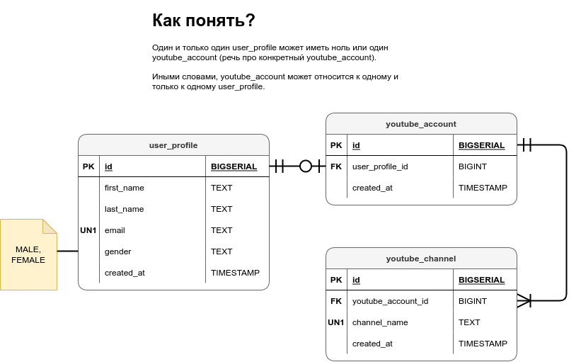

# Проектирование баз данных (Database design)

## Источники:

- [Database Design & Implementation (Master ERD & SQL Implementation)](https://www.amigoscode.com/p/database-design)

Ключевое понятие – *сущность* (*entity*). Сущность – это что-то, что поддаётся 
определению. Объекты реального мира – сущности.

## Инструментарий

- [diagrams.net](https://www.diagrams.net/)

## Моделирование YouTube-платформы

Чтобы спроектировать YouTube-like платформу, нам нужны следующие сущности:


Построим таблицу базы данных для сущности *user_profile*:


**PK** – **P**rimary **K**ey – поле, однозначно идентифицирующее запись в 
таблице.

При моделировании сущности *user_profile* нужно учесть, что поле *email* 
должно быть уникально для каждой записи в таблице:


**UN1** – **UN**ique – **1**-е из уникальных полей.

Нужно указать типы данных:


SQL для таблицы *user_profile*:

```sql
CREATE TABLE IF NOT EXISTS user_profile (
    id         BIGSERIAL PRIMARY KEY,
    first_name TEXT NOT NULL,
    last_name  TEXT NOT NULL,
    email      TEXT UNIQUE NOT NULL,
    gender     TEXT CHECK(gender IN ('MALE', 'FEMALE')) NOT NULL,
    created_at TIMESTAMP WITHOUT TIME ZONE NOT NULL
);
```

### Отношения (Relationships)

*Отношения* описывают то, как сущности относятся между собой.

Создадим таблицы ещё для двух сущностей: *youtube_account* и *youtube_channel*:


Покажем их отношения через ***F**oreign **K**eys* (внешние ключи):


### Cardinality (Мощности <del>множества</del>)


(слева – минимум, справа – максимум)



### Связь "один к одному"

Совместим **PK** и **FK** в *youtube_account*:


Опишем таблицу *youtube_account* через **SQL**:

```sql
CREATE TABLE IF NOT EXISTS youtube_account (
    id BIGINT PRIMARY KEY REFERENCES user_profile(id),
    created_at TIMESTAMP WITHOUT TIME ZONE NOT NULL
);
```

В таком случае какому-то *user_profile* может принадлежать максимум один 
*youtube_account*. Это обеспечивается тем, что *user_profile_id* является, 
помимо первичного ключа, ещё и внешним.

### Связь "один ко многим"

```sql
CREATE TABLE IF NOT EXISTS youtube_channel (
    id BIGSERIAL PRIMARY KEY,
    youtube_account_id BIGINT NOT NULL REFERENCES youtube_account(id),
    channel_name TEXT UNIQUE NOT NULL,
    created_at TIMESTAMP WITHOUT TIME ZONE NOT NULL
);
```

### Связь "многие ко многим"

Например, нужно хранить подписчиков YouTube-канала. Тогда создаётся 
link-таблица (bridge-таблица). Ноль или **многие** могут быть подписаны на один 
канал. Один канал может иметь ноль или **много** подписчиков.

```sql
CREATE TABLE IF NOT EXISTS channel_subscriber (
    youtube_account_id BIGINT REFERENCES youtube_account(id),
    youtube_channel_id BIGINT REFERENCES youtube_channel(id),
    created_at TIMESTAMP WITHOUT TIME ZONE NOT NULL,
    PRIMARY KEY (youtube_account_id, youtube_channel_id)
);
```

---
Последняя строчка – *composite key* (*составной ключ*).
---

## Нормализация базы данных

### Первая нормальная форма (1NF)

Добавим поле *phone_number* в таблицу *user_profile*:


*Первая нормальная форма говорит*, что атрибуты должны иметь одиночные 
атомарные значения.

| id | first_name | last_name | email                | gender | phone_number   | created_at |
| -- | ---------- | --------- | -------------------- | ------ | -------------- | ---------- |
| 1  | James      | Bond      | james.bond@gmail.com | MALE   | 007, 071, 0072 | 2020-11-24 |

В данном случае поле *phone_number* является **нарушением** *первой нормальной 
формы* (оно хранит более одного значения).

**ПРИВЕДЕНИЕ К ПЕРВОЙ НОРМАЛЬНОЙ ФОРМЕ**:


| id | first_name | last_name | email                | gender | created_at |
| -- | ---------- | --------- | -------------------- | ------ | ---------- |
| 1  | James      | Bond      | james.bond@gmail.com | MALE   | 2020-11-24 |

| id | user_profile_id | phone_number |
| -- | --------------- | ------------ |
| 1  | 1               | 007          |
| 2  | 1               | 0071         |
| 3  | 1               | 0072         |

### Вторая нормальная форма (2NF)

Для удовлетворения второй нормальной форме, таблица должна удовлетворять 
первой нормальной форме.

Вторая нормальная форма говорит, что каждый столбец должен зависеть от **ВСЕХ** 
первичных ключей. Не должно быть *частичной зависимости*.

| id | first_name | last_name | email                | gender | phone_number   | created_at | address |
| -- | ---------- | --------- | -------------------- | ------ | -------------- | ---------- | ------- |
| 1  | James      | Bond      | james.bond@gmail.com | MALE   | 007, 071, 0072 | 2020-11-24 | London  |

С этой таблицей всё хорошо, она удовлетворяет второй нормальной форме.

| id | first_name | last_name | email                | gender | phone_number   | created_at | address | post_code |
| -- | ---------- | --------- | -------------------- | ------ | -------------- | ---------- | ------- | --------- |
| 1  | James      | Bond      | james.bond@gmail.com | MALE   | 007, 071, 0072 | 2020-11-24 | London  | NW1 1PK   |

Эта таблица удовлетворяет первой нормальной форме, НО НЕ удовлетворяет второй 
нормальной форме, потому что *post_code* относится (зависит от) *address*.

*ПРИВЕДЕНИЕ КО ВТОРОЙ НОРМАЛЬНОЙ ФОРМЕ*:

| id | first_name | last_name | email                | gender | phone_number   | created_at | address |
| -- | ---------- | --------- | -------------------- | ------ | -------------- | ---------- | ------- |
| 1  | James      | Bond      | james.bond@gmail.com | MALE   | 007, 071, 0072 | 2020-11-24 | London  |

| id | user_profile_id | address | post_code |
| -- | --------------- | ------- | --------- |
| 1  | 1               | London  | NW1 1PK   |

### Третья нормальная форма (3NF)

Для удовлетворения третьей нормальной форме, таблица должна удовлетворять 
второй нормальной форме (и, соответственно, первой нормальной форме).

Третья нормальная форма говорит, что ни один неключевой атрибут не должен 
находиться в транзитивной зависимости от первичного ключа.

| *Tournament*          | *Year* | Winner         | Winner's date of birth |
| --------------------- | ------ | -------------- | ---------------------- |
| Indiana Invitational  | 1998   | Al Fredrickson | 21 July 1975           |
| Cleveland Open        | 1999   | Bob Albertson  | 28 September 1968      |
| Des Moines Masters    | 1999   | Al Fredrickson | 21 July 1975           |
| Indiana Invitational  | 1999   | Chip Masterson | 14 March 1977          |

Таблица удовлетворяет второй нормальной форме, НО НЕ удовлетворяет третьей.

В этой таблице используется составной ключ *Tournament + Year*.

*Winner* зависит от ключа полностью.

*Winners's date of birth* тоже зависит от ключа, НО он зависит от ключа **через 
неключевое поле** (*Winner*) – **транзитивная зависимость**.

**ПРИВЕДЕНИЕ К ТРЕТЬЕЙ НОРМАЛЬНОЙ ФОРМЕ**:

| *Tournament*           | *Year* | Winner         |
| ---------------------- | ------ | -------------- |
| Indiana Invitational   | 1998   | Al Fredrickson |
| Cleveland Open         | 1999   | Bob Albertson  |
| Des Moines Masters     | 1999   | Al Fredrickson |
| Indiana Invitational   | 1999   | Chip Masterson |

| *Winner*         | Date of birth     |
| ---------------- | ----------------- |
| Al Fredrickson   | 21 July 1975      |
| Bob Albertson    | 28 September 1968 |
| Al Fredrickson   | 21 July 1975      |
| Chip Masterson   | 14 March 1977     |
