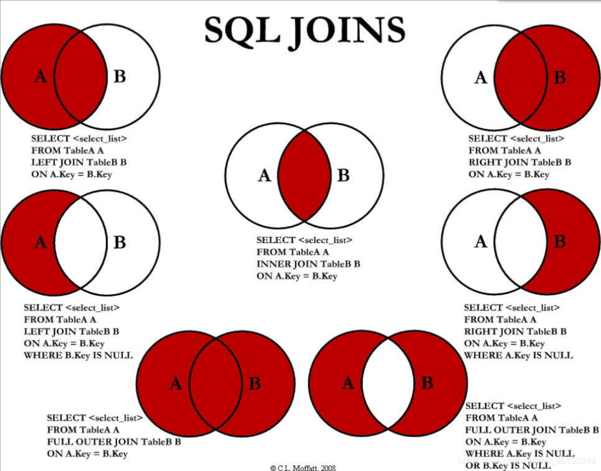

# PostgreSQL

## Источники

- [Learn PostgreSQL Tutorial - Full Course for Beginners](https://www.youtube.com/watch?v=qw--VYLpxG4)

## Полезные ссылки

- https://mockaroo.com/ – генератор данных для баз данных

## Подключение

**psql** — это терминальный клиент для работы с PostgreSQL.

Список команд можно посмотреть, зайдя в **psql** с помощью команды терминала

```bash
psql
```

и введя команду в терминал **psql**

```
\?
```

### Первый способ подключения к базе данных

```bash
psql -h <имя_хоста> -p <порт> -U <имя_пользователя> <название_базы данных>
```

Например,

```bash
psql -h localhost -p 5432 -U shuryak testDb
```

### Второй способ подключения к базе данных

```bash
psql
```

```
\c <название_базы_данных>
```

### Основные команды **psql**

- `\l` – просмотр списка всех баз данных
- `\d` – просмотр списка всех таблиц и последовательностей (sequences)
- `\dt` – просмотр списка всех таблиц и только таблиц
- `\d <название_таблицы>` – просмотр списка всех столбцов таблицы
- `\i <путь_к_файлу_с_командами_sql>` – исполнение SQL-команд из файла
- `\x` – вкл/выкл расширенное отображение
- `\q` – выход из **psql**

## Основные команды SQL

### Создание базы данных

```sql
CREATE DATABASE <название_базы_данных>;
```

### Удаление базы данных

```sql
DROP DATABASE <название_базы_данных>;
```

### Создание таблицы

```sql
CREATE TABLE <название_таблицы> (
    <название_столбца> <тип_данных> <ограничения_при_необходимости>,
    ...
);
```

[Поддерживаемые типы данных для текущей версии PostgreSQL](https://www.postgresql.org/docs/current/datatype.html)

Основные ограничения (constraints):

- `PRIMARY KEY` – первичный ключ
- `NOT NULL` – не *NULL*

[Подробнее об ограничениях (constraints) PostgreSQL](https://www.postgresql.org/docs/14/ddl-constraints.html)

### Удаление таблицы

```sql
DROP TABLE <название_таблицы>;
```

### Создание записей

```sql
INSERT INTO <название_таблицы> (
    <столбец_для_вставки_1>,
    <столбец_для_вставки_2>,
    ...
    <столбец_для_вставки_n>
) VALUES ('<значение_для_вставки_в_столбец_1>', '<в_столбец_2>', ..., 
'<в_столбец_n>');
```

### Получение записей

```sql
SELECT <стобец_для_получения_1>, <столбец_для_получения_2>, ..., 
<столбец__n> FROM <название_таблицы>;
```

- Сортировка при получении записей:

  ```sql
  SELECT ... FROM ... ORDER BY <по_какому_столбцу_сортировать> 
  <порядок_сортировки>;
  ```

- - Возможный *порядок сортировки*:
    - `ASC` (Ascending) – сортировка по возрастанию (по умолчанию)
    - `DESC` (Descending) – сортировка по убыванию

- Сортировка по множеству столбцов:

  ```sql
  SELECT ... FROM ... ORDER BY <столбец_1> <порядок_сортировки_для_столбца_1>, 
  <столбец_2> <порядок_для_столбца_2>, ..., <столбец_n> <порядок_для_столбца_n>;
  ```

  Эта команда сначала отсортирует по *столбцу 1* в указаном для него порядке, 
  затем отсортирует по *столбцу 2* в указаном для него порядке и т.д. до *столбца 
  n*.

- Исключение из результата повторяющихся строчек:

  ```sql
  SELECT DISTINCT <столбец_с_повторяющимися_значениями> FROM <название_таблицы>;
  ```

- Условная выборка:

  ```sql
  SELECT ... FROM ... WHERE <условное_выражение>;
  ```

- `LIMIT`, `OFFSET`, `FETCH`:

  ```sql
  SELECT ... FROM ... LIMIT <число_записей_для_получения>;
  ```

  ```sql
  SELECT ... FROM ... OFFSET <число_записей_для_пропуска>;
  ```

  ```sql
  SELECT ... FROM ... FETCH FIRST <число_записей_для_получения> ROW ONLY;
  ```

- `IN`:

  ```sql
  SELECT ... FROM ... WHERE <столбец> IN ('значение_1', 'значение_2', ..., 
  'значение_n');
  ```

  Эквивалентно записи:

  ```sql
  SELECT ... FROM ... WHERE <столбец> = 'значение_1' OR <столбец> = 'значение_2' 
  OR ... OR <столбец> = 'значение_n';
  ```

- `BETWEEN`:

  ```sql
  SELECT ... FROM ... WHERE <столбец> 
  BETWEEN <нижняя_граница> AND <верхняя_граница>;
  ```

- Выборка по паттерну:

  ```sql
  SELECT ... FROM ... WHERE <столбец> LIKE <паттерн>;
  ```

  `ILIKE` выполняет то же самое, но не чувствителен к регистру

- Группировка `GROUP BY`:

  ```sql
  SELECT ... FROM ... GROUP BY <группирующий_столбец_1>, 
  <группирующий_столбец_2>, ... <группирующий_столбец_n>;
  ```

  `GROUP BY` группирует строки таблицы, объединяя их в одну группу при совпадении 
  значений во всех перечисленных столбцах.

  Пример:

  ```sql
  SELECT country_of_birth, COUNT(*) FROM person GROUP BY country_of_birth;
  ```

- Группировка `GROUP BY HAVING`:

  ```sql
  SELECT ... FROM ... GROUP BY <список_группирующих_столбцов> HAVING 
  <условие_с_агрегирующими_функциями>;
  ```

  Пример:

  ```sql
  SELECT country_of_birth, COUNT(*) FROM person GROUP BY country_of_birth HAVING 
  COUNT(*) > 5;
  ```

  [Подробнее об агрегирующих функциях](https://www.postgresql.org/docs/current/functions-aggregate.html)

### Алиасы

```sql
SELECT <стобец_для_получения_1>, <столбец_для_получения_2> AS <алиас>, ..., 
<столбец_для_получения_n> FROM ...;
```

### `COALESCE`:

Эта функция позовляет задать значение по умолчанию, если изначальное значение – 
`NULL` (не представлено).

```sql
SELECT COALESCE(NULL, 555) AS result;
```

Результат:

```
 result
--------
555
(1 row)
```

### `NULLIF` и деление на ноль

Функция `NULLIF` принимает два аргумента и возвращает первый аргумент, если 
второй аргумент не равен первому.

Попытка поделить 10 *на ноль*:

```sql
SELECT 10 / 0;
```

Результат:

```
ERROR:  division by zero
```

"Правильное" деление *на ноль*:

```sql
SELECT 10 / NULLIF(0, 0);
```

Результат:

```
 ?column?
----------

(1 row)
```

Или с использованием `COALESCE`:

```sql
SELECT COALESCE(10 / NULLIF(0, 0), 0);
```

Результат:

```
 coalesce
----------
        0
(1 row)
```

### Работа с датами

Функция `NOW` возвращает текущую дату и время

Результат функции можно скастовать к необходимому типу данных:

```sql
SELECT NOW()::TIME;
```

[Подробнее о временных типах данных](https://www.postgresql.org/docs/current/datatype-datetime.html)

- Сложение и вычитание дат:

  Пример:

  ```sql
  SELECT NOW() + INTERVAL '1 YEAR 2 MONTHS';
  ```

- Функция `AGE`:

  ```sql
  SELECT AGE(NOW(), NOW() - INTERVAL '1 YEAR 6 MONTHS 5 DAYS');
  ```

  Результат:

  ```
          age          
  ----------------------
  1 year 6 mons 5 days
  (1 row)
  ```

### Извлечение значений

Пример:

```sql
SELECT EXTRACT(YEAR FROM NOW());
```

### Первичные ключи

Первичный ключ (primary key) однозначно идентифицирует запись в таблице.

Создадим таблицу `person`:

```sql
CREATE TABLE person (
  id BIGSERIAL NOT NULL PRIMARY KEY,
  first_name VARCHAR(50) NOT NULL,
  last_name VARCHAR(50) NOT NULL
);
```

Результат команды **psql** `\d person`:

```
                                     Table "public.person"
   Column   |         Type          | Collation | Nullable |              Default               
------------+-----------------------+-----------+----------+------------------------------------
 id         | bigint                |           | not null | nextval('person_id_seq'::regclass)
 first_name | character varying(50) |           | not null | 
 last_name  | character varying(50) |           | not null | 
Indexes:
    "person_pkey" PRIMARY KEY, btree (id)
```

Автоматически создалось ограничение уникальности (constraint) `person_pkey` 
(`PRIMARY KEY`). Оно удаляется следующей командой (доказательство того, что это constraint):

```sql
ALTER TABLE person DROP CONSTRAINT person_pkey;
```

Автоматически создалась последовательность `person_id_seq` (`BIGSERIAL`).

- Добавление первичного ключа:

  ```sql
  ALTER TABLE person ADD PRIMARY KEY (id);
  ```

  Можно передавать *список* первичных ключей.

### Ограничения уникальности

Создадим таблицу `person`:

```sql
CREATE TABLE person (
  id BIGSERIAL NOT NULL PRIMARY KEY,
  first_name VARCHAR(50) NOT NULL,
  last_name VARCHAR(50) NOT NULL,
  email VARCHAR(100)
);
```

Создадим ограничение уникальности для поля `email`:

```sql
ALTER TABLE person ADD CONSTRAINT unique_email_address UNIQUE (email);
```

Другой способ создания ограничения уникальности:

```sql
ALTER TABLE person ADD UNIQUE (email);
```

Разница заключается в том, что во втором случае название ограничения будет 
автоматически сгенерировано PostgreSQL.

### Ограничения-проверки

Создадим таблицу `video_ratings`:

```sql
CREATE TABLE video_ratings (
  id BIGSERIAL NOT NULL PRIMARY KEY,
  user_id BIGINT NOT NULL,
  video_id BIGINT NOT NULL,
  rating VARCHAR(7) NOT NULL
);
```

Создадим ограничение-проверку для поля `rating`:

```sql
ALTER TABLE video_ratings ADD CONSTRAINT rating_constraint CHECK 
(rating = 'like' OR rating = 'dislike');
```

### Удаление записей

**ВНИМАНИЕ!** `DELETE FROM <название_таблицы>;` удалит все записи указанной 
таблицы!

- Удаление по условию:

  ```sql
  DELETE FROM <название_таблицы> WHERE <условие>;
  ```

### Обновление записей

```sql
UPDATE <название_таблицы> SET <название_столбца_1> = <значение_столбца_1>, 
<название_столбца_2> = <значение_столбца_2>, ..., <название_столбца_n> = 
<название_столбца_n> WHERE <условие>;
```

### `ON CONFLICT DO NOTHING`:

```sql
INSERT INTO ... VALUES ... ON CONFLICT (<название_столбца>) DO NOTHING;
```

*Название столбца* должно быть с ограничением уникальности.

### `UPSERT` (Update and Insert):

Пример:

```sql
INSERT INTO person (id, first_name, last_name, gender, email, date_of_birth, 
country_of_birth) VALUES (2017, 'Ivan', 'Petrov', 'Male', 'ivan@mail.ru', 
DATE '2000-01-05', 'Russia') ON CONFLICT (id) DO UPDATE SET email = 
EXCLUDED.email, last_name = EXCLUDED.last_name;
```

### Внешние ключи (Foreign keys)

Создадим таблицу `person`:

```sql
CREATE TABLE person (
  id BIGSERIAL NOT NULL PRIMARY KEY,
  first_name VARCHAR(50) NOT NULL,
  last_name VARCHAR(50) NOT NULL,
  gender VARCHAR(7) NOT NULL,
  email VARCHAR(100),
  date_of_birth DATE NOT NULL,
  country_of_birth VARCHAR(50) NOT NULL,
  car_id BIGINT REFERENCES car (id),
  UNIQUE(car_id)
);
```

Но перед этим создадим таблицу `car`:

```sql
CREATE TABLE car (
  id BIGSERIAL NOT NULL PRIMARY KEY,
  make VARCHAR(100) NOT NULL,
  model VARCHAR(100) NOT NULL,
  price NUMERIC(19, 2) NOT NULL
);
```

Создадим в них, например, следующие записи:

```sql
INSERT INTO person (first_name, last_name, gender, email, date_of_birth, 
country_of_birth) VALUES ('Fernanda', 'Beardon', 'Female', 'fernandab@is.gd', 
'1953-10-28', 'Comoros');
INSERT INTO person (first_name, last_name, gender, email, date_of_birth, 
country_of_birth) VALUES ('Omar', 'Colmore', 'Male', NULL, 
'1921-04-03', 'Finland');
INSERT INTO person (first_name, last_name, gender, email, date_of_birth,
country_of_birth) VALUES ('Adriana', 'Matuschek', 'Female', 
'amatuschek2@feedburner.com', '1965-02-28', 'Cameroon');

INSERT INTO car (make, model, price) VALUES ('Land Rover', 'Sterling', 
'87665.38');
INSERT INTO car (make, model, price) VALUES ('GMC', 'Acadia', '17662.69');
```

### Объединения (Joins)



```sql
UPDATE person SET car_id = 2 WHERE id = 1;
UPDATE person SET car_id = 1 WHERE id = 2;
```

- INNER JOINS:

  ```sql
  SELECT * FROM person JOIN car ON person.car_id = car.id;
  ```

  Это эквивалентно следующему выражению, потому что `person.id` и `car.id` 
  являются первичными ключами:

  ```sql
  SELECT * FROM person JOIN car USING (id);
  ```

  Применив команду **psql** `\x`, посмотрим результат:

  ```
  -[ RECORD 1 ]----+----------------
  id               | 2
  first_name       | Omar
  last_name        | Colmore
  gender           | Male
  email            | 
  date_of_birth    | 1921-04-03
  country_of_birth | Finland
  car_id           | 1
  id               | 1
  make             | Land Rover
  model            | Sterling
  price            | 87665.38
  -[ RECORD 2 ]----+----------------
  id               | 1
  first_name       | Fernanda
  last_name        | Beardon
  gender           | Female
  email            | fernandab@is.gd
  date_of_birth    | 1953-10-28
  country_of_birth | Comoros
  car_id           | 2
  id               | 2
  make             | GMC
  model            | Acadia
  price            | 17662.69
  ```

- LEFT JOINS:

  ```sql
  SELECT * FROM person LEFT JOIN car ON car.id = person.car_id;
  ```

  Результат:

  ```
  -[ RECORD 1 ]----+---------------------------
  id               | 2
  first_name       | Omar
  last_name        | Colmore
  gender           | Male
  email            | 
  date_of_birth    | 1921-04-03
  country_of_birth | Finland
  car_id           | 1
  id               | 1
  make             | Land Rover
  model            | Sterling
  price            | 87665.38
  -[ RECORD 2 ]----+---------------------------
  id               | 1
  first_name       | Fernanda
  last_name        | Beardon
  gender           | Female
  email            | fernandab@is.gd
  date_of_birth    | 1953-10-28
  country_of_birth | Comoros
  car_id           | 2
  id               | 2
  make             | GMC
  model            | Acadia
  price            | 17662.69
  -[ RECORD 3 ]----+---------------------------
  id               | 3
  first_name       | Adriana
  last_name        | Matuschek
  gender           | Female
  email            | amatuschek2@feedburner.com
  date_of_birth    | 1965-02-28
  country_of_birth | Cameroon
  car_id           | 
  id               | 
  make             | 
  model            | 
  price            | 
  ```

### Генерация CSV

Пример генерации CSV средствами **psql**:

```sql
\copy (SELECT * FROM person LEFT JOIN car ON car.id = person.car_id)
TO '/home/shuryak/Desktop/results.csv' DELIMITER ',' CSV HEADER;
```

### Серии (serials) и последовательности (sequences)

Пример получения следующего значения последовательности:

```sql
SELECT nextval('person_id_seq'::regclass);
```

Пример сброса последовательности:

```sql
ALTER SEQUENCE person_id_seq RESTART WITH 10;
```

### Расширения (extensions)

Просмотр списка доступных расширений:

```sql
SELECT * FROM pg_available_extensions;
```

Работа с расширением на примере расширения `uuid-ossp`:

[Подробнее о UUID](https://en.wikipedia.org/wiki/Universally_unique_identifier)

Установка расширения:

```sql
CREATE EXTENSION IF NOT EXISTS "uuid-ossp";
```

Список функций:

```
\df
```

Результат:

```
                                 List of functions
 Schema |        Name        | Result data type |    Argument data types    | Type 
--------+--------------------+------------------+---------------------------+------
 public | uuid_generate_v1   | uuid             |                           | func
 public | uuid_generate_v1mc | uuid             |                           | func
 public | uuid_generate_v3   | uuid             | namespace uuid, name text | func
 public | uuid_generate_v4   | uuid             |                           | func
 public | uuid_generate_v5   | uuid             | namespace uuid, name text | func
 public | uuid_nil           | uuid             |                           | func
 public | uuid_ns_dns        | uuid             |                           | func
 public | uuid_ns_oid        | uuid             |                           | func
 public | uuid_ns_url        | uuid             |                           | func
 public | uuid_ns_x500       | uuid             |                           | func
(10 rows)
```

Генерация UUID [4-й версии](https://en.wikipedia.org/wiki/Universally_unique_identifier#Version_4_(random)):

```sql
SELECT uuid_generate_v4();
```

Результат:

```
           uuid_generate_v4           
--------------------------------------
 347aa88b-4b3d-4e8c-bbce-bd20e48af1cf
(1 row)
```
