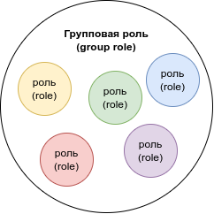

# PostgreSQL

## Источники

- [Learn PostgreSQL Tutorial - Full Course for Beginners](https://www.youtube.com/watch?v=qw--VYLpxG4)
- [Advanced Databases (Master Advanced Concepts)](https://www.amigoscode.com/p/advanced-databases)

## Полезные ссылки

- https://mockaroo.com/ – генератор данных для баз данных

## Подключение

**psql** — это терминальный клиент для работы с PostgreSQL.

Список команд можно посмотреть, зайдя в **psql** с помощью команды терминала

```bash
psql
```

и введя команду в терминал **psql**

```
\?
```

### Первый способ подключения к базе данных

```bash
psql -h <имя_хоста> -p <порт> -U <имя_пользователя> <название_базы данных>
```

Например,

```bash
psql -h localhost -p 5432 -U shuryak testDb
```

### Второй способ подключения к базе данных

```bash
psql
```

```
\c <название_базы_данных>
```

### Основные команды **psql**

- `\l` – просмотр списка всех баз данных
- `\d` – просмотр списка всех таблиц и последовательностей (sequences)
- `\dt` – просмотр списка всех таблиц и только таблиц
- `\df` – просмотр списка всех пользовательских функций
- `\du` – просмотр списка всех ролей (пользователей)
- `\dn` – просмотр списка всех схем
- `\d <название_таблицы>` – просмотр списка всех столбцов таблицы
- `\i <путь_к_файлу_с_командами_sql>` – исполнение SQL-команд из файла
- `\x` – вкл/выкл расширенное отображение
- `\timing` – вкл/выкл отображение времени выполнения
- `\q` – выход из **psql**

## Основные команды SQL

### Создание базы данных

```sql
CREATE DATABASE <название_базы_данных>;
```

### Удаление базы данных

```sql
DROP DATABASE <название_базы_данных>;
```

### Создание таблицы

```sql
CREATE TABLE <название_таблицы> (
    <название_столбца> <тип_данных> <ограничения_при_необходимости>,
    ...
);
```

[Поддерживаемые типы данных для текущей версии PostgreSQL](https://www.postgresql.org/docs/current/datatype.html)

Основные ограничения (constraints):

- `PRIMARY KEY` – первичный ключ
- `NOT NULL` – не *NULL*

[Подробнее об ограничениях (constraints) PostgreSQL](https://www.postgresql.org/docs/14/ddl-constraints.html)

### Удаление таблицы

```sql
DROP TABLE <название_таблицы>;
```

### Создание записей

```sql
INSERT INTO <название_таблицы> (
    <столбец_для_вставки_1>,
    <столбец_для_вставки_2>,
    ...
    <столбец_для_вставки_n>
) VALUES ('<значение_для_вставки_в_столбец_1>', '<в_столбец_2>', ..., 
'<в_столбец_n>');
```

### Получение записей

```sql
SELECT <стобец_для_получения_1>, <столбец_для_получения_2>, ..., 
<столбец__n> FROM <название_таблицы>;
```

- Сортировка при получении записей:

  ```sql
  SELECT ... FROM ... ORDER BY <по_какому_столбцу_сортировать> 
  <порядок_сортировки>;
  ```

- - Возможный *порядок сортировки*:
    - `ASC` (Ascending) – сортировка по возрастанию (по умолчанию)
    - `DESC` (Descending) – сортировка по убыванию

- Сортировка по множеству столбцов:

  ```sql
  SELECT ... FROM ... ORDER BY <столбец_1> <порядок_сортировки_для_столбца_1>, 
  <столбец_2> <порядок_для_столбца_2>, ..., <столбец_n> <порядок_для_столбца_n>;
  ```

  Эта команда сначала отсортирует по *столбцу 1* в указаном для него порядке, 
  затем отсортирует по *столбцу 2* в указаном для него порядке и т.д. до *столбца 
  n*.

- Исключение из результата повторяющихся строчек:

  ```sql
  SELECT DISTINCT <столбец_с_повторяющимися_значениями> FROM <название_таблицы>;
  ```

- Условная выборка:

  ```sql
  SELECT ... FROM ... WHERE <условное_выражение>;
  ```

- `LIMIT`, `OFFSET`, `FETCH`:

  ```sql
  SELECT ... FROM ... LIMIT <число_записей_для_получения>;
  ```

  ```sql
  SELECT ... FROM ... OFFSET <число_записей_для_пропуска>;
  ```

  ```sql
  SELECT ... FROM ... FETCH FIRST <число_записей_для_получения> ROW ONLY;
  ```

- `IN`:

  ```sql
  SELECT ... FROM ... WHERE <столбец> IN ('значение_1', 'значение_2', ..., 
  'значение_n');
  ```

  Эквивалентно записи:

  ```sql
  SELECT ... FROM ... WHERE <столбец> = 'значение_1' OR <столбец> = 'значение_2' 
  OR ... OR <столбец> = 'значение_n';
  ```

- `BETWEEN`:

  ```sql
  SELECT ... FROM ... WHERE <столбец> 
  BETWEEN <нижняя_граница> AND <верхняя_граница>;
  ```

- Выборка по паттерну:

  ```sql
  SELECT ... FROM ... WHERE <столбец> LIKE <паттерн>;
  ```

  `ILIKE` выполняет то же самое, но не чувствителен к регистру

- Группировка `GROUP BY`:

  ```sql
  SELECT ... FROM ... GROUP BY <группирующий_столбец_1>, 
  <группирующий_столбец_2>, ... <группирующий_столбец_n>;
  ```

  `GROUP BY` группирует строки таблицы, объединяя их в одну группу при совпадении 
  значений во всех перечисленных столбцах.

  Пример:

  ```sql
  SELECT country_of_birth, COUNT(*) FROM person GROUP BY country_of_birth;
  ```

- Группировка `GROUP BY HAVING`:

  ```sql
  SELECT ... FROM ... GROUP BY <список_группирующих_столбцов> HAVING 
  <условие_с_агрегирующими_функциями>;
  ```

  Пример:

  ```sql
  SELECT country_of_birth, COUNT(*) FROM person GROUP BY country_of_birth HAVING 
  COUNT(*) > 5;
  ```

  [Подробнее об агрегирующих функциях](https://www.postgresql.org/docs/current/functions-aggregate.html)

### Алиасы

```sql
SELECT <стобец_для_получения_1>, <столбец_для_получения_2> AS <алиас>, ..., 
<столбец_для_получения_n> FROM ...;
```

### `COALESCE`:

Эта функция позовляет задать значение по умолчанию, если изначальное значение – 
`NULL` (не представлено).

```sql
SELECT COALESCE(NULL, 555) AS result;
```

Результат:

```
 result
--------
555
(1 row)
```

### `NULLIF` и деление на ноль

Функция `NULLIF` принимает два аргумента и возвращает первый аргумент, если 
второй аргумент не равен первому.

Попытка поделить 10 *на ноль*:

```sql
SELECT 10 / 0;
```

Результат:

```
ERROR:  division by zero
```

"Правильное" деление *на ноль*:

```sql
SELECT 10 / NULLIF(0, 0);
```

Результат:

```
 ?column?
----------

(1 row)
```

Или с использованием `COALESCE`:

```sql
SELECT COALESCE(10 / NULLIF(0, 0), 0);
```

Результат:

```
 coalesce
----------
        0
(1 row)
```

### Работа с датами

Функция `NOW` возвращает текущую дату и время

Результат функции можно скастовать к необходимому типу данных:

```sql
SELECT NOW()::TIME;
```

[Подробнее о временных типах данных](https://www.postgresql.org/docs/current/datatype-datetime.html)

- Сложение и вычитание дат:

  Пример:

  ```sql
  SELECT NOW() + INTERVAL '1 YEAR 2 MONTHS';
  ```

- Функция `AGE`:

  ```sql
  SELECT AGE(NOW(), NOW() - INTERVAL '1 YEAR 6 MONTHS 5 DAYS');
  ```

  Результат:

  ```
          age          
  ----------------------
  1 year 6 mons 5 days
  (1 row)
  ```

### Извлечение значений

Пример:

```sql
SELECT EXTRACT(YEAR FROM NOW());
```

### Первичные ключи

Первичный ключ (primary key) однозначно идентифицирует запись в таблице.

Создадим таблицу `person`:

```sql
CREATE TABLE person (
  id BIGSERIAL NOT NULL PRIMARY KEY,
  first_name VARCHAR(50) NOT NULL,
  last_name VARCHAR(50) NOT NULL
);
```

Результат команды **psql** `\d person`:

```
                                     Table "public.person"
   Column   |         Type          | Collation | Nullable |              Default               
------------+-----------------------+-----------+----------+------------------------------------
 id         | bigint                |           | not null | nextval('person_id_seq'::regclass)
 first_name | character varying(50) |           | not null | 
 last_name  | character varying(50) |           | not null | 
Indexes:
    "person_pkey" PRIMARY KEY, btree (id)
```

Автоматически создалась последовательность `person_id_seq` (`BIGSERIAL`).

Автоматически создалось ограничение уникальности (constraint) `person_pkey` 
(`PRIMARY KEY`). Оно удаляется следующей командой (доказательство того, что это 
constraint):

```sql
ALTER TABLE person DROP CONSTRAINT person_pkey;
```

- Добавление первичного ключа:

  ```sql
  ALTER TABLE person ADD PRIMARY KEY (id);
  ```

  Можно передавать *список* первичных ключей.

### Ограничения уникальности

Создадим таблицу `person`:

```sql
CREATE TABLE person (
  id BIGSERIAL NOT NULL PRIMARY KEY,
  first_name VARCHAR(50) NOT NULL,
  last_name VARCHAR(50) NOT NULL,
  email VARCHAR(100)
);
```

Создадим ограничение уникальности для поля `email`:

```sql
ALTER TABLE person ADD CONSTRAINT unique_email_address UNIQUE (email);
```

Другой способ создания ограничения уникальности:

```sql
ALTER TABLE person ADD UNIQUE (email);
```

Разница заключается в том, что во втором случае название ограничения будет 
автоматически сгенерировано PostgreSQL.

### Ограничения-проверки

Создадим таблицу `video_ratings`:

```sql
CREATE TABLE video_ratings (
  id BIGSERIAL NOT NULL PRIMARY KEY,
  user_id BIGINT NOT NULL,
  video_id BIGINT NOT NULL,
  rating VARCHAR(7) NOT NULL
);
```

Создадим ограничение-проверку для поля `rating`:

```sql
ALTER TABLE video_ratings ADD CONSTRAINT rating_constraint CHECK 
(rating = 'like' OR rating = 'dislike');
```

### Удаление записей

**ВНИМАНИЕ!** `DELETE FROM <название_таблицы>;` удалит все записи указанной 
таблицы!

- Удаление по условию:

  ```sql
  DELETE FROM <название_таблицы> WHERE <условие>;
  ```

### Обновление записей

```sql
UPDATE <название_таблицы> SET <название_столбца_1> = <значение_столбца_1>, 
<название_столбца_2> = <значение_столбца_2>, ..., <название_столбца_n> = 
<название_столбца_n> WHERE <условие>;
```

### `ON CONFLICT DO NOTHING`:

```sql
INSERT INTO ... VALUES ... ON CONFLICT (<название_столбца>) DO NOTHING;
```

*Название столбца* должно быть с ограничением уникальности.

### `UPSERT` (Update and Insert):

Пример:

```sql
INSERT INTO person (id, first_name, last_name, gender, email, date_of_birth, 
country_of_birth) VALUES (2017, 'Ivan', 'Petrov', 'Male', 'ivan@mail.ru', 
DATE '2000-01-05', 'Russia') ON CONFLICT (id) DO UPDATE SET email = 
EXCLUDED.email, last_name = EXCLUDED.last_name;
```

### Внешние ключи (Foreign keys)

Создадим таблицу `person`:

```sql
CREATE TABLE person (
  id BIGSERIAL NOT NULL PRIMARY KEY,
  first_name VARCHAR(50) NOT NULL,
  last_name VARCHAR(50) NOT NULL,
  gender VARCHAR(7) NOT NULL,
  email VARCHAR(100),
  date_of_birth DATE NOT NULL,
  country_of_birth VARCHAR(50) NOT NULL,
  car_id BIGINT REFERENCES car (id),
  UNIQUE(car_id)
);
```

Но перед этим создадим таблицу `car`:

```sql
CREATE TABLE car (
  id BIGSERIAL NOT NULL PRIMARY KEY,
  make VARCHAR(100) NOT NULL,
  model VARCHAR(100) NOT NULL,
  price NUMERIC(19, 2) NOT NULL
);
```

Создадим в них, например, следующие записи:

```sql
INSERT INTO person (first_name, last_name, gender, email, date_of_birth, 
country_of_birth) VALUES ('Fernanda', 'Beardon', 'Female', 'fernandab@is.gd', 
'1953-10-28', 'Comoros');
INSERT INTO person (first_name, last_name, gender, email, date_of_birth, 
country_of_birth) VALUES ('Omar', 'Colmore', 'Male', NULL, 
'1921-04-03', 'Finland');
INSERT INTO person (first_name, last_name, gender, email, date_of_birth,
country_of_birth) VALUES ('Adriana', 'Matuschek', 'Female', 
'amatuschek2@feedburner.com', '1965-02-28', 'Cameroon');

INSERT INTO car (make, model, price) VALUES ('Land Rover', 'Sterling', 
'87665.38');
INSERT INTO car (make, model, price) VALUES ('GMC', 'Acadia', '17662.69');
```

### Объединения (Joins)


```sql
UPDATE person SET car_id = 2 WHERE id = 1;
UPDATE person SET car_id = 1 WHERE id = 2;
```

- INNER JOINS:

  ```sql
  SELECT * FROM person JOIN car ON person.car_id = car.id;
  ```

  Это эквивалентно следующему выражению, потому что `person.id` и `car.id` 
  являются первичными ключами:

  ```sql
  SELECT * FROM person JOIN car USING (id);
  ```

  Применив команду **psql** `\x`, посмотрим результат:

  ```
  -[ RECORD 1 ]----+----------------
  id               | 2
  first_name       | Omar
  last_name        | Colmore
  gender           | Male
  email            | 
  date_of_birth    | 1921-04-03
  country_of_birth | Finland
  car_id           | 1
  id               | 1
  make             | Land Rover
  model            | Sterling
  price            | 87665.38
  -[ RECORD 2 ]----+----------------
  id               | 1
  first_name       | Fernanda
  last_name        | Beardon
  gender           | Female
  email            | fernandab@is.gd
  date_of_birth    | 1953-10-28
  country_of_birth | Comoros
  car_id           | 2
  id               | 2
  make             | GMC
  model            | Acadia
  price            | 17662.69
  ```

- LEFT JOINS:

  ```sql
  SELECT * FROM person LEFT JOIN car ON car.id = person.car_id;
  ```

  Результат:

  ```
  -[ RECORD 1 ]----+---------------------------
  id               | 2
  first_name       | Omar
  last_name        | Colmore
  gender           | Male
  email            | 
  date_of_birth    | 1921-04-03
  country_of_birth | Finland
  car_id           | 1
  id               | 1
  make             | Land Rover
  model            | Sterling
  price            | 87665.38
  -[ RECORD 2 ]----+---------------------------
  id               | 1
  first_name       | Fernanda
  last_name        | Beardon
  gender           | Female
  email            | fernandab@is.gd
  date_of_birth    | 1953-10-28
  country_of_birth | Comoros
  car_id           | 2
  id               | 2
  make             | GMC
  model            | Acadia
  price            | 17662.69
  -[ RECORD 3 ]----+---------------------------
  id               | 3
  first_name       | Adriana
  last_name        | Matuschek
  gender           | Female
  email            | amatuschek2@feedburner.com
  date_of_birth    | 1965-02-28
  country_of_birth | Cameroon
  car_id           | 
  id               | 
  make             | 
  model            | 
  price            | 
  ```

### Генерация CSV

Пример генерации CSV средствами **psql**:

```sql
\copy (SELECT * FROM person LEFT JOIN car ON car.id = person.car_id)
TO '/home/shuryak/Desktop/results.csv' DELIMITER ',' CSV HEADER;
```

### Серии (serials) и последовательности (sequences)

Пример получения следующего значения последовательности:

```sql
SELECT nextval('person_id_seq'::regclass);
```

Пример сброса последовательности:

```sql
ALTER SEQUENCE person_id_seq RESTART WITH 10;
```

### Расширения (extensions)

Просмотр списка доступных расширений:

```sql
SELECT * FROM pg_available_extensions;
```

Работа с расширением на примере расширения `uuid-ossp`:

[Подробнее о UUID](https://en.wikipedia.org/wiki/Universally_unique_identifier)

Установка расширения:

```sql
CREATE EXTENSION IF NOT EXISTS "uuid-ossp";
```

Список функций:

```
\df
```

Результат:

```
                                 List of functions
 Schema |        Name        | Result data type |    Argument data types    | Type 
--------+--------------------+------------------+---------------------------+------
 public | uuid_generate_v1   | uuid             |                           | func
 public | uuid_generate_v1mc | uuid             |                           | func
 public | uuid_generate_v3   | uuid             | namespace uuid, name text | func
 public | uuid_generate_v4   | uuid             |                           | func
 public | uuid_generate_v5   | uuid             | namespace uuid, name text | func
 public | uuid_nil           | uuid             |                           | func
 public | uuid_ns_dns        | uuid             |                           | func
 public | uuid_ns_oid        | uuid             |                           | func
 public | uuid_ns_url        | uuid             |                           | func
 public | uuid_ns_x500       | uuid             |                           | func
(10 rows)
```

Генерация UUID [4-й версии](https://en.wikipedia.org/wiki/Universally_unique_identifier#Version_4_(random)):

```sql
SELECT uuid_generate_v4();
```

Результат:

```
           uuid_generate_v4           
--------------------------------------
 347aa88b-4b3d-4e8c-bbce-bd20e48af1cf
(1 row)
```

## Транзакции

```sql
CREATE TABLE IF NOT EXISTS accounts (
    id BIGSERIAL PRIMARY KEY,
    name TEXT NOT NULL,
    balance NUMERIC(19, 2) NOT NULL
);

INSERT INTO accounts (name, balance)
VALUES ('James', 1000),
       ('Jamila', 1000);
```

### Требования **ACID**:

- **A**tomicity – Атомарность. Атомарность гарантирует, что никакая транзакция 
  не будет зафиксирована в системе лишь частично (всё или ничего!).
- **C**onsistency – Согласованность. Согласованность обеспечивает то, что 
  данные будут записаны лишь в валидной форме и согласно предопределённым 
  правилам.
- **I**solation – Изолированность. Во время выполнения транзакции параллельные 
  транзакции не должны оказывать влияния на её результат.
- **D**urability – Прочность. Независимо от проблем на нижних уровнях (к 
  примеру, обесточивание системы или сбои в оборудовании) изменения, сделанные 
  успешно завершённой транзакцией, должны остаться сохранёнными после 
  возвращения системы в работу. Другими словами, если пользователь получил 
  подтверждение от системы, что транзакция выполнена, он может быть уверен, что 
  сделанные им изменения не будут отменены из-за какого-либо сбоя.

Представим ситуацию:

```sql
UPDATE accounts
SET balance = balance - 200
WHERE id = 1;

-- В базе данных случается сбой, а мы должны бы ещё записать следующее:

UPDATE accounts
SET balance = balance + 200
WHERE id = 2;
```

Три ключевых слова: `BEGIN`, `COMMIT`, `ROLLBACK`.

```sql
BEGIN;
UPDATE accounts
SET balance = balance + 200
WHERE id = 1;

UPDATE accounts
SET balance = balance - 200
WHERE id = 2;

-- Если мы сейчас напишем следующее, то в текущей сессии мы увидим
-- "изменившиеся" данные, но в другой сессии ничего не изменится!

SELECT * FROM accounts;

```


Если перед `SELECT` мы укажем `ROLLBACK`, то изменения откатятся.

Если перед `SELECT` мы укажем `COMMIT`, то изменения применятся.

```sql
BEGIN;
UPDATE accounts
SET balance = balance + 200
WHERE id = 1;

UPDATE accounts
SET balance = balance - 200
WHERE id = 2;
COMMIT; -- ROLLBACK;

SELECT * FROM accounts;
```

### Вложенные транзакции

Можно создавать вложенные транзакции:

```sql
BEGIN;
  BEGIN;
  -- something
  COMMIT;

  BEGIN;
  -- something
  ROLLBACK;
COMMIT;
```

Здесь "нарушается" изолированность из ACID (на самом деле, это просто 
вложенность).

## Индексы

Индексы позволяют выполнять быстрый поиск.

Когда мы создаём первичный ключ, автоматически также создаётся индекс для него, 
ведь он всегда уникален.

`UNIQUE` тоже автоматически создаётся с индексом.

Выполним в **psql** команду `\d accounts`:

```
                                Table "public.accounts"
 Column  |     Type      | Collation | Nullable |               Default                
---------+---------------+-----------+----------+--------------------------------------
 id      | bigint        |           | not null | nextval('accounts_id_seq'::regclass)
 name    | text          |           | not null | 
 balance | numeric(19,2) |           | not null | 
Indexes:
    "accounts_pkey" PRIMARY KEY, btree (id)

```

Обратим внимание на `Indexes:`:

`btree` – один из множества типов индексов.

### Получение всех индексов

```sql
SELECT tablename, indexname, indexdef FROM pg_indexes
WHERE schemaname = 'public';
```

Примерный результат (включенный **psql**-параметр `\x`):

```sql
-[ RECORD 1 ]--------------------------------------------------------------------------------
tablename | order_item
indexname | order_item_pkey
indexdef  | CREATE UNIQUE INDEX order_item_pkey ON public.order_item USING btree (id)
-[ RECORD 2 ]--------------------------------------------------------------------------------
tablename | product
indexname | product_pkey
indexdef  | CREATE UNIQUE INDEX product_pkey ON public.product USING btree (id)
-[ RECORD 3 ]--------------------------------------------------------------------------------
tablename | customer
indexname | customer_pkey
indexdef  | CREATE UNIQUE INDEX customer_pkey ON public.customer USING btree (id)
-[ RECORD 4 ]--------------------------------------------------------------------------------
tablename | customer
indexname | customer_email_key
indexdef  | CREATE UNIQUE INDEX customer_email_key ON public.customer USING btree (email)
-[ RECORD 5 ]--------------------------------------------------------------------------------
tablename | customer_order
indexname | customer_order_pkey
indexdef  | CREATE UNIQUE INDEX customer_order_pkey ON public.customer_order USING btree (id)
-[ RECORD 6 ]--------------------------------------------------------------------------------
tablename | accounts
indexname | accounts_pkey
indexdef  | CREATE UNIQUE INDEX accounts_pkey ON public.accounts USING btree (id)
```

### Создание индексов

```sql
CREATE INDEX <название_индекса> ON <название_таблицы>(<название_столбца>);
```

Принятно называть индексы так:

```
<название_таблицы>_<название_столбца>_idx
```

Например:

```sql
CREATE INDEX accounts_balance_idx ON accounts(balance);
```

По умолчанию все индексы имеют тип `btree`.

### Удаление индексов

```sql
DROP INDEX <название_индекса>;
```

### Индексы в действии

Для этого следует выполнить **SQL**-код из файла 
[create-people.sql](./create-people.sql)

```diff
testDB=# \timing
Timing is on.
testDB=# SELECT * FROM people
WHERE first_name = 'Jesus';
 first_name | last_name 
------------+-----------
 Jesus      | Gordon
 Jesus      | Welch
 Jesus      | Arnold
 Jesus      | Taylor
 Jesus      | Reese
 Jesus      | Willis
 Jesus      | Sherman
 Jesus      | Murray
 Jesus      | Hart
 Jesus      | Arnold
 Jesus      | McBride
 Jesus      | Cole
 Jesus      | Flores
 Jesus      | Ortiz
 Jesus      | Allen
 Jesus      | Owen
 Jesus      | Ramos
(17 rows)

-Time: 3,145 ms
+testDB=# CREATE INDEX people_first_name_idx ON people(first_name);
CREATE INDEX
Time: 29,765 ms
testDB=# SELECT * FROM people
WHERE first_name = 'Jesus';
 first_name | last_name 
------------+-----------
 Jesus      | Gordon
 Jesus      | Welch
 Jesus      | Arnold
 Jesus      | Taylor
 Jesus      | Reese
 Jesus      | Willis
 Jesus      | Sherman
 Jesus      | Murray
 Jesus      | Hart
 Jesus      | Arnold
 Jesus      | McBride
 Jesus      | Cole
 Jesus      | Flores
 Jesus      | Ortiz
 Jesus      | Allen
 Jesus      | Owen
 Jesus      | Ramos
(17 rows)

+Time: 1,003 ms

```

### Индексы с несколькими столбцами (Multi-column indexes)

```sql
CREATE INDEX <название_индекса>
ON <название_таблицы>(<список_столбцов>);
```

Например:

```sql
CREATE INDEX people_first_name_last_name_idx
ON people(first_name, last_name);
```

Как такие индексы показывают себя в действии:

> Пусть есть столбцы `a` и `b`.
> 
> ```sql
> CREATE INDEX something_a_b_idx
> ON something(a, b);
> ```

- `... WHERE a = '' AND b = ''` – хорошо
- `... WHERE a = ''` – хорошо
- `... WHERE b = ''` – плохо (индекс не сработает)

### UNIQUE-индексы

> Создание ограничений уникальности обсуждалось выше (вместе с ними 
> автоматически создавались UNIQUE-индексы).
> 
> Удаление ограничения уникальности на примере:
> 
> ```sql
> ALTER TABLE customer DROP CONSTRAINT customer_email_key;
> ```

Создание UNIQUE-**индекса**:

```sql
CREATE UNIQUE INDEX customer_email_idx ON customer(email);
```

(Индекс можно создать только если в нужном столбце нет повторяющихся значений, 
каждое значение должно быть уникально).

Удалить такой индекс уже можно через удаление непосредственно индекса:

```sql
DROP INDEX customer_email_idx;
```

### Частичные индексы (Partial indexes)

Частичные индексы строятся на подмножестве таблицы.

Сценарий, когда нам могут пригодится частичные индексы:

> Пусть есть столбец с такими значениями:
> 
> ```
> TRUE
> TRUE
> FALSE
> FALSE
> TRUE
> FALSE
> ```
> 
> Мы заинтересованы только в получении `FALSE`-значений. Мы часто выполняем 
> запросы на получение именно `FALSE`-значений.
> 
> Тогда мы строим индекс, который основывется только на `FALSE`-значениях, 
> игнорируя `TRUE`-значения.
> 
> Таким образом мы оптимизируем индексы и экономим пространство на диске.

Создание частичного индекса:

```sql
CREATE INDEX product_discontinued_partial_idx
ON product(discontinued)
WHERE discontinued; -- = true;
```

## Функции

Скелет функции:

```sql
CREATE OR REPLACE FUNCTION function_name(p1 INT, p2 TEXT)
  RETURNS INT
  LANGUAGE plpgsql -- language
AS
$$
DECLARE
--      variable declaration
  a INT;

BEGIN
--      logic
--      RETURN something;
END;
$$
```

### Создание функции

```sql
CREATE OR REPLACE FUNCTION count_by_first_name(p_first_name TEXT)
    RETURNS INT
    LANGUAGE plpgsql
AS
$$
DECLARE
--      variable declaration
    total INT;
BEGIN
    -- logic
    SELECT COUNT(*)
    INTO total
    FROM people
    WHERE first_name = p_first_name;

    RETURN total;
END;
$$
```

Использование функции:

```sql
SELECT count_by_first_name('Jesus');
```

### Просмотр всех созданных функций

В **psql** можно написать `\df` для просмотра всех пользовательских функций.

Примерный вывод:

```
                              List of functions
 Schema |        Name         | Result data type | Argument data types | Type 
--------+---------------------+------------------+---------------------+------
 public | count_by_first_name | integer          | p_first_name text   | func
 public | function_name       | integer          | p_first_name text   | func
(2 rows)

```

### Удаление функций

```sql
DROP FUNCTION <название_функции>;
```

## Роли (Roles)

**Postgres** использует роли для представления пользовательских аккаунтов. Роли 
позволяют тонко настроить доступ к нашей базе данных.

Можем, например, создать роль, которая может только логиниться и смотреть, но 
не изменять содержимое.

Обычно роль ассоциирована с рельным пользователем или приложением:


Когда мы определяем роль, мы можем задать множество атрибутов для неё, 
например, сделать суперпользователем (`SUPERUSER`).

[Подробнее о создании ролей](https://www.postgresql.org/docs/current/sql-createrole.html).

Роли могут содержать другие роли – это называется *группами*:



Для такого *наследования* применяется ключевое слово `INHERIT`.

### Просмотр ролей

**psql**:

```
testDB=# \c postgres
You are now connected to database "postgres" as user "shuryak".
```

Можно просмотреть список всех ролей (пользователей) через **psql**-команду 
`\du`:

```
                                   List of roles
 Role name |                         Attributes                         | Member of 
-----------+------------------------------------------------------------+-----------
 postgres  | Superuser, Create role, Create DB, Replication, Bypass RLS | {}
 shuryak   | Superuser, Create role, Create DB                          | {}

```

Часто в **Postgres** `USER` – это алиас для `ROLE`.

Просмотр всех ролей (в т.ч. и системных):

```sql
SELECT rolname FROM pg_roles;
```

Результат:

```
          rolname          
---------------------------
 pg_monitor
 pg_read_all_settings
 pg_read_all_stats
 pg_stat_scan_tables
 pg_read_server_files
 pg_write_server_files
 pg_execute_server_program
 pg_signal_backend
 postgres
 shuryak
(10 rows)
```

### Создание ролей

```sql
CREATE ROLE maria;
```

```
shuryak=# \du
                                   List of roles
 Role name |                         Attributes                         | Member of 
-----------+------------------------------------------------------------+-----------
 maria     | Cannot login                                               | {}
 postgres  | Superuser, Create role, Create DB, Replication, Bypass RLS | {}
 shuryak   | Superuser, Create role, Create DB                          | {}
```

Удалим роль `maria`.

- Создание роли с атрибутами:

  ```sql
  CREATE ROLE maria WITH LOGIN PASSWORD 'password';
  ```

  Ключевое слово `WITH` опционально, его можно не указывать, а сразу перейти к 
  перечислению атрибутов.

  Вместо `ROLE` можно использовать `USER`. `USER` – это алиас для `ROLE`.

### Удаление ролей

```sql
DROP ROLE IF EXISTS <название_роли>;
```

### Привелегии

По умолчанию создаваемые нами роли не могут ничего делать. Мы можем наделить 
роли **привилегиями**, которые *позвоялет выполнять определённые операции* на 
схемах (schemas) или на всех базе данных (или просто на определённых таблицах).

[Подробнее о наделении привилегиями (GRANT)](https://www.postgresql.org/docs/current/sql-grant.html).

Пример:

```sql
GRANT SELECT ON people TO maria;
```

Наделение всеми привилегиями над всеми таблицами из схемы `public`:

```sql
GRANT ALL PRIVILEGES ON ALL TABLES IN SCHEMA public TO maria;
```

### Отзыв привилегий

```sql
REVOKE ALL ON ALL TABLES IN SCHEMA public FROM maria;
```

### Роли участников (Member roles)

Создадим роль `engineers`:

```sql
CREATE ROLE engineers LOGIN;
```

Теперь скажем, что `maria` – это одна из `engineers`:

```sql
GRANT engineers TO maria;
```

Теперь `\du` в **psql** выведет следующее (внимание на `Member of`):

```
                                    List of roles
 Role name |                         Attributes                         |  Member of  
-----------+------------------------------------------------------------+-------------
 alex      | Superuser                                                  | {}
 engineers |                                                            | {}
 maria     |                                                            | {engineers}
 postgres  | Superuser, Create role, Create DB, Replication, Bypass RLS | {}
 shuryak   | Superuser, Create role, Create DB                          | {}

```

Можем это отозвать:

```sql
REVOKE engineers FROM maria;
```

> Если мы хотим создать роль, которая **наследует все атрибуты группы**, нужно 
> написать следующее (внимание на `INHERIT`):
> 
> ```sql
> CREATE ROLE ali INHERIT LOGIN PASSWORD 'password';
> ```
> 
> А затем:
> 
> ```sql
> GRANT engineers TO ali;
> ```
> 
> Результат `\du` в **psql**:
> 
> ```
>                                     List of roles
>  Role name |                         Attributes                         |  Member of  
> -----------+------------------------------------------------------------+-------------
>  alex      | Superuser                                                  | {}
>  ali       |                                                            | {engineers}
>  engineers |                                                            | {}
>  maria     |                                                            | {}
>  postgres  | Superuser, Create role, Create DB, Replication, Bypass RLS | {}
>  shuryak   | Superuser, Create role, Create DB                          | {}
> ```

## Схемы (Schemas)

Схемы – это пространства имён, которые содержат объекты базы данных, такие как 
табличные индексы, функции, представления (VIEWS) и т.д.

Схемы позволяют организовать нашу базу данных в логические группы, сделав её 
более лёгкой для управления.


`\dn` в **psql** позволяет посмотреть список всех схем:

```
  List of schemas
  Name  |  Owner   
--------+----------
 public | postgres
(1 row)
```

По умолчанию **Postgres** создаёт схему `public`.

По умолчанию **текущая** схема установлена на `public`.

Стоит заметить, что когда мы 
создаём роли и привилегии в конкретной схеме, мы наделяем немного наделяем её 
привилегиями.

**Текущую схему** можно получить через вызов `current_schema()`:

```sql
SELECT current_schema();
```

```
 current_schema 
----------------
 public
(1 row)
```

### Создание схемы

Создадим схему `sales`:

```sql
CREATE SCHEMA sales;
```

### Создание таблицы в схеме

Создадим пустую (`()`) таблицу `people` в схеме `sales`:

```sql
CREATE TABLE sales.people ();
```

- Получение всех таблиц схемы `sales`:

  В **psql** выполним команду `\dt sales.*`:

  ```
          List of relations
  Schema |  Name  | Type  |  Owner  
  --------+--------+-------+---------
  sales  | people | table | shuryak
  (1 row)
  ```

### Путь поиска схемы

Напишем, например, следующее:

```sql
SELECT * FROM people LIMIT 1;
```

По факту мы получили данные из таблицы `people` схемы `public` (но явно схему 
мы нигде не указывали).

Потому что по умолчанию путь поиска схемы установлен на `public`:

```sql
SHOW search_path;
```

Результат:

```
   search_path   
-----------------
 "$user", public
(1 row)
```

### Изменение пути поиска схемы

```sql
SET search_path TO marketing, "$user", public;
```

Чем левее схема, тем она приоритетнее.

### Наделение привилегиями над схемой

Сначала нужно залогиниться под пользователем-владельцем конкретной схемы.

Затем, например:

```sql
GRANT USAGE ON SCHEMA marketing TO maria;
```

Так мы дали привилегии только на использование схемы, но не на использование 
конкретных таблиц этой схемы. Чтобы дополнительно наделить роль (пользователя) 
ещё и такими привелегиями, нужно выполнить похожую команду как на примере:

```sql
GRANT ALL PRIVILEGES ON ALL TABLES IN SCHEMA marketing TO maria;
```

### Резервное копирование баз данных (Backups)

- Неполное резервное копирование (с конкретной базы данных):

  Команда **bash** `pg_dump --help` позволит нам узнать возможные параметры 
  резервного копирования.

  Например:

  ```bash
  pg_dump -U shuryak -F p testDB > testDB-backup.sql
  ```

  (резервное копирование в *SQL*-файл)

  ```bash
  pg_dump -U shuryak -F t testDB > testDB-backup.tar
  ```

  (резервное копирование в *tar*-файл)

- Полное резервное копирование (со всех баз данных)

  ```bash
  pg_dumpall > backup-all.sql
  ```

  Восстановление только схем:

  ```bash
  pg_dumpall --schema-only > backup-all.sql
  ```

  Помощь:

  ```bash
  pg_dumpall --help
  ```

### Восстановление из резервной копии

- Способ 1:

  Создадим таблицу `testDB_backup`:

  ```sql
  CREATE DATABASE testDB_backup;
  ```

  Выполним в неё **SQL**-код из резервной копии следующей командой **psql**:

  ```bash
  psql -U shuryak -d testdb_backup -f testDB-backup.sql
  ```

- Способ 2:

  **bash**-команда `pg_restore` поможет нам восстановить из резервной копии:

  ```bash
  pg_restore -d testdb_backup testDB-backup.tar
  ```
