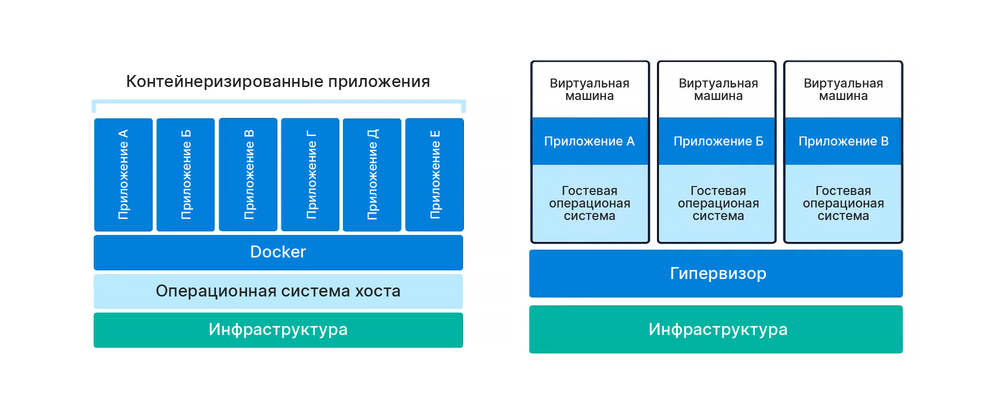
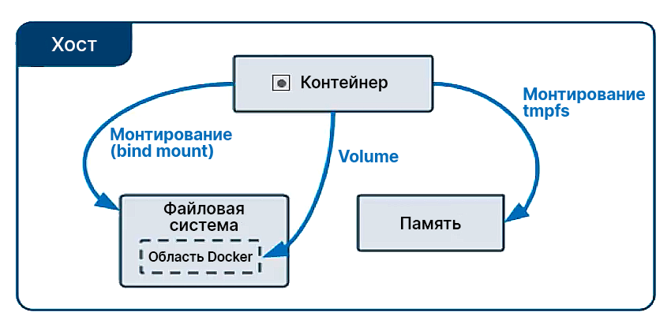

# Docker

**Docker** – инструмент для запуска приложений в изолированной среде.

## Оглавление

[**Docker Compose**](docker-compose.md)

**Docker**:

- [Docker](#docker)
  - [Оглавление](#оглавление)
  - [Источники](#источники)
  - [Контейнеры и виртуальные машины](#контейнеры-и-виртуальные-машины)
  - [Docker Images (образы) и Docker Containers (контейнеры)](#docker-images-образы-и-docker-containers-контейнеры)
    - [Docker Images](#docker-images)
    - [Docker Container](#docker-container)
  - [Pulling images (Получение образов)](#pulling-images-получение-образов)
    - [nginx](#nginx)
  - [Просмотр образов, доступных локально](#просмотр-образов-доступных-локально)
  - [Запуск контейнеров](#запуск-контейнеров)
    - [Запуск контейнера в *detached* режиме](#запуск-контейнера-в-detached-режиме)
  - [Остановка контейнеров](#остановка-контейнеров)
  - [Просмотр запущенных контейнеров](#просмотр-запущенных-контейнеров)
    - [Другой способ](#другой-способ)
  - [Exposing ports (Перенаправление портов)](#exposing-ports-перенаправление-портов)
    - [Exposing multiply ports (Перенаправление нескольких портов)](#exposing-multiply-ports-перенаправление-нескольких-портов)
  - [Управление контейнерами](#управление-контейнерами)
    - [Удаление](#удаление)
    - [Именование контейнеров](#именование-контейнеров)
    - [Форматирование результата `docker ps`](#форматирование-результата-docker-ps)
    - [Docker Volumes (Тома)](#docker-volumes-тома)
      - [Пример с nginx](#пример-с-nginx)
    - [Dockerfile](#dockerfile)
      - [Создание Dockerfile (создание образов)](#создание-dockerfile-создание-образов)
      - [Пример с Node.js и Express](#пример-с-nodejs-и-express)
    - [.dockerignore](#dockerignore)
    - [Кэширование и слои](#кэширование-и-слои)
    - [Alpine Linux](#alpine-linux)
      - [Получение образов Alpine Linux (Pulling Alpine Docker Images)](#получение-образов-alpine-linux-pulling-alpine-docker-images)
    - [Переключение на Alpine](#переключение-на-alpine)
    - [Теги и версионирование](#теги-и-версионирование)
      - [Перезапись тегов (Tagging override)](#перезапись-тегов-tagging-override)
      - [Использование тегов](#использование-тегов)
    - [Реестры Docker (Docker registries)](#реестры-docker-docker-registries)
      - [Docker Hub как пример реестра Docker](#docker-hub-как-пример-реестра-docker)
    - [Docker Inspect](#docker-inspect)
    - [Логи Docker (Docker logs)](#логи-docker-docker-logs)
    - [Доступ к Bash в контейнерах](#доступ-к-bash-в-контейнерах)

## Источники

- [Docker Tutorial for Beginners by Amigoscode](https://www.youtube.com/watch?v=p28piYY_wv8)

## Контейнеры и виртуальные машины

*Контейнер* – это абстракция программного уровня, которая упаковывает *код* и 
*зависимости* вместе. Множество контейнеров могут работать на одной машине и 
делить ядро ОС с другими контейнерами. Каждый контейнер запускается в 
изолированном процессе. Разворачивается быстро, занимает мало места.

> Контейнер не требует полноценную операционную систему.

*Виртуальные машины (VM)* – это абстракция физического уровня, превращающая 
*один сервер* во *множество серверов*. Гипервизор позволяет множеству VM 
запускаться на одной машине. Каждая VM включает в себя полноценную копию ОС, 
приложение, необходимые бинарники и библиотеки. Может разворачиваться долго, 
занимает много места.



## Docker Images (образы) и Docker Containers (контейнеры)

### Docker Images

*Образ* (*Image*) – это шаблон для создания окружения на выбор пользователя.

*Образ* – это также снимок (snapshot). Мы можем создавать множество снимков 
(версий) образа и в каждый конкретный момент выбирать нужную нам версию.

Образ **ДОЛЖЕН СОДЕРЖАТЬ ВСЁ НЕОБХОДИМОЕ** для запуска нашего кода.

### Docker Container

*Контейнер* – это **запущенный** экземпляр (instance) образа.

## Pulling images (Получение образов)

[Docker Hub](https://hub.docker.com/) содержит готовые образы в публичном 
доступе.

### nginx

На странице [nginx на Docker Hub](https://hub.docker.com/_/nginx) содержится 
строчка:

```bash
docker pull nginx
```

## Просмотр образов, доступных локально

```bash
docker images
```

или

```bash
docker image ls
```

## Запуск контейнеров

Смотрим доступные локально образы:

```
REPOSITORY   TAG       IMAGE ID       CREATED       SIZE
nginx        latest    12766a6745ee   2 weeks ago   142MB
```

Запускаем `nginx`:

```bash
docker run nginx:latest
```

Нажатие `^C` (`Ctrl + C`) завершит работу контейнера.

### Запуск контейнера в *detached* режиме

```bash
docker run -d nginx:latest
```

Примерный результат команды:

```
0e80a5317c147aa0f740c8a45c6bcd379ca58f1d6dc94c828d2f9a82105af65b
```

Результат команды `docker container ls`:

```
CONTAINER ID   IMAGE          COMMAND                  CREATED          STATUS          PORTS     NAMES
0e80a5317c14   nginx:latest   "/docker-entrypoint.…"   34 seconds ago   Up 33 seconds   80/tcp    busy_volhard
```

## Остановка контейнеров

```bash
docker stop <id_контейнера>
```

или

```bash
docker stop <имя_контейнера>
```

> При просмотре контейнеров `<id_контейнера>` отображается в поле 
> `CONTAINER_ID`.

> При просмотре контейнеров `<имя_контейнера>` отображаются в поле `NAMES`

> Но мы снова сможем запустить эти контейнеры по `<id_контейнера>` или по 
> `<имя_контейнера>`, заменив в команде `stop` на `start`, про удаление см. 
> ниже

## Просмотр запущенных контейнеров

```bash
docker container ls
```

Примерный результат команды:

```
CONTAINER ID   IMAGE          COMMAND                  CREATED          STATUS          PORTS     NAMES
e81499d5b790   nginx:latest   "/docker-entrypoint.…"   46 seconds ago   Up 45 seconds   80/tcp    bold_elion
```

### Другой способ

```bash
docker ps
```

## Exposing ports (Перенаправление портов)

Допустим, контейнер использует TCP-порт `80`. Мы хотим пробросить этот порт на 
хост как `8080` (точнее, мы хотим указывать `8080`\`м портом хоста на `80`\`й 
порт контейнера). При этом с хоста не будет доступен порт `80` напрямую.

```bash
docker run -d -p 8080:80 nginx:latest
```

Результат `docker ps`:

```
CONTAINER ID   IMAGE          COMMAND                  CREATED         STATUS        PORTS                  NAMES
92afa9cad88c   nginx:latest   "/docker-entrypoint.…"   2 seconds ago   Up 1 second   0.0.0.0:8080->80/tcp   nifty_joliot
```

Обращаем внимание на:

```
PORTS
0.0.0.0:8080->80/tcp
```

Здесь `80` – порт контейнера, а `8080` – порт хоста.

### Exposing multiply ports (Перенаправление нескольких портов)

Допустим, мы хотим указывать портами `8080` и `3000` хоста на порт `80` 
контейнера.

```bash
docker run -d -p 3000:80 -p 8080:80 nginx:latest
```

## Управление контейнерами

Просмотрим справку по `docker ps`

```bash
docker ps --help
```

Результат:

```
Usage:  docker ps [OPTIONS]

List containers

Options:
  -a, --all             Show all containers (default shows just running)
  -f, --filter filter   Filter output based on conditions provided
      --format string   Pretty-print containers using a Go template
  -n, --last int        Show n last created containers (includes all states) (default -1)
  -l, --latest          Show the latest created container (includes all states)
      --no-trunc        Don't truncate output
  -q, --quiet           Only display container IDs
  -s, --size            Display total file sizes
```

Отсюда видим, что по умолчанию показываются *только запущенные контейнеры*. 
Чтобы отображались все, нужно указать параметр `-a`.

### Удаление

```bash
docker rm <id_контейнера>
```

или

```bash
docker rm <имя_контейнера>
```

> Если написать `docker ps --help`, можно увидеть, что у `docker ps` есть 
> параметр `-q` (`--quiet`), который выводит только числовые идентификаторы 
> (ID).
> 
> Так для удаления всех контейнеров можно использовать команду 
> `docker rm $(docker ps -aq)`. Но это не сработает для работающих контейнеров.
> Для принудительного удаления следует использовать 
> `docker rm -f $(docker ps -aq)`.

### Именование контейнеров

Запустим контейнер командой `docker run -d -p 3000:80 -p 8080:80 nginx:latest`.

Результат `docker ps`:

```
CONTAINER ID   IMAGE          COMMAND                  CREATED          STATUS          PORTS                                        NAMES
1ae36f78952b   nginx:latest   "/docker-entrypoint.…"   42 seconds ago   Up 40 seconds   0.0.0.0:3000->80/tcp, 0.0.0.0:8080->80/tcp   hardcore_kirch
```

Нас интересует поле `NAMES`:

```
NAMES
hardcore_kirch
```

> По умолчанию Docker сам генерирует название контейнеров

Удалим контейнер, создадим такой же с именем `website`:

```bash
docker run --name website -d -p 3000:80 -p 8080:80 nginx:latest
```

### Форматирование результата `docker ps`

Мы хотим применить следующий формат для вывода:

```
ID\t{{.ID}}\nNAME\t{{.Names}}\nImage\t{{.Image}}\nPORTS\t{{.Ports}}\nCOMMAND\t{{.Command}}\nCREATED\t{{.CreatedAt}}\nSTATUS\t{{.Status}}\n
```

Для этого пишем команду:

```bash
docker ps --format="ID\t{{.ID}}\nNAME\t{{.Names}}\nImage\t{{.Image}}\nPORTS\t{{.Ports}}\nCOMMAND\t{{.Command}}\nCREATED\t{{.CreatedAt}}\nSTATUS\t{{.Status}}\n"
```

Результат:

```
ID      a7fe61f0970c
NAME    website-two
Image   nginx:latest
PORTS   0.0.0.0:9000->80/tcp
COMMAND "/docker-entrypoint.…"
CREATED 2022-04-23 00:33:49 +0300 MSK
STATUS  Up 4 minutes

ID      4cc1eaab45c8
NAME    website
Image   nginx:latest
PORTS   0.0.0.0:3000->80/tcp, 0.0.0.0:8080->80/tcp
COMMAND "/docker-entrypoint.…"
CREATED 2022-04-23 00:32:03 +0300 MSK
STATUS  Up 2 minutes
```

Для удобства можем создать переменную окружения:

```bash
export FORMAT="ID\t{{.ID}}\nNAME\t{{.Names}}\nImage\t{{.Image}}\nPORTS\t{{.Ports}}\nCOMMAND\t{{.Command}}\nCREATED\t{{.CreatedAt}}\nSTATUS\t{{.Status}}\n"
```

И тогда сможем писать просто:

```bash
docker ps --format=$FORMAT
```

### Docker Volumes (Тома)

*Volumes* 
([тома](https://ru.wikipedia.org/wiki/%D0%A2%D0%BE%D0%BC_(%D1%81%D0%B8%D1%81%D1%82%D0%B5%D0%BC%D1%8B_%D1%85%D1%80%D0%B0%D0%BD%D0%B5%D0%BD%D0%B8%D1%8F))) 
позволяют обмениваться файлами и директориями **между хостом и контейнером** и 
**между контейнерами**.

> Например, если мы создадим файл на хосте, он сразу же будет доступен 
> из Volume. И наоборот, создав файл в Volume, мы получим его и на хосте.



#### Пример с nginx

Перейдём на 
[страницу официального образа nginx](https://hub.docker.com/_/nginx).

Найдём там:

-> Hosting some simple static content <-

```bash
docker run --name some-nginx -v /some/content:/usr/share/nginx/html:ro -d nginx
```

`/some/content` – источник, `/usr/share/nginx/html` – место назначения, `ro` – 
readonly (только на чтение).

- **Volumes между хостом и контейнером**

  Создадим HTML-файл `index.html` по пути `~/website` со следующим содержанием:

  ```html
  <h1>Hello Docker and Volumes!</h1>
  ```

  Выполним команду:

  ```bash
   docker run --name website -v $(pwd):/usr/share/nginx/html:ro -d -p 8080:80 nginx
  ```

  > Команда `pwd` распечатывает текущий путь

  Теперь по адресу `http://localhost:8080/` мы получаем наш HTML-файл.

  *Если мы изменим файл в Volume в контейнере, он также изменится на хосте*:

  Зайдём в **bash**-оболочку контейнера `website` с помощью команды:

  ```bash
  docker exec -it website bash
  ```

  > Подробнее о `docker exec` можно узнать с помощью команды 
  > `docker exec --help`.

  Создадим таким образом, например, файл `about.html` в Volume:

  ```bash
  cd /usr/share/nginx/html/
  ```

  ```bash
  touch about.html
  ```

  Но произойдёт ошибка:

  ```
  touch: cannot touch 'about.html': Read-only file system
  ```

  (Volume только для чтения)

  Удалим контейнер `website` и создадим новый с Volume для чтения и записи:

  ```bash
  docker rm -f website
  ```

  ```bash
  docker run --name website -v $(pwd):/usr/share/nginx/html -d -p 8080:80 nginx
  ```

  Снова перейдём в **bash**-оболочку и создадим `about.html`:

  Убедимся, что файл появился также на хосте.

- **Volumes между контейнерами**

  Создадим "клона" (будет использовать тот же Volume) контейнера `website`:

  ```bash
  docker run --name website-copy --volumes-from website -d -p 8081:80 nginx
  ```

  Теперь по адресу `http://localhost:8081/` мы увидим то же, что и по 
  `http://localhost:8080/`.

### Dockerfile

*Dockerfile* позволяет строить собственные образы (images). Он содержит 
описание шагов для создания образов.

[Документация по Dockerfile](https://docs.docker.com/engine/reference/builder/).

#### Создание Dockerfile (создание образов)

**Важно! ОБРАЗ ДОЛЖЕН СОДЕРЖАТЬ ВСЁ НЕОБХОДИМОЕ** для запуска и работы 
приложения.

- Пусть в директории `~/website` имеются следующие файлы (результат команды 
  `ls -l`):

  ```
  drwxr-xr-x 3 shuryak shuryak  4096 Apr 24 01:05 assets
  drwxr-xr-x 2 shuryak shuryak  4096 Apr 24 01:05 css
  -rw-r--r-- 1 shuryak shuryak 12900 Mar 23 19:42 index.html
  drwxr-xr-x 2 shuryak shuryak  4096 Apr 24 01:05 js
  ```

  Создадим простой `Dockerfile` (такое название обязательно) со следующим 
  содержимым:

  ```dockerfile
  # Образ основан на образе nginx:latest:
  FROM nginx:latest
  # Помещаем локальные файлы из директории "." в директорию
  # "/usr/share/nginx/html":
  ADD . /usr/share/nginx/html
  ```

- Соберём образ:

  В директории `~/website` выполним команду:

  ```bash
  docker build --tag website:latest .
  ```

  (Эта команда соберёт наш образ. `website:latest` – тег образа, `.` – 
  расположение `Dockerfile`)

  Удалим все контейнеры и выполним команду для запуска контейнера, основанного 
  на образе `website`:

  ```bash
  docker run --name my-website -p 8080:80 -d website:latest
  ```

#### Пример с Node.js и Express

- Создадим директорию `~/user-service-api` и перейдём в неё.

  Создадим приложение с помощью `npm`:

  ```bash
  npm init
  ```

  Установим фреймворк **Express**:

  ```bash
  npm i express
  ```

  Создадим файл `index.js` со следующим содержимым:

  ```javascript
  const express = require('express')
  const app = express()
  const port = 3000

  app.get('/', (req, res) => res.json([
    {
      name: 'Bob',
      email: 'bob@gmail.com'
    }
  ]))

  app.listen(port, () => console.log(`App listening on port ${port}`))
  ```

  > Запуск приложения осуществляется с помощью команды `node index.js`.

- Создадим `Dockerfile` со следующим содержимым:

  ```dockerfile
  # За основу берём образ node:
  FROM node:latest
  # Рабочей директорией назначаем "/app":
  WORKDIR /app
  # Всё из директории хоста копируем в "/app" ("." в образе – это "/app")
  ADD . .
  # Команда для установки пакетов (выполнится при запуске контейнера и этот слой 
  # зафиксируется):
  RUN npm install
  # Команда для запуска приложения (выполнится при запуске контейнера):
  CMD node index.js
  ```

- Создадим образ с тегом `user-service-api:latest` с помощью команды:

  ```bash
  docker build --tag user-service-api:latest .
  ```

- Запустим контейнер этого образа с помощью команды:

  ```bash
  docker run --name user-api -d -p 3000:3000 user-service-api:latest
  ```

### .dockerignore

`.dockerignore` имеет синтаксис как в `.gitignore`.

Применяется в случае копирования данных с хоста в рабочую директорию контейнера.

### Кэширование и слои

Каждые шаги в наших `Dockerfile` до этого мы создавали слои. Слои используются 
в кэшировании.

Установим зависимости для нашего приложения из примера выше:

```bash
npm i react webpack gulp grunt
```

Соберём образ с помощью команды:

```bash
docker build --tag user-service-api:latest .
```

Результат выполнения команды:

```diff
[+] Building 24.8s (9/9) FINISHED
 => [internal] load build definition from Dockerfile                                                                                                                  0.0s
 => => transferring dockerfile: 38B                                                                                                                                   0.0s
 => [internal] load .dockerignore                                                                                                                                     0.0s
 => => transferring context: 69B                                                                                                                                      0.0s
 => [internal] load metadata for docker.io/library/node:latest                                                                                                        3.4s
 => [1/4] FROM docker.io/library/node:latest@sha256:e5b7b349d517159246070bf14242027a9e220ffa8bd98a67ba1495d969c06c01                                                  0.0s
 => [internal] load build context                                                                                                                                     0.0s
 => => transferring context: 355.64kB                                                                                                                                 0.0s
+ => CACHED [2/4] WORKDIR /app                                                                                                                                         0.0s
 => [3/4] ADD . .                                                                                                                                                     0.1s
 => [4/4] RUN npm install                                                                                                                                            19.4s
 => exporting to image                                                                                                                                                1.8s
 => => exporting layers                                                                                                                                               1.8s
 => => writing image sha256:ada46a5e83118f1453932bb7a416c9e99ce356c890bdb9a45fa88b35955e6046                                                                          0.0s
 => => naming to docker.io/library/user-service-api:latest
```

Из результат видно, что были использованы кэшированные слои.

- Мы можем улучшить `Dockerfile` из предыдущего примера

  Было:

  ```dockerfile
  FROM node:latest
  WORKDIR /app
  ADD . .
  RUN npm install
  CMD node index.js
  ```

  Стало:

  ```dockerfile
  FROM node:latest
  WORKDIR /app
  ADD package*.json .
  RUN npm install
  ADD . .
  CMD node index.js
  ```

  Теперь мы не будем очень часто проверять, что внутри `package.json` и 
  `package-lock.json`. **Docker** будет вычислять всё снова только если эти 
  файлы изменятся, иначе он будет просто пропускать эти шаги, так как они будут 
  закэшированы.

  Результат сборки:

  Собираем первый раз:

  ```diff
  - [+] Building 32.8s (10/10) FINISHED
   => [internal] load build definition from Dockerfile                                                               0.0s
   => => transferring dockerfile: 135B                                                                               0.0s
   => [internal] load .dockerignore                                                                                  0.0s
   => => transferring context: 34B                                                                                   0.0s
   => [internal] load metadata for docker.io/library/node:latest                                                     2.1s
   => [1/5] FROM docker.io/library/node:latest@sha256:e5b7b349d517159246070bf14242027a9e220ffa8bd98a67ba1495d969c06  0.0s
   => [internal] load build context                                                                                  0.0s
   => => transferring context: 132B                                                                                  0.0s
   => CACHED [2/5] WORKDIR /app                                                                                      0.0s
   => [3/5] ADD package*.json .                                                                                      0.0s
  - => [4/5] RUN npm install                                                                                         27.3s
   => [5/5] ADD . .                                                                                                  0.1s
   => exporting to image                                                                                             3.1s
   => => exporting layers                                                                                            3.1s
   => => writing image sha256:2ac194accb07685b5d738ea2c994c9ffa109e55b93b21da70d7d09e136f688ff                       0.0s
   => => naming to docker.io/library/user-service-api:latest
  ```

  Собираем второй раз, что-то поменяв в `index.js`:

  ```diff
  + [+] Building 4.8s (10/10) FINISHED
   => [internal] load build definition from Dockerfile                                                               0.0s
   => => transferring dockerfile: 37B                                                                                0.0s
   => [internal] load .dockerignore                                                                                  0.0s
   => => transferring context: 34B                                                                                   0.0s
   => [internal] load metadata for docker.io/library/node:latest                                                     3.1s
   => [1/5] FROM docker.io/library/node:latest@sha256:e5b7b349d517159246070bf14242027a9e220ffa8bd98a67ba1495d969c06  0.0s
   => [internal] load build context                                                                                  0.0s
   => => transferring context: 502B                                                                                  0.0s
   => CACHED [2/5] WORKDIR /app                                                                                      0.0s
   => CACHED [3/5] ADD package*.json .                                                                               0.0s
  + => CACHED [4/5] RUN npm install                                                                                   0.0s
   => [5/5] ADD . .                                                                                                  1.4s
   => exporting to image                                                                                             0.1s
   => => exporting layers                                                                                            0.0s
   => => writing image sha256:fabbccd7914ceebff91795a79dddb8ec18c1e25c186fa7cdab467793c807cb71                       0.0s
   => => naming to docker.io/library/user-service-api:latest                                                         0.0s
  ```

### Alpine Linux

Наши образы занимают достаточно много места на диске. В этом можно убедиться с 
помощью команды `docker image ls`:

```
REPOSITORY         TAG              IMAGE ID       CREATED          SIZE
user-service-api   latest           fabbccd7914c   16 minutes ago   1.03GB
website            latest           f1e5e9e855ea   2 days ago       143MB
node               latest           738d733448be   4 days ago       995MB
nginx              latest           12766a6745ee   3 weeks ago      142MB
```

Можно сократить занимаемое место с помощью дистрибутива **Alpine Linux**.

> *A container requires no more than 8 MB and a minimal installation to disk 
> requires around 130 MB of storage* — 
> [About Alpine Linux](https://www.alpinelinux.org/about/).

#### Получение образов Alpine Linux (Pulling Alpine Docker Images)

На [Docker Hub](https://hub.docker.com/) для многих образов на их страницах в 
разделе "*Supported tags and respective `Dockerfile` links*" можно найти версии 
с тегом `alpine`.

Например, нас интересует версия с тегом `alpine` для образа 
[node](https://hub.docker.com/_/node).

Выполним pulling:

```bash
docker pull node:alpine
```

Посмотрим `docker image ls`:

```diff
REPOSITORY         TAG       IMAGE ID       CREATED          SIZE
user-service-api   latest    fabbccd7914c   22 minutes ago   1.03GB
website            latest    f1e5e9e855ea   2 days ago       143MB
- node               latest    738d733448be   4 days ago       995MB
+ node               alpine    de1a9de7d955   4 days ago       172MB
nginx              latest    12766a6745ee   3 weeks ago      142MB
```

### Переключение на Alpine

Для использования `alpine`-версий в своих репозиториях, нужно поменять строку 
в `Dockerfile` с, например:

```dockerfile
FROM <название_базового_образа>:latest
```

на, например:

```dockerfile
FROM <название_базового_образа>:alpine
```

### Теги и версионирование

Теги и версии позволяют контролировать то, какой конкретно образ мы хотим 
использовать. Это, в первую очередь, помогает избегать изменений, которые 
поломают работу нашего приложения. *Это безопасно*.

> К примеру, сегодня `docker pull node:latest` сделает pull 8-й версии 
> **Node**, а завтра уже 12-й. Это может сломать работу нашего приложения.
>
> Но мы можем всё проконтролировать. Например, `docker pull node:8-alpine`.

#### Перезапись тегов (Tagging override)

Если сделать какие-то изменения в образе и при его сборке повторно использовать 
какой-то тег, то в `docker image ls` можно увидеть подобное:

```diff
REPOSITORY         TAG       IMAGE ID       CREATED         SIZE
user-service-api   latest    af7a5a5a5632   5 seconds ago   1.03GB
+ <none>             <none>    fabbccd7914c   24 hours ago    1.03GB
```

> Повторно используя тег, мы его стираем с предыдущего образа.

#### Использование тегов

Соберём образ `shuryak-website:latest`:

```bash
docker build -t shuryak-website:latest .
```

Создадим образ, основанный на `latest`-теге `shuryak-website` с тегом `1`:

```bash
docker tag shuryak-website:latest shuryak-website:1
```

Результат `docker image ls`:

```
REPOSITORY         TAG       IMAGE ID       CREATED          SIZE
shuryak-website    1         f1e5e9e855ea   3 days ago       143MB
shuryak-website    latest    f1e5e9e855ea   3 days ago       143MB
```

Оба образа из результата имеют одинаковое содержание.

Внесём какие-нибудь изменения в наше приложение. После чего соберём снова 
`latest`-образ:

```bash
docker build -t shuryak-website:latest .
```

И теперь создадим на основе `latest`-образа образ `shuryak-website:2`:

```bash
docker tag shuryak-website:latest shuryak-website:2
```

Результат `docker image ls`:

```
REPOSITORY         TAG       IMAGE ID       CREATED              SIZE
shuryak-website    2         2df2397a258f   About a minute ago   143MB
shuryak-website    latest    2df2397a258f   About a minute ago   143MB
shuryak-website    1         f1e5e9e855ea   3 days ago           143MB
```

- Запустим по одному контейнеру на каждый образ:

  ```bash
  docker run --name shuryak-latest -p 8080:80 -d shuryak-website:latest
  ```

  ```bash
  docker run --name shuryak-2 -p 8081:80 -d shuryak-website:2
  ```

  ```bash
  docker run --name shuryak-1 -p 8082:80 -d shuryak-website:1
  ```

  На портах `8080` (`latest`) и `8081` (`2`) будет расположена актуальная 
  версия приложения. На порту `8082` (`1`) – более ранняя.

### Реестры Docker (Docker registries)

Реестр Docker – серверное приложение с высокой масштабируемостью, которое 
хранит и позволяет распространять пользовательские образы Docker.

Могут использоваться в CI/CD и просто для запуска приложений (мы можем 
загрузить в реестр *контейнер* с хоста и использовать для запуска инстансов 
нашего приложения).

> Реестры бывают *публичными* и *приватными*.

#### Docker Hub как пример реестра Docker

Нажимаем "Create Repository" на 
[странице репозиториев](https://hub.docker.com/repositories).

После создания, на странице репозитория можно увидеть команду для пушинга:

```bash
docker push <имя_пользователя>/<название_репозитория>:<тег>
```

- Выполним пуш с хоста в реестр:

  Сначала нужно назначить теги нашим локальным образам, согласно формату 
  `<имя_пользователя>/<название_репозитория>:<тег>`:

  ```bash
  docker tag shuryak-website:1 testuser010/website:1
  ```

  ```bash
  docker tag shuryak-website:2 testuser010/website:2
  ```

  ```bash
  docker tag shuryak-website:latest testuser010/website:latest
  ```

  Далее необходимо авторизоваться:

  ```bash
  docker login
  ```

  Результат:

  ```
  Login with your Docker ID to push and pull images from Docker Hub. If you don't have a Docker ID, head over to https://hub.docker.com to create one.
  Username: testuser010
  Password:
  Login Succeeded

  Logging in with your password grants your terminal complete access to your account.
  For better security, log in with a limited-privilege personal access token. Learn more at https://docs.docker.com/go/access-tokens/
  ```

  Выполним непосредственно пуши:

  ```bash
  docker push testuser010/website:1
  ```

  ```bash
  docker push testuser010/website:2
  ```

  ```bash
  docker push testuser010/website:latest
  ```

- Выполним пулл с реестра на хост

  Например:

  ```bash
  docker pull testuser010/website
  ```

### Docker Inspect

Для любого контейнера мы можем выполнить команду `docker inspect`, чтобы 
посмотреть полную информацию о нём в формате **JSON**:

```bash
docker inspect <id_контейнера>
```

или

```bash
docker inspect <имя_контейнера>
```

### Логи Docker (Docker logs)

Для любого контейнера мы можем выполнить команду `docker logs`, чтобы 
посмотреть всю информацию, что он выводил в консоль:

```bash
docker logs <id_контейнера>
```

или

```bash
docker logs <имя_контейнера>
```

> Можно просматривать логи в режиме реального времени с помощью флага `-f`.

### Доступ к Bash в контейнерах

Результат команды `docker exec --help`:

```
Usage:  docker exec [OPTIONS] CONTAINER COMMAND [ARG...]

Run a command in a running container

Options:
  -d, --detach               Detached mode: run command in the
                             background
      --detach-keys string   Override the key sequence for
                             detaching a container
  -e, --env list             Set environment variables
      --env-file list        Read in a file of environment
                             variables
  -i, --interactive          Keep STDIN open even if not attached
      --privileged           Give extended privileges to the
                             command
  -t, --tty                  Allocate a pseudo-TTY
  -u, --user string          Username or UID (format:
                             <name|uid>[:<group|gid>])
  -w, --workdir string       Working directory inside the container
```

Чтобы получить доступ к привычному **Bash** следует выполнить следующую команду:

```bash
docker exec -it <id_контейнера> /bin/bash
```

или

```bash
docker exec -it <имя_контейнера> /bin/bash
```

> Иногда `/bin/bash` может отсутствовать, тогда можно попробовать `/bin/sh`.
