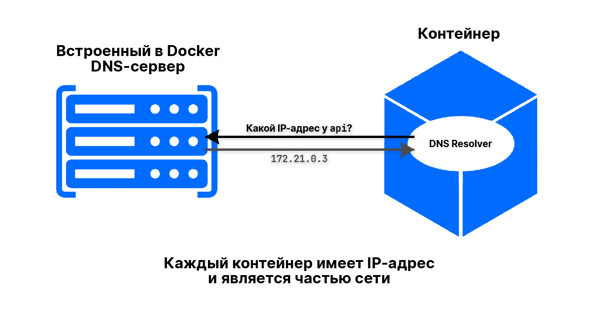

# Docker Compose

**Docker Compose** – это инструмент для определения и запуска 
мультиконтейнерных приложений.

**Docker Compose** использует конфигурацию на основе **YAML**-файла.

## Источники

- [Docker Compose Tutorial by *Programming with Mosh*](https://www.youtube.com/watch?v=HG6yIjZapSA)

## Оглавление

- [Docker Compose](#docker-compose)
  - [Источники](#источники)
  - [Оглавление](#оглавление)
  - [**YAML** VS **JSON**](#yaml-vs-json)
  - [`docker-compose.yml` (`docker-compose.yaml`)](#docker-composeyml-docker-composeyaml)
    - [Пример:](#пример)
  - [Запуск и остановка](#запуск-и-остановка)
    - [Запуск](#запуск)
      - [Запуск в *detached*-режиме](#запуск-в-detached-режиме)
      - [Запуск со предварительной сборкой](#запуск-со-предварительной-сборкой)
    - [Остановка](#остановка)
  - [Docker Networking (Сеть Docker)](#docker-networking-сеть-docker)
    - [`ping`](#ping)
    - [`ifconfig`](#ifconfig)

## **YAML** VS **JSON**

Пример **JSON**-файла:

```json
{
  "name": "Alexander Konovalov",
  "age": 18,
  "is_developer": true,
  "programming_langs": ["CSharp", "JS"],
  "skills": {
    "CSharp": 60,
    "JS": 30
  }
}
```

Тот же пример но на **YAML**:

```yaml
---
name: Alexander Konovalov
age: 18
is_developer: true
programming_langs:
  - CSharp
  - JS
skills:
  CSharp: 60
  JS: 30
```

> **YAML** сложнее парсить, чем **JSON**. **YAML** проще для людей, **JSON** 
> проще для машин.

## `docker-compose.yml` (`docker-compose.yaml`)

В начале файла указывается 
[версия спецификации](https://docs.docker.com/compose/compose-file/compose-versioning/) 
в поле `version`.

Далее в `services` описываются сервисы.

### Пример:

В каталоге [`services`](services/) находятся два сервиса с `Dockerfile`:

- [`calculator-backend`](services/calculator-backend/) – **REST API** 
  мини-калькулятора на **ASP.NET Core** (**C#**).

  [`Dockerfile`](services/calculator-backend/Dockerfile):

  ```dockerfile
  FROM mcr.microsoft.com/dotnet/sdk:6.0 AS build
  WORKDIR /app
  EXPOSE 80

  COPY CalculatorBackend.sln ./
  COPY CalculatorBackend/*.csproj ./CalculatorBackend/
  RUN dotnet restore -r linux-x64

  COPY CalculatorBackend/* ./CalculatorBackend/
  RUN dotnet publish -c Release -o out -r linux-x64 --self-contained false --no-restore

  FROM mcr.microsoft.com/dotnet/aspnet:6.0
  WORKDIR /app
  COPY --from=build /app/out .
  ENTRYPOINT ["dotnet", "CalculatorBackend.dll"]
  ```

- [`calculator-frontend`](services/calculator-frontend/) – **SPA** 
  мини-калькулятора на **React**.

  [`Dockerfile`](services/calculator-frontend/Dockerfile):

  ```dockerfile
  FROM node:18-alpine as build
  ARG API_HOST
  ARG API_PORT

  WORKDIR /app
  COPY package*.json ./
  RUN npm install
  COPY . .

  RUN REACT_APP_API_HOST=${API_HOST} \
      REACT_APP_API_PORT=${API_PORT} \
      npm run build

  FROM nginx:stable-alpine
  COPY --from=build /app/build /usr/share/nginx/html
  EXPOSE 80
  CMD ["nginx", "-g", "daemon off;"]
  ```

  > Для этого сервиса использована небольшая хитрость для передачи *переменных 
  > окружения*. Подробнее: 
  > [ReactJS + Docker — Environment Variables](https://medium.com/swlh/reactjs-docker-environment-variables-f35eb591683e).

Ещё одним сервисом выступает `postgres`.

[`docker-compose`](services/docker-compose.yml):

```yaml
version: "3.8"

services:
  web:
    links:
      - api
    build:
      context: ./calculator-frontend
      args:
        API_HOST: 'http://localhost'
        API_PORT: 8080
    ports:
      - 80:80
  api:
    build: ./calculator-backend
    ports:
      - 8080:80
    environment:
      DB_HOST: db
      DB_PORT: 5432
      DB_NAME: historydb
      DB_USER: shuryak
      DB_PASSWORD: secret1000
  db:
    image: postgres:14.2-alpine
    ports:
      - 5432:5432
    volumes:
      - history:/var/lib/postgresql/data
    environment:
      POSTGRES_USER: shuryak
      POSTGRES_PASSWORD: secret1000
      POSTGRES_DB: historydb

volumes:
  history:
```

**Docker Compose** помогает нам связать эти сервисы и запускать их одной 
командой.

> С командой `docker-compose` можно работать почти как с командой `docker`. 
> Например, выполнять `docker-compose ps`, `docker-compose build` и т.д.

## Запуск и остановка

### Запуск

```bash
docker-compose up
```

#### Запуск в *detached*-режиме

```bash
docker-compose up -d
```

#### Запуск со предварительной сборкой

```bash
docker-compose up --build
```

### Остановка

```bash
docker-compose down
```

## Docker Networking (Сеть Docker)

В `docker-compose.yml` следует обратить внимание на строчку:

```diff
...
api:
    build: ./calculator-backend
    ports:
      - 8080:80
    environment:
+      DB_HOST: db
...
```

> Вместо реального имени хоста, мы передаём его алиас.

При запуске нашего приложения, **Docker Compose** автоматически создаёт сеть:

Результат команды `docker-compose up -d`:

```diff
+ Creating network "services_default" with the default driver
Creating services_api_1 ... done
Creating services_db_1  ... done
Creating services_web_1 ... done
```

Мы можем посмотреть все сети **Docker** с помощью команды `docker network ls`:

```
NETWORK ID     NAME               DRIVER    SCOPE
9bf00a59600b   bridge             bridge    local
e72b34aa689f   host               host      local
48d16749a391   none               null      local
6fe8f3746a6a   services_default   bridge    local
```

### `ping`

Запустим наше приложение и войдем в `bash` (или `/bin/sh`) какого-нибудь 
контейнера с помощью команды `docker exec -it <контейнер> /bin/sh`.

Например, мы в контейнере `web`. Из него мы можем пинговать `api`-контейнер по 
алиасу сети `api` с помощью команды `ping api`:

```
64 bytes from 172.19.0.2: seq=0 ttl=64 time=0.115 ms
64 bytes from 172.19.0.2: seq=1 ttl=64 time=0.113 ms
64 bytes from 172.19.0.2: seq=2 ttl=64 time=0.096 ms
64 bytes from 172.19.0.2: seq=3 ttl=64 time=0.089 ms
```

Как это происходит:



### `ifconfig`

```
eth0      Link encap:Ethernet  HWaddr 02:42:AC:13:00:04  
          inet addr:172.19.0.4  Bcast:172.19.255.255  Mask:255.255.0.0
          UP BROADCAST RUNNING MULTICAST  MTU:1500  Metric:1
          RX packets:23 errors:0 dropped:0 overruns:0 frame:0
          TX packets:6 errors:0 dropped:0 overruns:0 carrier:0
          collisions:0 txqueuelen:0
          RX bytes:1774 (1.7 KiB)  TX bytes:476 (476.0 B)

lo        Link encap:Local Loopback
          inet addr:127.0.0.1  Mask:255.0.0.0
          UP LOOPBACK RUNNING  MTU:65536  Metric:1
          RX packets:4 errors:0 dropped:0 overruns:0 frame:0
          TX packets:4 errors:0 dropped:0 overruns:0 carrier:0
          collisions:0 txqueuelen:1000
          RX bytes:215 (215.0 B)  TX bytes:215 (215.0 B)
```
