# Kubernetes

[Wikipedia](https://ru.wikipedia.org/wiki/Kubernetes):

**Kubernetes** (от др. -греч. *κυβερνήτης* — «*кормчий*», «*рулевой*», часто 
также используется нумероним *k8s*) — открытое программное обеспечение для 
[*оркестровки*](https://ru.wikipedia.org/wiki/%D0%9E%D1%80%D0%BA%D0%B5%D1%81%D1%82%D1%80%D0%BE%D0%B2%D0%BA%D0%B0_(%D0%98%D0%A2)) 
контейнеризированных приложений — автоматизации их развёртывания, 
масштабирования и координации в условиях кластера.

Задачи **Kubernetes**:

- Деплой и управление приложениями (**контейнерами**)
- Масштабирование и сужение согласно текущим требованиям
- Деплой с нулевым временем простоя (*zero downtime*)
- Откаты
- И многое другое

## Источники

- [Mastering Kubernetes. Master k8s from A to Z](https://amigoscode.com/p/kubernetes)

> [GitHub-репозиторий видеокурса](https://github.com/amigoscode/kubernetes).

## Оглавление

- [Kubernetes](#kubernetes)
  - [Источники](#источники)
  - [Оглавление](#оглавление)
  - [Понятие кластера (Cluster)](#понятие-кластера-cluster)
  - [Master-нода](#master-нода)
    - [Control Plane](#control-plane)
    - [API Server](#api-server)
    - [Cluster Store (etcd)](#cluster-store-etcd)
    - [Scheduler](#scheduler)
    - [Controller Manager](#controller-manager)
    - [Cloud Controller Manager](#cloud-controller-manager)
    - [Подытог сведений о master-ноде](#подытог-сведений-о-master-ноде)
  - [Worker-ноды](#worker-ноды)
    - [Kubelet](#kubelet)
    - [Среда выполнения контейнера (Container Runtime)](#среда-выполнения-контейнера-container-runtime)
    - [Kube Proxy](#kube-proxy)
  - [Запуск Kubernetes](#запуск-kubernetes)
    - [Что значит *управляемые* **Kubernetes**](#что-значит-управляемые-kubernetes)
      - [Пример на основе **Amazon EKS**](#пример-на-основе-amazon-eks)
    - [Запуск кластера локально](#запуск-кластера-локально)
  - [Minikube](#minikube)
    - [Запуск кластера Minikube](#запуск-кластера-minikube)
    - [Остановка кластера Minikube](#остановка-кластера-minikube)
    - [Удаление кластера Minikube](#удаление-кластера-minikube)
    - [Статус Minikube](#статус-minikube)
    - [IP-адрес master-ноды Minikube](#ip-адрес-master-ноды-minikube)
    - [Запуск Minikube с несколькими нодами](#запуск-minikube-с-несколькими-нодами)
    - [Просмотр логов Minikube](#просмотр-логов-minikube)
      - [Просмотр логов с текущего момента](#просмотр-логов-с-текущего-момента)
      - [Просмотр логов определённой ноды](#просмотр-логов-определённой-ноды)
  - [Kubectl](#kubectl)
    - [Создание и запуск **пода** напрямую (императивный путь)](#создание-и-запуск-пода-напрямую-императивный-путь)
    - [Запуск **пода** с помощью конфигурационного файла (декларативный путь)](#запуск-пода-с-помощью-конфигурационного-файла-декларативный-путь)
    - [Получение списка **подов**](#получение-списка-подов)
      - [Слежение за **подами**](#слежение-за-подами)
      - [Получение списка всех **подов**](#получение-списка-всех-подов)
      - [Получения списка **подов** определённого пространства имён (неймспейса)](#получения-списка-подов-определённого-пространства-имён-неймспейса)
    - [Получение списка ***всего***](#получение-списка-всего)
    - [Получение расширенной информации о **поде**](#получение-расширенной-информации-о-поде)
      - [Выбор формата вывода](#выбор-формата-вывода)
      - [Получение полной информации](#получение-полной-информации)
    - [Получения списка пространств имён (неймспейсов)](#получения-списка-пространств-имён-неймспейсов)
    - [Получение списка **Deployments**](#получение-списка-deployments)
      - [Получение полной информации](#получение-полной-информации-1)
    - [Получение списка **ReplicaSet**](#получение-списка-replicaset)
      - [Получение полной информации](#получение-полной-информации-2)
    - [Получение по Label selectors](#получение-по-label-selectors)
      - [Получение по Label selectors с помощью специального синтаксиса](#получение-по-label-selectors-с-помощью-специального-синтаксиса)
    - [Императивное создание **ConfigMap**](#императивное-создание-configmap)
    - [Императивное создание **Secret**](#императивное-создание-secret)
    - [Проброс порта на хост](#проброс-порта-на-хост)
    - [Удаление **пода**](#удаление-пода)
    - [Дебаг **подов**](#дебаг-подов)
      - [Просмотр логов](#просмотр-логов)
      - [Просмотр логов для определённого контейнера](#просмотр-логов-для-определённого-контейнера)
      - [`exec` в контейнерах](#exec-в-контейнерах)
    - [Просмотр ресурсов API](#просмотр-ресурсов-api)
    - [Исследование кластера](#исследование-кластера)
      - [Подключение к ноде по SSH](#подключение-к-ноде-по-ssh)
  - [**Поды** (**Pods**)](#поды-pods)
    - [Способы создания **подов**](#способы-создания-подов)
      - [Императивный способ](#императивный-способ)
      - [Декларативный способ](#декларативный-способ)
    - [Deployments](#deployments)
    - [ReplicaSet](#replicaset)
      - [Контуры управления (Control loops)](#контуры-управления-control-loops)
      - [Rolling Update](#rolling-update)
      - [Предыдущий **ReplicaSet** после *Rolling Update*](#предыдущий-replicaset-после-rolling-update)
      - [Откат версии](#откат-версии)
      - [Информация о ревизии (версии)](#информация-о-ревизии-версии)
    - [Стратегии деплоя (Deployment Strategy)](#стратегии-деплоя-deployment-strategy)
      - [Настройка Rolling Update](#настройка-rolling-update)
      - [Пауза и продолжение Rolling Update](#пауза-и-продолжение-rolling-update)
    - [Сервисы (Services)](#сервисы-services)
      - [Типы сервисов](#типы-сервисов)
      - [**ClusterIP**](#clusterip)
      - [**NodePort**](#nodeport)
        - [Пример с **NodePort**](#пример-с-nodeport)
      - [**LoadBalancer**](#loadbalancer)
        - [Пример с **LoadBalancer**](#пример-с-loadbalancer)
      - [Пример](#пример)
      - [Для чего нужен сервис `kubernetes`](#для-чего-нужен-сервис-kubernetes)
      - [Для чего нужны `labels`](#для-чего-нужны-labels)
        - [Label selectors](#label-selectors)
      - [Аннотации](#аннотации)
      - [**Service Discovery** (**Обнаружение сервисов**)](#service-discovery-обнаружение-сервисов)
        - [Регистрация сервисов](#регистрация-сервисов)
      - [Endpoints](#endpoints)
      - [**KubeProxy**](#kubeproxy)
      - [Storage (хранилища) и Volumes (тома)](#storage-хранилища-и-volumes-тома)
        - [Volume: EmptyDir](#volume-emptydir)
        - [Volume: HostPath](#volume-hostpath)
        - [Другие Volumes](#другие-volumes)
        - [Персистентные тома (Persistent Volumes)](#персистентные-тома-persistent-volumes)
        - [PersistentVolume Subsystem](#persistentvolume-subsystem)
      - [**ConfigMaps**](#configmaps)
        - [Инъекция **ConfigMaps** в **поды**](#инъекция-configmaps-в-поды)
      - [**Secrets** (**Секреты**)](#secrets-секреты)
        - [Типы **Secrets**](#типы-secrets)
        - [Пуллинг приватного образа Docker](#пуллинг-приватного-образа-docker)

## Понятие кластера (Cluster)

**Кластер** (**Cluster**) – набор **нод** (**node**).

**Нода** (**Node**) – виртуальная (**VM**) или физическая машина.

Это всё может запускаться на облачных платформах таких как *AWS*, *Azure*, 
*Google Cloud* и т.д.

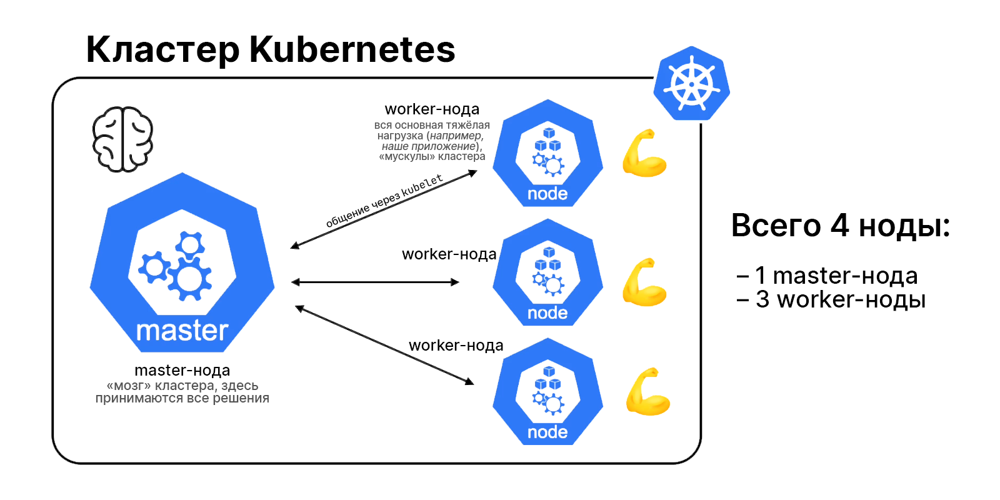

## Master-нода

### Control Plane

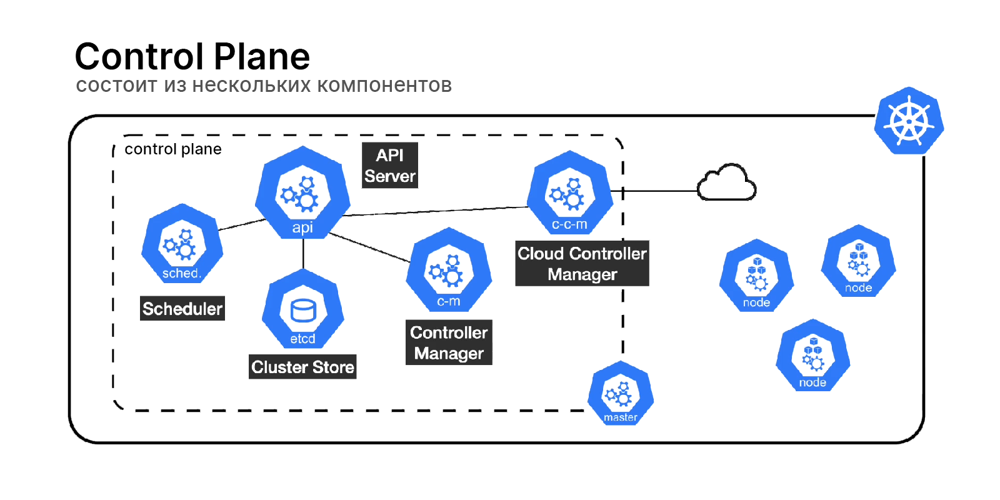

### API Server

**API Server** выступает фронтендом для Control Plane. Все коммуникации 
(внутренние и внешние) проходят через **API Server**.

> **API Server** Открывает порт 443 с RESTful API.
> 
> Также он выполняет проверки аутентификации и авторизации.

### Cluster Store (etcd)

**Cluster Store** хранит весь стейт (состояние) нашего приложения, а также 
конфигурацию. Выступает также распределённым хранилищем *ключ-значение* и 
отдельным [single source of truth](https://en.wikipedia.org/wiki/Single_source_of_truth).

[Официальный сайт etcd](https://etcd.io/).

### Scheduler

**Scheduler** следит за новой нагрузкой/pods и назначает их к нодам по 
отдельным факторам расписания:

- Здорова ли нода? (Is healthy?)
- Достаточно ли ей ресурсов?
- Доступен ли порт?
- Affinity- и Anti Affinity-правила
- и другое

### Controller Manager

**Controller Manager** – это демон, который управляет контуром управления 
(control loop). Это *контроллер контроллеров*.

> 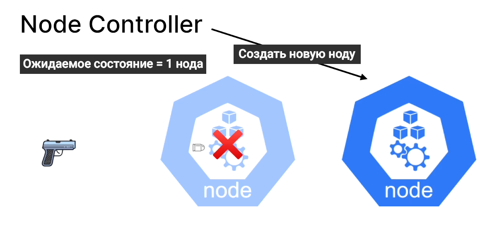
> 
> Другие контроллеры:
> 
> - ReplicaSet. Контроллер, ответственный за обеспечение корректного числа 
>   запущенных подов (pods)
> - Endpoint. Назначает порты сервисам.
> - Namespace.
> - Service Account.

Каждый контроллер следит за изменениями через **API Server**.

Цель: следить за изменениями, которые не совпадают с ожидаемым стейтом 
(состоянием) (if desire state doesn't match the current state). Если не 
совпадают, то "пнуть" соответствующий контроллер, чтобы он попытался исправить 
это.

Контроллер, по-сути, это watch loop.

### Cloud Controller Manager

**Cloud Controller Manager** ответственен за взаимодействие с облачным 
провайдером.

### Подытог сведений о master-ноде

Master-нода запускает все сервисы Control Plane.

## Worker-ноды

**Worker-нода** – это виртуальная или физическая машина (часто под управлением 
 Linux). Предоставляет среду для запуска приложений.

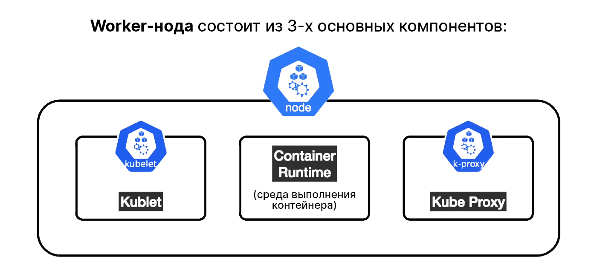

### Kubelet

**Kubelet** – это основной агент, который запускается в каждой отдельной ноде. 
Он получает определение *подов* (*Pods*) с **API Server**. Взаимодействует со 
средой выполнения контейнера (Container Runtime), чтобы запускать контейнеры, 
связанные с подами. Отправляет отчёты нод и подов в Master.

### Среда выполнения контейнера (Container Runtime)

**Среда выполнения контейнера** (**Container Runtime**) ответственна за пулл 
образов (images) с реестров, таких как **Docker Hub**, **Google Container 
Registry**, **Amazon ECR**, **Azure Container Registry** и т.д. Также она 
отвечает за запуск и остановку контейнеров с этих образов, абстрагируя 
управление контейнерами для **Kubernetes**.

Среда также предоставляет **C**ontainer **R**untime **I**nterface (**CRI**), 
который является интерфейсом для *сторонних* (*3rd party*) сред выполнения 
контейнеров.

> **Kubernetes** с какого-то начал использовать по умолчанию **Containerd** 
> вместо Docker. [Подробнее](https://habr.com/ru/company/flant/blog/531120/).
> 
> [Официальный сайт Containerd](https://containerd.io/).

### Kube Proxy

**Kube Proxy** – это агент, который запускается на каждой отдельной ноде через 
**DaemonSets**.

Отвечает за:

- Локальную сеть кластера (Local cluster networking)
- - Каждая нода получает свой уникальный IP-адрес
- Перенаправляет (routing) сетевой траффик на сервисы-балансировщики нагрузки 
  (load balanced services)


## Запуск Kubernetes

Способы запуска Kubernetes:

- Запустить самостоятельно. *Очень сложно*
- Использовать *управляемые **Kubernetes*** (*Managed **Kubernetes***)
- - **EKS** – **E**lastic **K**ubernetes **S**ervice
- - **GKE** – **G**oogle **K**ubernetes **S**ervice
- - **AKS** – **A**zure **K**ubernetes
- - И другие облачные поставщики (провайдеры, providers)

### Что значит *управляемые* **Kubernetes**

*Управляемые **Kubernetes*** избавляют нас от лишней работы с Master-нодой и 
позволяют сфокусироваться на разработке непосредственно нашего приложения.

> **Control Plane** полностью настроена за нас и для нас.

#### Пример на основе **Amazon EKS**

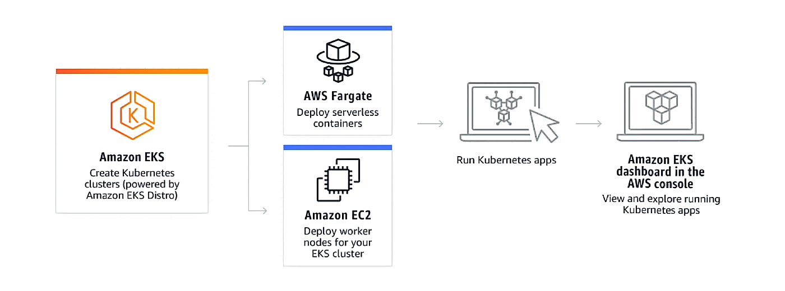

### Запуск кластера локально

Для запуска кластера локально существуют три основных способа:

- **Minikube**
- **Kind**
- **Docker**

Они служат следующим целям:

- Изучение **Kubernetes**
- Локальная разработка или **CI**

**ВАЖНО!** **НЕ НУЖНО ИСПОЛЬЗОВАТЬ ИХ НА РАЗЛИЧНЫХ СРЕДАХ ОКРУЖЕНИЯ, ВКЛЮЧАЯ 
PRODUCTION!**

> Здесь будет использоваться **Minikube**.

## Minikube

[Документация на Minikube](https://minikube.sigs.k8s.io/docs/).

### Запуск кластера Minikube

```bash
minikube start
```

Теперь мы имеем локальный кластер из одной ноды – master-ноды. Внутри находится 
**Control Plane** со всеми компонентами, которые описаны выше. У этой ноды 
есть [*свой IP-адрес*](#ip-адрес-master-ноды-minikube).

### Остановка кластера Minikube

```bash
minikube stop
```

> Все настройки сохранятся.

### Удаление кластера Minikube

```bash
minikube delete
```

### Статус Minikube

```bash
minikube status
```

Примерный результат:

```
minikube
type: Control Plane
host: Running
kubelet: Running
apiserver: Running
kubeconfig: Configured
```

> Результат `docker ps`:
> 
> ```
> CONTAINER ID   IMAGE                                 COMMAND                  CREATED          STATUS          PORTS                                                                                                                                  NAMES
> a0fec3e7dbae   gcr.io/k8s-minikube/kicbase:v0.0.30   "/usr/local/bin/entr…"   22 minutes ago   Up 22 minutes   127.0.0.1:60181->22/tcp, 127.0.0.1:60182->2376/tcp, 127.0.0.1:60184->5000/tcp, 127.0.0.1:60185->8443/tcp, 127.0.0.1:60183->32443/tcp   minikube
> ```

[Драйверы Minikube](https://minikube.sigs.k8s.io/docs/drivers/).

### IP-адрес master-ноды Minikube

```bash
minikube ip
```

### Запуск Minikube с несколькими нодами

Для начала [удалим кластер](#удаление-кластера-minikube).

Напишем `minikube start --help`:

```diff
...
+ -n, --nodes=1: The number of nodes to spin up. Defaults to 1.
...
```

Таким образом запустим кластер с двумя нодами:

```bash
minikube start --nodes=2
```

Результат `minikube status`:

```diff
minikube
+ type: Control Plane
host: Running
kubelet: Running
apiserver: Running
kubeconfig: Configured

minikube-m02
+ type: Worker
host: Running
kubelet: Running
```

Результат [`minikube get nodes`](#исследование-кластера):

```
NAME           STATUS   ROLES                  AGE    VERSION
minikube       Ready    control-plane,master   5m9s   v1.23.3
minikube-m02   Ready    <none>                 3m1s   v1.23.3
```

Теперь мы имеем кластер с двумя нодами и у каждой ноды 
[свой IP-адрес](#ip-адрес-master-ноды-minikube).

### Просмотр логов Minikube

Команда для получения логов master-ноды:

```bash
minikube logs
```

(получает логи **с самого запуска**, их очень много)

#### Просмотр логов с текущего момента

```bash
minikube logs -f
```

#### Просмотр логов определённой ноды

[Получаем список нод](#исследование-кластера).

Далее к `minikube logs` добавляем параметр `--node`, например:

```bash
minikube logs --node='minikube m02' -f
```

## Kubectl

**Kubectl** – инструмент командной строки **Kubernetes**. Представляет собой 
клиент для взаимодействия с **API Server**.

Позволяет взаимодействовать с кластером (посылать ему команды):

- Деплой
- Инспектирование
- Редактирование ресурсов
- Дебаг
- Просмотр логов
- И другое

**Под** (**Pod**) – набор из одного или нескольких контейнеров.

### Создание и запуск **пода** напрямую (императивный путь)

Создадим и запустим **под** с названием `hello-world` на основе Docker-образа 
`amigoscode/kubernetes:hello-world`:

```bash
kubectl run hello-world --image=amigoscode/kubernetes:hello-world --port=80
```

Результат выполнения команды:

```
pod/hello-world created
```

### Запуск **пода** с помощью конфигурационного файла (декларативный путь)

```bash
kubectl apply -f <путь_к_конфигурационному_файлу>
```

> Хитрый запуск через `cat`:
> 
> ```bash
> cat <путь_к_конфигурационному_файлу> | kubectl apply -f -
> ```

### Получение списка **подов**

> `// TODO:`
> - [ ] Универсально описать способы получения сущностей.

Команда получения *текущих **подов*** в *текущем пространстве имён* 
(*неймспейсе*):

```bash
kubectl get pods
```

Примерный результат:

```
NAME          READY   STATUS    RESTARTS   AGE
hello-world   1/1     Running   0          79s
```

#### Слежение за **подами**

Параметр `-w` позволяет получать новые состояния **подов** в реальном времени:

```bash
kubernetes get pods -w
```

#### Получение списка всех **подов**

```bash
kubectl get pods -A
```

#### Получения списка **подов** определённого пространства имён (неймспейса)

```bash
kubectl get pod -n <название_неймспейса>
```

### Получение списка ***всего***

Команда для получения списка *всех* сущностей:

```bash
kubectl get all
```

Команда для получения списка *всех* сущностей *отовсюду*:

```bash
kubectl get all -A
```

Примерный результат:

```
NAMESPACE     NAME                                   READY   STATUS    RESTARTS       AGE
kube-system   pod/coredns-64897985d-f492w            1/1     Running   3 (26h ago)    34h
kube-system   pod/etcd-minikube                      1/1     Running   3 (26h ago)    34h
kube-system   pod/kindnet-dplwt                      1/1     Running   3 (26h ago)    34h
kube-system   pod/kindnet-hzskd                      1/1     Running   3 (26h ago)    34h
kube-system   pod/kube-apiserver-minikube            1/1     Running   3 (26h ago)    34h
kube-system   pod/kube-controller-manager-minikube   1/1     Running   3 (26h ago)    34h
kube-system   pod/kube-proxy-bcpqc                   1/1     Running   3 (26h ago)    34h
kube-system   pod/kube-proxy-ppgxg                   1/1     Running   3 (26h ago)    34h
kube-system   pod/kube-scheduler-minikube            1/1     Running   3 (26h ago)    34h
kube-system   pod/storage-provisioner                1/1     Running   10 (61s ago)   34h

NAMESPACE     NAME                 TYPE        CLUSTER-IP   EXTERNAL-IP   PORT(S)                  AGE
default       service/kubernetes   ClusterIP   10.96.0.1    <none>        443/TCP                  34h
kube-system   service/kube-dns     ClusterIP   10.96.0.10   <none>        53/UDP,53/TCP,9153/TCP   34h

NAMESPACE     NAME                        DESIRED   CURRENT   READY   UP-TO-DATE   AVAILABLE   NODE SELECTOR
AGE
kube-system   daemonset.apps/kindnet      2         2         2       2            2           <none>
34h
kube-system   daemonset.apps/kube-proxy   2         2         2       2            2           kubernetes.io/os=linux   34h

NAMESPACE     NAME                      READY   UP-TO-DATE   AVAILABLE   AGE
kube-system   deployment.apps/coredns   1/1     1            1           34h

NAMESPACE     NAME                                DESIRED   CURRENT   READY   AGE
kube-system   replicaset.apps/coredns-64897985d   1         1         1       34h
```

> Мы получили **поды** (`pod`), **сервисы** (`service`) и другое.

### Получение расширенной информации о **поде**

#### Выбор формата вывода

```bash
kubectl get pod <название_пода> -o wide
```

для вывода в расширенном формате.

Примерный результат:

```
NAME          READY   STATUS    RESTARTS   AGE   IP           NODE           NOMINATED NODE   READINESS GATES
hello-world   1/1     Running   0          34s   10.244.1.2   minikube-m02   <none>           <none>
```

Или

```bash
kubectl get pod <название_пода> -o yaml
```

для вывода в формате **YAML**.

Так же можно указать **JSON**-формат.

#### Получение полной информации

```bash
kubectl describe pod <название_пода>
```

### Получения списка пространств имён (неймспейсов)

```bash
kubectl get namespaces
```

Или

```bash
kubectl get ns
```

### Получение списка **Deployments**

```bash
kubectl get deployments
```

#### Получение полной информации

```bash
kubectl describe deployment <название_deployment>
```

### Получение списка **ReplicaSet**

```bash
kubectl get replicaset
```

Или

```bash
kubectl get rs
```

#### Получение полной информации

```bash
kubectl describe rs <название_replicaset>
```

### Получение по Label selectors

```bash
kubectl get <объект_kubernetes> --selector="<название_селектора>=<значение>,..."
```

Или

```bash
kubectl get <объект_kubernetes> -l <название_селектора>=<значение>,...
```

#### Получение по Label selectors с помощью специального синтаксиса

```bash
kubectl get <объект_kubernetes> -l '<название_селектора> in (<возможное_значение_1>, <..._2>, ..., <...n>), <другие_селекторы_по_аналогии>'
```

> Наряду c `in` можно использовать `notin`.

### Императивное создание **ConfigMap**

Получить помощь можно с помощью следующей команды:

```bash
kubectl create cm -h
```

Пример:

```bash
kubectl create cm config1 --from-literal=key1=value1 --from-literal=key2=value2
```

Результат `kubectl describe cm config1`:

```
Name:         config1
Namespace:    default
Labels:       <none>
Annotations:  <none>

Data
====
key1:
----
value1
key2:
----
value2

BinaryData
====

Events:  <none>
```

### Императивное создание **Secret**

Пример:

```bash
kubectl create secret generic mysecret --from-literal=db-password=123 --from-literal=api-token=token
```

Результат `kubectl get secret mysecret -o yaml`:

```yaml
apiVersion: v1
data:
  api-token: dG9rZW4=
  db-password: MTIz
kind: Secret
metadata:
  creationTimestamp: "2022-06-05T13:03:35Z"
  name: mysecret
  namespace: default
  resourceVersion: "57043"
  uid: a7e1232d-c2ff-4105-97c8-b05fd6523cb8
type: Opaque
```

Для **кодирования** (**не** шифрования) используется **Base64**.

### Проброс порта на хост

На примере **пода** `hello-world`:

```bash
kubectl port-forward pod/hello-world 8080:80
```

Порт `8080` – порта хоста, `80` – порт контейнера.

### Удаление **пода**

```bash
kubectl delete pod <название_пода>
```

### Дебаг **подов**

#### Просмотр логов

```bash
kubectl logs <название_пода>
```

Также можно смотреть логи в реальном времени:

```bash
kubectl logs <название_пода> -f
```

#### Просмотр логов для определённого контейнера

> **Под** – это *набор* контейнеров.

```bash
kubectl logs <название_пода> -c <название_контейнера>
```

#### `exec` в контейнерах

Зайдём в `bash`-оболочку контейнера какого-то пода:

```
kubectl exec -it <название_пода> -c <название_контейнера>  -- bash
```

Иногда может потребоваться заменить `bash` на `sh`.

### Просмотр ресурсов API

```bash
kubectl api-resource
```

Это выведет то, что поддерживает **Kubectl**.

Для получения справки по использованию **Kubectl** можно воспользоваться 
следующей командой:

```bash
kubectl --help
```

> Флаг `--help` можно применять к любой команде **Kubectl**.

### Исследование кластера

Получим список нод:

```bash
kubectl get nodes
```

Результат:

```
NAME       STATUS   ROLES                  AGE   VERSION
minikube   Ready    control-plane,master   32h   v1.23.3
```

Следует обратить внимание на колонку `ROLES`. Она говорит нам, что нода с 
названием `minikube` – это master-нода. **Minikube** создаёт её при выполнении 
команды `minikube start`.

Но если мы попробуем получить список **подов**:

```bash
kubectl get pods
```

То увидим, что результат будет пустой (нет ресурсов в *пространстве имён* 
(*неймспейсе*) по умолчанию):

```
No resources found in default namespace.
```

Но если добавить параметр `-A` к `kubectl get pods` – `kubectl get pods -A`, то 
мы получим **все** **поды**:

```
NAMESPACE     NAME                               READY   STATUS    RESTARTS      AGE
kube-system   coredns-64897985d-mbg9z            1/1     Running   1 (38m ago)   32h
kube-system   etcd-minikube                      1/1     Running   1 (38m ago)   32h
kube-system   kube-apiserver-minikube            1/1     Running   1 (38m ago)   32h
kube-system   kube-controller-manager-minikube   1/1     Running   1 (38m ago)   32h
kube-system   kube-proxy-47whj                   1/1     Running   1 (38m ago)   32h
kube-system   kube-scheduler-minikube            1/1     Running   1 (38m ago)   32h
kube-system   storage-provisioner                1/1     Running   3 (37m ago)   32h
```

> Все эти **поды** в одном неймспейсе – `kube-system`. **Под** `hello-world`, 
> который мы запускали ранее, создавался в неймспейсе `default`.

> Здесь нет **Cloud Controller Manager**, т.к. кластер запущен локально и не 
> использует облака.

#### Подключение к ноде по SSH

Для подключения по SSH следует выполнить следующую команду:

```bash
minikube ssh
```

> Можно указать ноду для подключения с помощью параметра `-n`. По умолчанию 
> подключение происходит к **Control Plane**.

> Если внутри написать `docker ps`, можно увидеть все сервисы, необходимые для 
> работы кластера:
> 
> ```
> CONTAINER ID   IMAGE                  COMMAND                  CREATED          STATUS          PORTS     NAMES
> 7ad334ff415b   6e38f40d628d           "/storage-provisioner"   48 minutes ago   Up 48 minutes             k8s_storage-provisioner_storage-provisioner_kube-system_ad5f6345-857d-41d9-bb93-eab64406337a_3
> a2830f984723   a4ca41631cc7           "/coredns -conf /etc…"   48 minutes ago   Up 48 minutes             k8s_coredns_coredns-64897985d-mbg9z_kube-system_91f163ef-3177-4863-a3fa-67a071ce423a_1
> a85f78ffe8ca   9b7cc9982109           "/usr/local/bin/kube…"   48 minutes ago   Up 48 minutes             k8s_kube-proxy_kube-proxy-47whj_kube-system_ba9b4016-0926-4ab2-b92d-40d3f284f9a3_1
> 753eca6a0986   k8s.gcr.io/pause:3.6   "/pause"                 48 minutes ago   Up 48 minutes             k8s_POD_kube-proxy-47whj_kube-system_ba9b4016-0926-4ab2-b92d-40d3f284f9a3_1
> 651563cc2935   k8s.gcr.io/pause:3.6   "/pause"                 48 minutes ago   Up 48 minutes             k8s_POD_coredns-64897985d-mbg9z_kube-system_91f163ef-3177-4863-a3fa-67a071ce423a_1
> d288e11149c0   k8s.gcr.io/pause:3.6   "/pause"                 48 minutes ago   Up 48 minutes             k8s_POD_storage-provisioner_kube-system_ad5f6345-857d-41d9-bb93-eab64406337a_1
> 0d126d5ef473   f40be0088a83           "kube-apiserver --ad…"   48 minutes ago   Up 48 minutes             k8s_kube-apiserver_kube-apiserver-minikube_kube-system_cd6e47233d36a9715b0ab9632f871843_1
> b170e1734e0a   25f8c7f3da61           "etcd --advertise-cl…"   48 minutes ago   Up 48 minutes             k8s_etcd_etcd-minikube_kube-system_9d3d310935e5fabe942511eec3e2cd0c_1
> fe360fddd78c   b07520cd7ab7           "kube-controller-man…"   48 minutes ago   Up 48 minutes             k8s_kube-controller-manager_kube-controller-manager-minikube_kube-system_b965983ec05322d0973594a01d5e8245_1
> f82d12d94d6d   99a3486be4f2           "kube-scheduler --au…"   48 minutes ago   Up 48 minutes             k8s_kube-scheduler_kube-scheduler-minikube_kube-system_be132fe5c6572cb34d93f5e05ce2a540_1
> 1905754b6018   k8s.gcr.io/pause:3.6   "/pause"                 48 minutes ago   Up 48 minutes             k8s_POD_kube-scheduler-minikube_kube-system_be132fe5c6572cb34d93f5e05ce2a540_1
> 0c8b9902d454   k8s.gcr.io/pause:3.6   "/pause"                 48 minutes ago   Up 48 minutes             k8s_POD_etcd-minikube_kube-system_9d3d310935e5fabe942511eec3e2cd0c_1
> 3949b6cdebe8   k8s.gcr.io/pause:3.6   "/pause"                 48 minutes ago   Up 48 minutes             k8s_POD_kube-controller-manager-minikube_kube-system_b965983ec05322d0973594a01d5e8245_1
> b428e53a7268   k8s.gcr.io/pause:3.6   "/pause"                 48 minutes ago   Up 48 minutes             k8s_POD_kube-apiserver-minikube_kube-system_cd6e47233d36a9715b0ab9632f871843_1
> ```

## **Поды** (**Pods**)

**Под** – наименьший (контейнеры такими не являются) возможный юнит для деплоя 
(deployable) в **Kubernetes**.

> Наименьший возможный юнит для деплоя (Smallest deployable unit):
> 
> В **Docker** – **контейнер**.
> 
> В **Kubernetes** – **под**.

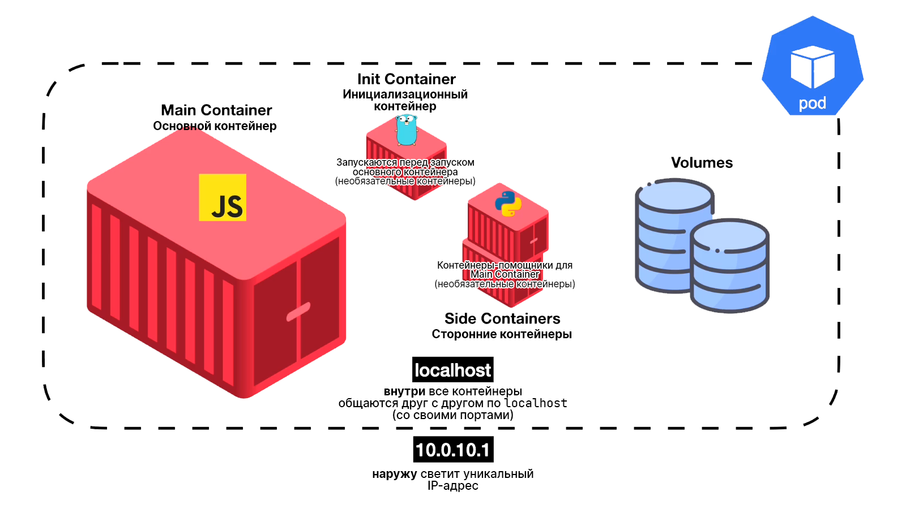

В итоге **под** – это:

- Группа из одного или более контейнеров.
- Представляет запущенный процесс.
- Разделяет одну сеть и одни Volumes.
- Не следует создавать **поды** как самостоятельные единицы. Для создания 
  *следует использовать контроллеры*.
- Недолговечный (ephemeral, эфемерный) и "одноразовый" (disposable). *Именно 
  поэтому предыдущий пункт имеет силу*.

Следует обратить внимание:

- Никогда не нужно деплоить **поды**, используя `kind: Pod` в 
  **YAML**-конфигурации.
- **Поды** не умеют самоисцеляться (self-heal). Если **под** упал – он сам не 
  встанет. **Под** может упасть из-за непредвиденной ошибки в вашем приложении.

### Способы создания **подов**

Способы создания **подов**:

- Императивная (<s>повелительная</s>) команда:
  
  > Например:
  > 
  > ```bash
  > kubectl run hello-world --image=amigoscode/kubernetes:hello-world --port=80
  > ```

  Используется для изучения, устранения проблем, экспериментирования.
- Декларативная конфигурация
  
  Использование конфигурационного файла.

  Воспроизводимость (можно взять одну конфигурацию и применить её для различных
  окружений). Best practices.

#### Императивный способ

[Создание и запуск пода с помощью Kubectl](#создание-и-запуск-пода).

#### Декларативный способ

Создадим каталог `pods` и внутри него в файле `pod.yml` (такое название 
необязательно) запишем следующее:

```yaml
apiVersion: v1
kind: Pod
metadata:
  name: hello-world
  labels:
    name: hello-world
spec:
  containers:
  - name: hello-world
    image: amigoscode/kubernetes:hello-world
    resources:
      limits:
        memory: "128Mi"
        cpu: "500m"
    ports:
      - containerPort: 80
```

Перейдём в каталог `pods` с помощью команды `cd pods/` и выполним следующую 
команду для запуска **пода**:

```bash
kubectl apply -f pod.yml
```

Результат `kubectl get pods`:

```
NAME          READY   STATUS    RESTARTS   AGE
hello-world   1/1     Running   0          26s
```

> Для того, чтобы **под** работал как задумано, нужно 
> [пробросить порты](#проброс-порта-на-хост):
> 
> ```bash
> kubectl port-forward pod/hello-world 8080:80
> ```

### Deployments

**Deployments** – это ресурс **Kubernetes**, который управляет релизами нового 
приложения. Предоставляет возможность деплоя с нулевым временем простоя 
(*zero downtime*). Создаёт **ReplicaSet**.

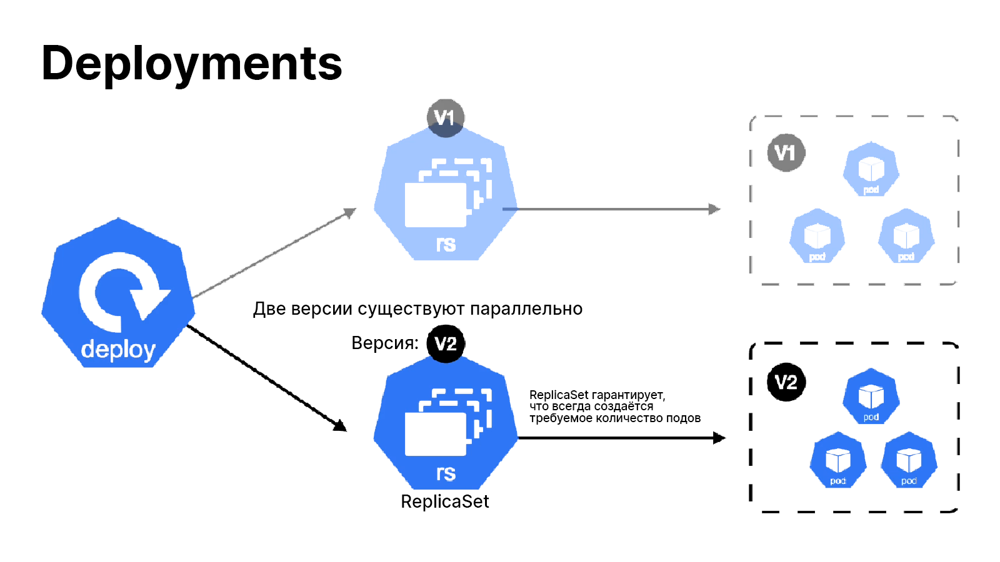

Создадим файл `deployment.yml` (такое название необязательно) со следующим 
содержимым:

```yaml
apiVersion: apps/v1
kind: Deployment
metadata:
  name: hello-world
spec:
  selector:
    matchLabels:
      app: hello-world
  template:
    metadata:
      labels:
        app: hello-world
    spec:
      containers:
      - name: hello-world
        image: amigoscode/kubernetes:hello-world
        resources:
          limits:
            memory: "128Mi"
            cpu: "500m"
        ports:
        - containerPort: 80
```

Применим эту конфигурацию:

```bash
kubectl apply -f deployment.yml
```

### ReplicaSet

**ReplicaSet** гарантирует, что необходимое число **подов** всегда запущено.

> Так же как и с **подами**, никогда не следует создавать **ReplicaSet** как 
> самостоятельные единицы. Вместо этого следует использовать **Deployments**.

Создадим файл `deployment-replicas.yml` (такое название необязательно) со 
следующим содержимым:

```yaml
apiVersion: apps/v1
kind: Deployment
metadata:
  name: hello-world
spec:
  replicas: 3
  selector:
    matchLabels:
      app: hello-world
  template:
    metadata:
      labels:
        app: hello-world
    spec:
      containers:
      - name: hello-world
        image: amigoscode/kubernetes:hello-world
        resources:
          limits:
            memory: "128Mi"
            cpu: "500m"
        ports:
        - containerPort: 80
```

> Следует обратить внимание на `replicas: 3`. Это поле указывает, что 
> **ReplicaSet** должен обеспечить запуск и работу 3-х **подов**.

Применим эту конфигурацию:

```bash
kubectl apply -f deployment-replicas.yml
```

Результат `kubectl get pods`:

```
NAME                           READY   STATUS    RESTARTS   AGE
hello-world-576c9b7fcd-4gs56   1/1     Running   0          105s
hello-world-576c9b7fcd-9gpc8   1/1     Running   0          105s
hello-world-576c9b7fcd-hqbwc   1/1     Running   0          105s
```

Результат `kubectl get rs`:

```
NAME                     DESIRED   CURRENT   READY   AGE
hello-world-576c9b7fcd   3         3         3       109s
```

Результат `kubectl get deployment`:

```
NAME          READY   UP-TO-DATE   AVAILABLE   AGE
hello-world   3/3     3            3           12m
```

#### Контуры управления (Control loops)

**ReplicaSet** реализует фоновый контур управления (control loop), который 
проверяет, что необходимое число **подов** всегда представлено в кластере.

#### Rolling Update

Осуществим *Rolling Update*. Для этого создадим вторую версию нашего 
**Deployment**.

Чтобы получить новую версию достаточно поменять поле `image` в конфигурационном 
файле **Deployment**. Например (файл `deployment-v2.yml`):

```yaml
apiVersion: apps/v1
kind: Deployment
metadata:
  name: hello-world
spec:
  replicas: 3
  selector:
    matchLabels:
      app: hello-world
  template:
    metadata:
      labels:
        app: hello-world
      annotations:
        kubernetes.io/change-cause: "amigoscode/kubernetes:hello-world-v2"
    spec:
      containers:
      - name: hello-world
        image: amigoscode/kubernetes:hello-world-v2
        resources:
          limits:
            memory: "128Mi"
            cpu: "500m"
        ports:
        - containerPort: 80
```

> Здесь также добавлено поле `kubernetes.io/change-cause` в `annotations`, 
> которое описывает причину изменения. Оно может содержать *любой* текст.

Применим эту конфигурацию, осуществив *Rolling Update*:

```bash
kubectl apply -f deployment-v2.yml
```

С помощью `kubectl get pods -w` можем просмотреть процесс *Rolling Update*:

```
NAME                           READY   STATUS              RESTARTS   AGE
hello-world-576c9b7fcd-cg59z   1/1     Running             0          26s
hello-world-576c9b7fcd-jmv8q   1/1     Running             0          26s
hello-world-576c9b7fcd-vbjpd   1/1     Running             0          45s
hello-world-6dd6685f99-wcz8g   0/1     ContainerCreating   0          2s
hello-world-6dd6685f99-wcz8g   1/1     Running             0          3s
hello-world-576c9b7fcd-cg59z   1/1     Terminating         0          28s
hello-world-6dd6685f99-t745d   0/1     Pending             0          0s
hello-world-6dd6685f99-t745d   0/1     Pending             0          0s
hello-world-6dd6685f99-t745d   0/1     ContainerCreating   0          0s
hello-world-576c9b7fcd-cg59z   0/1     Terminating         0          29s
hello-world-576c9b7fcd-cg59z   0/1     Terminating         0          29s
hello-world-576c9b7fcd-cg59z   0/1     Terminating         0          29s
hello-world-6dd6685f99-t745d   1/1     Running             0          1s
hello-world-576c9b7fcd-jmv8q   1/1     Terminating         0          29s
hello-world-6dd6685f99-z9rdw   0/1     Pending             0          0s
hello-world-6dd6685f99-z9rdw   0/1     Pending             0          0s
hello-world-6dd6685f99-z9rdw   0/1     ContainerCreating   0          0s
hello-world-576c9b7fcd-jmv8q   0/1     Terminating         0          30s
hello-world-576c9b7fcd-jmv8q   0/1     Terminating         0          30s
hello-world-576c9b7fcd-jmv8q   0/1     Terminating         0          30s
hello-world-6dd6685f99-z9rdw   1/1     Running             0          2s
hello-world-576c9b7fcd-vbjpd   1/1     Terminating         0          50s
hello-world-576c9b7fcd-vbjpd   0/1     Terminating         0          51s
hello-world-576c9b7fcd-vbjpd   0/1     Terminating         0          51s
hello-world-576c9b7fcd-vbjpd   0/1     Terminating         0          51s
```

И уже результат:

```
NAME                           READY   STATUS    RESTARTS   AGE
hello-world-6dd6685f99-t745d   1/1     Running   0          2m22s
hello-world-6dd6685f99-wcz8g   1/1     Running   0          2m26s
hello-world-6dd6685f99-z9rdw   1/1     Running   0          2m21s
```

Можно убедиться, что версия обновилась с помощью перенаправления портов. 
**ТАКОЙ СПОСОБ МОЖНО ИСПОЛЬЗОВАТЬ ТОЛЬКО НА ДЕБАГЕ**:

```bash
kubectl port-forward deployment/hello-world 8080:80
```

#### Предыдущий **ReplicaSet** после *Rolling Update*

*Rolling Update* оставляет предыдущий **ReplicaSet**.

Результат `kubectl get rs`:

```
NAME                     DESIRED   CURRENT   READY   AGE
hello-world-576c9b7fcd   0         0         0       20m
hello-world-6dd6685f99   3         3         3       19m
```

Выполним следующую команду для просмотра версий **Deployment**'а под названием 
`hello-world`:

```bash
kubectl rollout history deployment hello-world
```

Результат:

```
deployment.apps/hello-world
REVISION  CHANGE-CAUSE
1         <none>
2         amigoscode/kubernetes:hello-world-v2
```

> `CHANGE-CAUSE` берётся из `annotations` **YAML**-конфигурации.

#### Откат версии

```bash
kubectl rollout undo deployment hello-world --to-revision=<номер_ревизии>
```

> Если не указать номер ревизии, то откат произойдёт к предыдущей версии.

> По умолчанию **Kubernetes** хранит *только 10 версий*. Но в 
> **YAML**-конфигурации в `spec` -> `revisionHistoryLimit` можно указать другое 
> значение.

#### Информация о ревизии (версии)

```bash
kubectl rollout history deployment <название_deployment> --revision=<номер_ревизии>
```

### Стратегии деплоя (Deployment Strategy)

С помощью **Deployment** мы можем использовать следующие две стратегии:

- Пересоздание (Recreate)
  
  Удаляет все запущенные **поды** перед созданием новой версии нашего 
  приложения.

- Rolling Update. *Предпочитаемая стратегия, используется по умолчанию*

  Следит за тем, чтобы весь отправленный трафик обработался. Если с новой 
  версией проблемы, предыдущая версия останется жить.

В **YAML**-конфигурации в `spec` -> `strategy` -> `type` можно указать либо 
`Recreate`, либо `RollingUpdate` (используется по умолчанию).

#### Настройка Rolling Update

Далее все настройки будут производиться в `spec` -> `strategy` -> `type` -> 
`rollingUpdate`.

- `maxUnavailable` – максимальное число **подов**, которые могут быть 
  недоступны во время обновления. Значение может быть абсолютным числом или 
  процентом от необходимого (`replicas`) числа **подов**.
- `maxSurge` – максимальное число **подов**, на которое реальных подов может 
  быть больше, чем необходимых (`replicas`).

> Note: **Kubernetes** doesn't count terminating Pods when calculating the 
> number of `availableReplicas`, which must be between 
> `replicas - maxUnavailable` and `replicas + maxSurge`.
> 
> [Выдержка с официальной документации](https://kubernetes.io/docs/concepts/workloads/controllers/deployment/).

Пример **Deployment** с настройкой находится в 
[`pods/deployment-v3.yml`](pods/deployment-v3.yml):

```yaml
apiVersion: apps/v1
kind: Deployment
metadata:
  name: hello-world
spec:
  replicas: 5
  revisionHistoryLimit: 10
  strategy:
    type: RollingUpdate
    rollingUpdate:
      maxUnavailable: 1
      maxSurge: 1
  selector:
    matchLabels:
      app: hello-world
  template:
    metadata:
      labels:
        app: hello-world
      annotations:
        kubernetes.io/change-cause: "amigoscode/kubernetes:hello-world-v4"
    spec:
      containers:
      - name: hello-world
        image: amigoscode/kubernetes:hello-world-v4
        resources:
          limits:
            memory: "128Mi"
            cpu: "500m"
        ports:
        - containerPort: 80
```

> `// TODO:`
> - [ ] В этом конспекте намеренно пропущена 3-я версия **Deployment** из 
> видео. И поэтому в **YAML**-конфигурации используется образ 4-й версии.
> Разобраться с этим

Перейдём в каталог `pods` и применим эту конфигурацию:

```bash
kubectl apply -f deployment-v3.yml
```

Результат `kubectl rollout status deployments hello-world`:

```
Waiting for deployment "hello-world" rollout to finish: 2 out of 5 new replicas have been updated...
Waiting for deployment "hello-world" rollout to finish: 2 out of 5 new replicas have been updated...
Waiting for deployment "hello-world" rollout to finish: 2 out of 5 new replicas have been updated...
Waiting for deployment "hello-world" rollout to finish: 2 out of 5 new replicas have been updated...
Waiting for deployment "hello-world" rollout to finish: 2 out of 5 new replicas have been updated...
Waiting for deployment "hello-world" rollout to finish: 3 out of 5 new replicas have been updated...
Waiting for deployment "hello-world" rollout to finish: 3 out of 5 new replicas have been updated...
Waiting for deployment "hello-world" rollout to finish: 4 out of 5 new replicas have been updated...
Waiting for deployment "hello-world" rollout to finish: 4 out of 5 new replicas have been updated...
Waiting for deployment "hello-world" rollout to finish: 4 out of 5 new replicas have been updated...
Waiting for deployment "hello-world" rollout to finish: 1 old replicas are pending termination...
Waiting for deployment "hello-world" rollout to finish: 4 of 5 updated replicas are available...
deployment "hello-world" successfully rolled out
```

Результат `kubectl get pods`:

```
NAME                           READY   STATUS    RESTARTS   AGE
hello-world-6b7654c879-7kpdx   1/1     Running   0          97s
hello-world-6b7654c879-cwgf8   1/1     Running   0          93s
hello-world-6b7654c879-dmcvm   1/1     Running   0          97s
hello-world-6b7654c879-kq7kb   1/1     Running   0          90s
hello-world-6b7654c879-vpmzd   1/1     Running   0          93s
```

#### Пауза и продолжение Rolling Update

Результат `kubectl rollout --help`:

```diff
...
Available Commands:
  history     View rollout history
+  pause       Mark the provided resource as paused
  restart     Restart a resource
+  resume      Resume a paused resource
  status      Show the status of the rollout
  undo        Undo a previous rollout
...
```

Если мы понимаем, что новая версия не работает, то используем команду 
`kubectl rollout pause deployments <имя_deployment>`, фиксим и используем 
`resume`.

### Сервисы (Services)

Сервисы (Services) - это то, благодаря чему *мы* можем получить доступ к нашему 
приложению или благодаря чему *другой клиент* может обратиться к приложению или 
*микросервис* к *микросервису*

> **НАПОМИНАНИЕ!** `port-forward` используется только на этапе дебага для 
> тестирования.

Сервисы имеют собственный *стабильный* IP-адрес, *стабильное* имя **DNS**, 
*стабильный* порт.

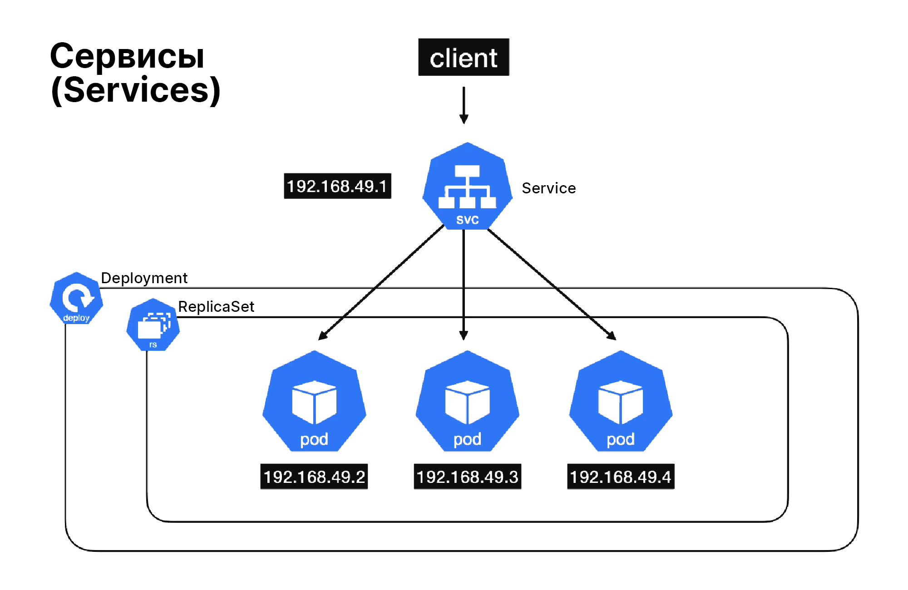

#### Типы сервисов

- **ClusterIP** (по умолчанию)
- **NodePort**
- **ExternalName**
- **LoadBalancer**

> Для **NodePort** и **LoadBalancer**: 
> [Minikube accessing apps](https://minikube.sigs.k8s.io/docs/handbook/accessing/).

#### **ClusterIP**

**ClusterIP** - это сервис **Kubernetes**, используемый по умолчанию.

Обеспечивает *только внутренний* доступ. Не внешний!

**ClusterIP** будет слать траффик к здоровым **подам**.

#### **NodePort**

**NodePort** позволяет открыть порт на всех нодах в диапазоне от `30000` до
`32767`.

Если явно не указать требуемый `nodePort`, выберется случайное значение из 
этого диапазона.

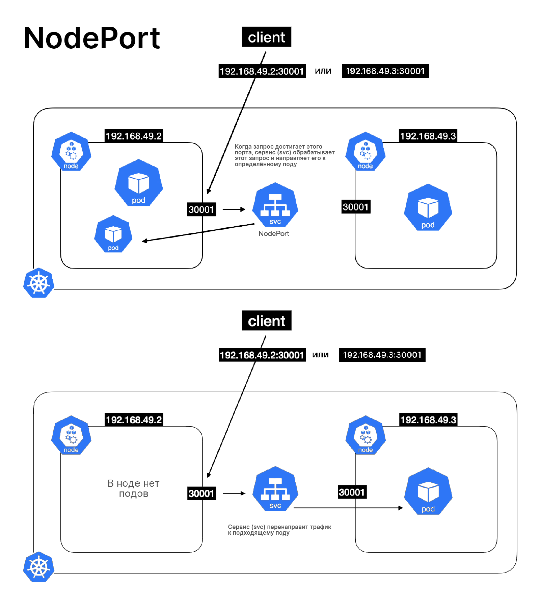

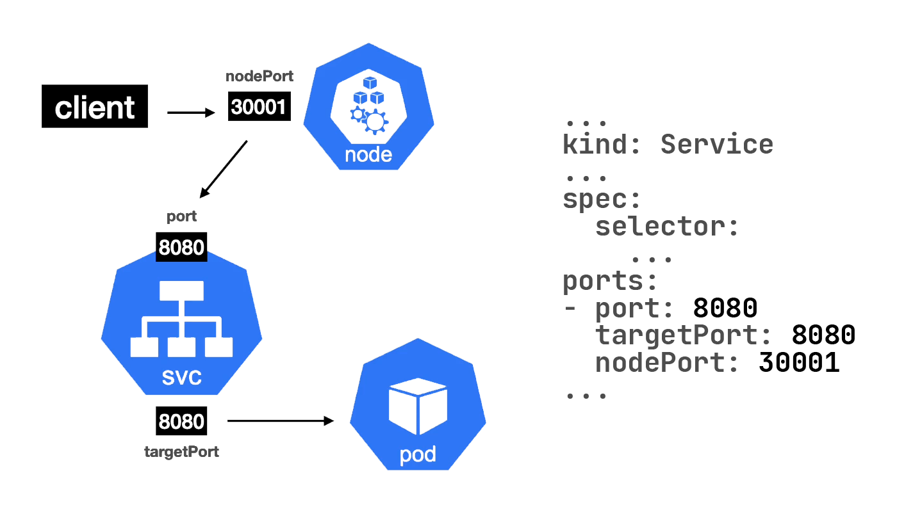

Недостатки **NodePort**:

- Один сервис на порт
- Если IP-адрес ноды меняется, это становится для нас проблемой

##### Пример с **NodePort**

В каталоге `microservices-yamls` есть файл 
`customer-deployment-env-with-service.yml` со следующим содержимым:

```yaml
apiVersion: apps/v1
kind: Deployment
metadata:
  name: customer
spec:
  replicas: 2
  selector:
    matchLabels:
      app: customer
  template:
    metadata:
      labels:
        app: customer
    spec:
      containers:
      - name: customer
        image: "amigoscode/kubernetes:customer-v1"
        resources:
          limits:
            memory: "128Mi"
            cpu: "500m"
        env:
        - name: ORDER_SERVICE
          value: "order"
        ports:
        - containerPort: 8080

---

apiVersion: v1
kind: Service
metadata:
  name: customer-node
spec:
  type: NodePort
  selector:
    app: customer
  ports:
  - port: 80
    targetPort: 8080
    nodePort: 30000
```

Применим эту конфигурацию

```bash
kubectl apply -f customer-deployment-env-with-service.yml
```

Результат `kubectl get services`:

```diff
NAME            TYPE        CLUSTER-IP      EXTERNAL-IP   PORT(S)        AGE
+ customer-node   NodePort    10.102.81.15    <none>        80:30000/TCP   9s
kubernetes      ClusterIP   10.96.0.1       <none>        443/TCP        11d
order           ClusterIP   10.98.135.178   <none>        80/TCP         23h
```

> Так как ноды мы создавали с помощью **Minikube**, посмотрим их IP-адреса:
> 
> - Список нод:
>   
>   ```bash
>   kubectl get nodes
>   ```
>   
>   Результат:
>   
>   ```
>   NAME           STATUS   ROLES                  AGE   VERSION
>   minikube       Ready    control-plane,master   11d   v1.23.3
>   minikube-m02   Ready    <none>                 31m   v1.23.3
>   ```
> 
> - IP-адрес `minikube`:
>   
>   ```bash
>   minikube ip -n minikube
>   ```
> 
>   Результат:
>   
>   ```
>   192.168.49.2
>   ```
> 
> - IP-адрес `minikube-m02`:
>   
>   ```bash
>   minikube ip -n minikube-m02
>   ```
> 
>   Результат:
>   
>   ```
>   192.168.49.3
>   ```
> 
> Получим доступ к SSH основной ноды **Minikube**:
> 
> ```bash
> minikube ssh
> ```
> 
> И внутри попробуем выполнить команду `curl localhost:30000/api/v1/customer`.

Откроем туннель для нашего сервиса:

```bash
minikube service customer-node --url
```

Результат:

```http://192.168.49.2:30000
🏃  Starting tunnel for service customer-node.
❗  Because you are using a Docker driver on linux, the terminal needs to be open to run it.
```

#### **LoadBalancer**

**LoadBalancer** — стандартный путь опубликовывать приложения в интернете.

Он создаёт балансировщик нагрузки **на один сервис** (**per service**).

> На **AWS**, на **GCP** и на других облачных платформах - сетевой 
> балансировщик нагрузки (Network Load Balancer, **NLB**).
> 
> Сетевой балансировщик нагрузки на примере **GCP**:
> 
> 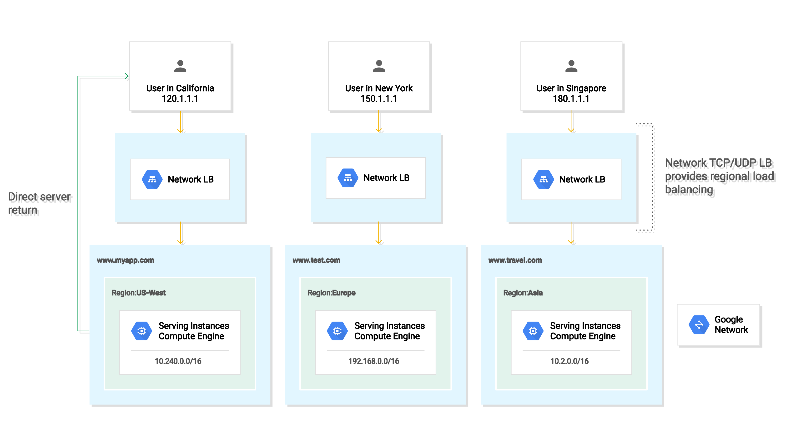

##### Пример с **LoadBalancer**

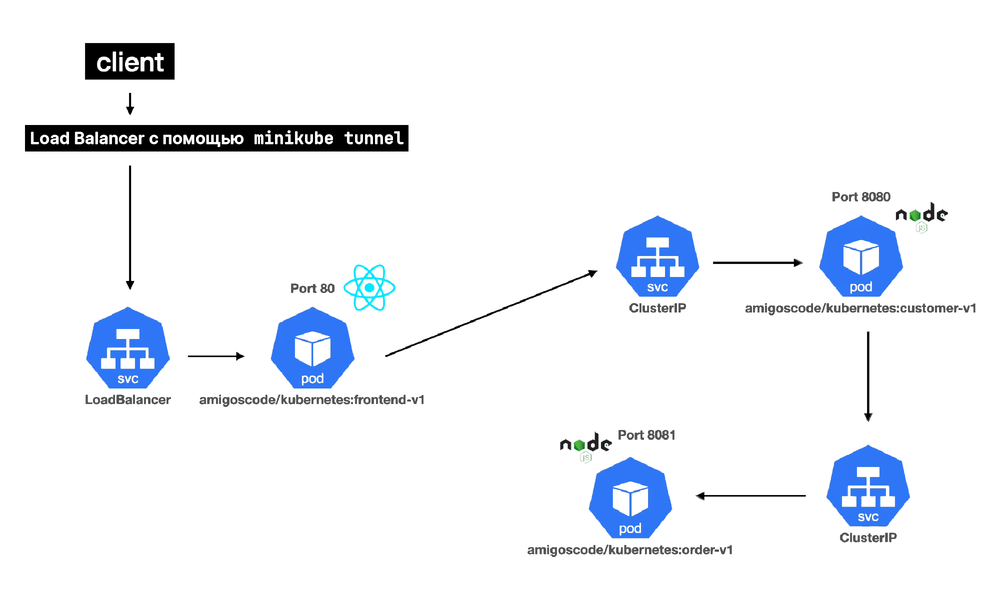

В каталоге `microservice-yamls/load-balanced` есть конфигурация `frontend.yml`:

```yaml
apiVersion: apps/v1
kind: Deployment
metadata:
  name: frontend
spec:
  replicas: 2
  selector:
    matchLabels:
      app: frontend
  template:
    metadata:
      labels:
        app: frontend
    spec:
      containers:
      - name: frontend
        image: amigoscode/kubernetes:frontend-v1
        resources:
          limits:
            memory: "128Mi"
            cpu: "500m"
        ports:
        - containerPort: 80

---

apiVersion: v1
kind: Service
metadata:
  name: frontend
spec:
  type: LoadBalancer
  selector:
    app: frontend
  ports:
  - port: 80
    targetPort: 80
```

> Следует обратить внимание на `nginx.conf` 
> (`microservices/frontend/nginx.conf`):
> 
> ```nginx
> upstream customer {
>     server customer;
> }
> ```
> 
> Здесь `customer` - это IP-адрес **ClusterIP**.

Также в этом каталоге существует файл `customer-deployment.yml`:

```yaml
apiVersion: apps/v1
kind: Deployment
metadata:
  name: customer
spec:
  replicas: 2
  selector:
    matchLabels:
      app: customer
  template:
    metadata:
      labels:
        app: customer
    spec:
      containers:
      - name: customer
        image: "amigoscode/kubernetes:customer-v1"
        resources:
          limits:
            memory: "128Mi"
            cpu: "500m"
        env:
        - name: ORDER_SERVICE
          value: "order"
        ports:
        - containerPort: 8080

---

apiVersion: v1
kind: Service
metadata:
  name: customer-node
spec:
  type: NodePort
  selector:
    app: customer
  ports:
  - port: 80
    targetPort: 8080
    nodePort: 30000

---

apiVersion: v1
kind: Service
metadata:
  name: customer
spec:
  type: ClusterIP
  selector:
    app: customer
  ports:
  - port: 80
    targetPort: 8080
```

Применим эти конфигурации:

```bash
kubectl apply -f customer-deployment.yml
```

```bash
kubectl apply -f frontend.yml
```

Результат команды `kubectl get svc` (`kubectl get services`):

```diff
NAME            TYPE           CLUSTER-IP      EXTERNAL-IP   PORT(S)        AGE
customer        ClusterIP      10.97.189.160   <none>        80/TCP         2m26s
customer-node   NodePort       10.102.81.15    <none>        80:30000/TCP   26h
+ frontend        LoadBalancer   10.103.32.163   <pending>     80:32163/TCP   2m21s
kubernetes      ClusterIP      10.96.0.1       <none>        443/TCP        12d
order           ClusterIP      10.98.135.178   <none>        80/TCP         2d1h
```

> Чтобы получить `EXTERNAL-IP` для `frontend` (сейчас там `<pending>`), нужно 
> запустить `minikube tunnel`.
> 
> Можно открыть два окна терминала и в одном выполнять `kubectl get svc -w`, а 
> в другом — `minikube tunnel` и так мы увидим назначение `EXTERNAL-IP`.
> 
> После выполнения `minikube tunnel` назначится `EXTERNAL-IP` `127.0.0.1`. 
> Можно открыть в браузере.

#### Пример

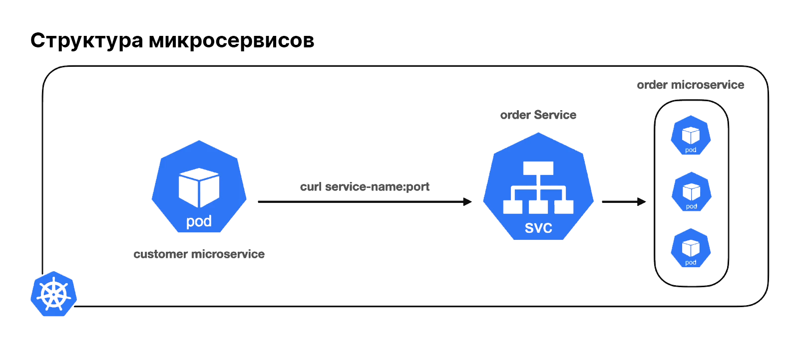

В каталоге `microservices-yamls` существует файл `customer-deployment.yml`:

```yaml
apiVersion: apps/v1
kind: Deployment
metadata:
  name: customer
spec:
  replicas: 2
  selector:
    matchLabels:
      app: customer
  template:
    metadata:
      labels:
        app: customer
    spec:
      containers:
      - name: customer
        image: "amigoscode/kubernetes:customer-v1"
        resources:
          limits:
            memory: "128Mi"
            cpu: "500m"
        ports:
        - containerPort: 8080
```

Также в этом каталоге существует файл `order-deployment.yml`:

```yaml
apiVersion: apps/v1
kind: Deployment
metadata:
  name: order
spec:
  replicas: 2
  selector:
    matchLabels:
      app: order
  template:
    metadata:
      labels:
        app: order
    spec:
      containers:
      - name: order
        image: "amigoscode/kubernetes:order-v1"
        resources:
          limits:
            memory: "128Mi"
            cpu: "500m"
        ports:
        - containerPort: 8081
```

Применим эти конфигурации:

```bash
kubectl apply -f customer-deployment.yml
```

```bash
kubectl apply -f order-deployment.yml
```

Убедиться, что микросервис запущен, можно с помощью 
`kubectl logs <название_пода>`. Если всё прошло успешно, в логах мы увидим 
следующее:

```
 Server Running on PORT 8080
```

(для пода из **Deployment**'а `customer`)

```
 Server Running on Port 8081
```

(для пода из **Deployment**'а `order`)

Модифицированная (с использованием сервиса) **YAML**-конфигурация находится в 
файле `order-deployment-with-service.yml`:

```yaml
apiVersion: apps/v1
kind: Deployment
metadata:
  name: order
spec:
  replicas: 2
  selector:
    matchLabels:
      app: order
  template:
    metadata:
      labels:
        app: order
    spec:
      containers:
      - name: order
        image: "amigoscode/kubernetes:order-v1"
        resources:
          limits:
            memory: "128Mi"
            cpu: "500m"
        ports:
        - containerPort: 8081
---

apiVersion: v1
kind: Service
metadata:
  name: order
spec:
  type: ClusterIP
  selector:
    app: order # Должен совпадать с labels Deployment'а
  ports:
  - port: 8081 # Порт самого сервиса. Не обязательно, чтобы совпадал с портом Deployment'а
    targetPort: 8081 # Должен совпадать с портом Deployment'а
```

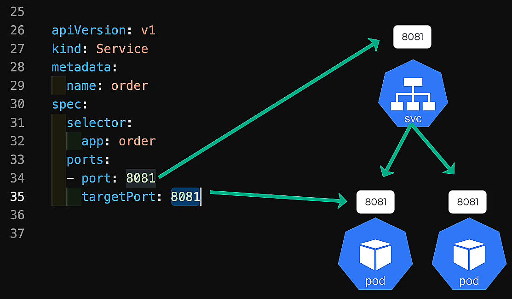

Применим её:

```bash
kubectl apply -f order-deployment-with-service.yml
```

Просмотрим список сервисов с помощью команды `kubectl get service`:

```diff
NAME         TYPE        CLUSTER-IP      EXTERNAL-IP   PORT(S)    AGE
+ kubernetes   ClusterIP   10.96.0.1       <none>        443/TCP    10d
order        ClusterIP   10.98.135.178   <none>        8081/TCP   64s
```

Подробнее про наш сервис с помощью команды `kubectl describe service order`:

```diff
Name:              order
Namespace:         default
Labels:            <none>
Annotations:       <none>
+ Selector:          app=order
Type:              ClusterIP
IP Family Policy:  SingleStack
IP Families:       IPv4
IP:                10.98.135.178
IPs:               10.98.135.178
Port:              <unset>  8081/TCP
TargetPort:        8081/TCP
+ Endpoints:         10.244.0.15:8081,10.244.1.17:8081
Session Affinity:  None
Events:            <none>
```

> `Endpoints` - это список IP-адресов здоровых подов микросервиса. Микросервис 
> и, соответственно, его **поды** ищутся через `Selector`.

*Endpoints* можно также получить с помощью с `kubectl get endpoints` или 
`kubectl get ep`.

Примерный результат:

```
NAME         ENDPOINTS                           AGE
kubernetes   192.168.49.2:8443                   10d
order        10.244.0.15:8081,10.244.1.17:8081   8m27s
```

И, наконец, применим конфигурацию `order-deployment-80.yml`:

```yaml
apiVersion: apps/v1
kind: Deployment
metadata:
  name: order
spec:
  replicas: 2
  selector:
    matchLabels:
      app: order
  template:
    metadata:
      labels:
        app: order
    spec:
      containers:
      - name: order
        image: "amigoscode/kubernetes:order-v1"
        resources:
          limits:
            memory: "128Mi"
            cpu: "500m"
        ports:
        - containerPort: 8081
---

apiVersion: v1
kind: Service
metadata:
  name: order
spec:
  type: ClusterIP
  selector:
    app: order
  ports:
  - port: 80
    targetPort: 8081
```

И `customer-deployment-env.yml`:

```yaml
apiVersion: apps/v1
kind: Deployment
metadata:
  name: customer
spec:
  replicas: 2
  selector:
    matchLabels:
      app: customer
  template:
    metadata:
      labels:
        app: customer
    spec:
      containers:
      - name: customer
        image: "amigoscode/kubernetes:customer-v1"
        resources:
          limits:
            memory: "128Mi"
            cpu: "500m"
        env:
        - name: ORDER_SERVICE
          value: "order"
        ports:
        - containerPort: 8080
```

И применим их:

```bash
kubectl apply -f order-deployment-80.yml
```

```bash
kubectl apply -f customer-deployment-env.yml
```

Для проверки работоспособности можно **временно и для целей тестирования** 
использовать `kubectl port-forward deployment/customer 8080:8080`. И затем в 
браузере открыть 
[`http://localhost:8080/api/v1/customer/1/orders`](http://localhost:8080/api/v1/customer/1/orders).

> `// TODO:`
> - [ ] Разобраться с хранением **YAML**-конфигураций.

#### Для чего нужен сервис `kubernetes`

`kubectl get svc` (`kubectl get services`):

```diff
NAME            TYPE           CLUSTER-IP      EXTERNAL-IP   PORT(S)        AGE
customer        ClusterIP      10.97.189.160   <none>        80/TCP         16m
customer-node   NodePort       10.102.81.15    <none>        80:30000/TCP   26h
frontend        LoadBalancer   10.103.32.163   127.0.0.1     80:32163/TCP   16m
+ kubernetes      ClusterIP      10.96.0.1       <none>        443/TCP        12d
order           ClusterIP      10.98.135.178   <none>        80/TCP         2d2h
```

`kubectl get ep` (`kubectl get endpoints`):

```diff
NAME            ENDPOINTS                          AGE
customer        10.244.0.13:8080,10.244.1.3:8080   17m
customer-node   10.244.0.13:8080,10.244.1.3:8080   26h
frontend        10.244.0.14:80,10.244.1.4:80       17m
+ kubernetes      192.168.49.2:8443                  12d
order           10.244.0.10:8081,10.244.0.4:8081   2d2h
```

IP-адрес эндпоинта: `192.168.49.2`, порт: `8443`.

Теперь `kubectl get pods -A` (флаг `-A` говорит выводить *все* поды):

```diff
...
+ kube-system   kube-apiserver-minikube            1/1     Running   10 (139m ago)   12d
...
```

`kubectl describe pod kube-apiserver-minikube -n kube-system`:

```diff
...
+ IP:                   192.168.49.2
IPs:
  IP:           192.168.49.2
...
+      --secure-port=8443
...
```

> Сервис `kubernetes` предоставляет возможность общаться с API **Kubernetes** 
> через **API Server**.

#### Для чего нужны `labels`

`labels` — это записи типа *ключ-значение*, которые мы можем придавать объектам 
**Kubernetes** (например, ***поды***, *сервисы*, *ReplicaSet'ы* и т.д.).

Они используются, чтобы организовать и выделять объекты.

Команда для получения `labels` **подов**:

```bash
kubectl get pods --show-labels
```

> Вот эта часть **YAML**-конфигурации, например, для "прицеливания" 
> *ReplicaSet*:
> 
> ```yaml
> ...
> replicas: 2
> selector:
>   matchLabels:
>     app: customer
> ...
> ```

##### Label selectors

*Label selectors* нужны, чтобы наполнить объект **Kubernetes** набором 
`labels`.

> Селекторы работают по принципу "всё или ничего". Все селекторы должны 
> совпадать для сопоставления одного объекта **Kubernetes** с другим.

#### Аннотации

*Аннотации* — это неструктурированные записи типа "ключ-значение" для хранения 
и получения различных метаданных.

Аннотации не предназначены для запросов (querying).

Цель аннотаций заключается в том, чтобы помогать инструментам и библиотекам 
работать с нашими объектами **Kubernetes**.

> Например, их можно использовать для того, чтобы передавать конфигурацию между 
> системами.

#### **Service Discovery** (**Обнаружение сервисов**)

**Service Discovery** (**Обнаружение сервисов**) — механизм для приложений и 
микросервисов по обнаружению друг друга в сети.

[Что такое DNS? (What is DNS?) — объяснение на Cloudflare](https://www.cloudflare.com/learning/dns/what-is-dns/).

##### Регистрация сервисов

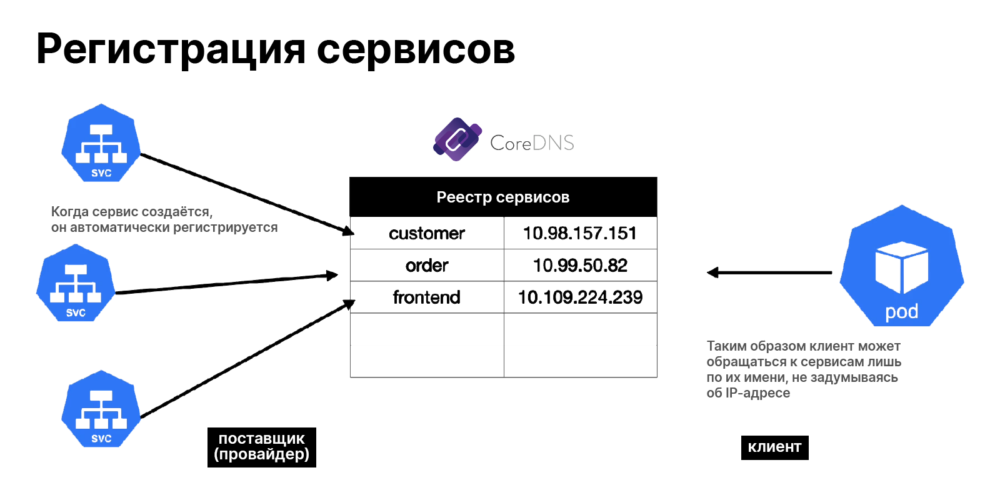

Всю магию за нас делает [**CoreDNS**](https://coredns.io/).

> Получение **подов** из неймспейса `kube-system` с помощью 
> `kubectl get pods -n kube-system`:
> 
> ```diff
> NAME                               READY   STATUS    RESTARTS       AGE
> + coredns-64897985d-f492w            1/1     Running   11 (47m ago)   19d
> etcd-minikube                      1/1     Running   11 (47m ago)   19d
> kindnet-dplwt                      1/1     Running   11 (47m ago)   19d
> ...
> ```

> `kubectl get service -n kube-system`:
> 
> ```
> NAME       TYPE        CLUSTER-IP   EXTERNAL-IP   PORT(S)                  AGE
> kube-dns   ClusterIP   10.96.0.10   <none>        53/UDP,53/TCP,9153/TCP
> ```
> 
> Следует обратить внимание на `CLUSTER-IP`: `10.96.0.10`
> 
> `kubectl exec -it <любой_под> -- sh`, затем в **sh**-оболочке 
> `cat /etc/resolv.conf`:
> 
> ```diff
> + nameserver 10.96.0.10
> search default.svc.cluster.local svc.cluster.local cluster.local
> options ndots:5
> ```
> 
> (Файл [`resolv.conf`](https://en.wikipedia.org/wiki/Resolv.conf) представлен 
> в *каждом* отдельном **поде**).

> Ещё, например, `nslookup customer` покажет следующее:
> 
> ```diff
> + Server:         10.96.0.10
> Address:        10.96.0.10#53
> 
> + Name:   customer.default.svc.cluster.local
> + Address: 10.97.189.160
> ```
> 
> Поле `Name` отображает длинное имя. Оно работает как и короткое — `customer`:
> 
> `curl http://customer.default.svc.cluster.local/api/v1/customer`:
> 
> (`default` здесь обозначает неймспейс).
> 
> ```json
> [{"id":1,"name":"James","address":"UK","gender":"M"},
> {"id":2,"name":"Jamila","address":"US","gender":"F"},
> {"id":3,"name":"Bilal","address":"ES","gender":"M"}]
> ```
> 
> **Примечание**: если `nslookup` не установлен, следует выполнить следующую 
> команду для установки:
> 
> ```bash
> apt install dnsutils
> ```

#### Endpoints

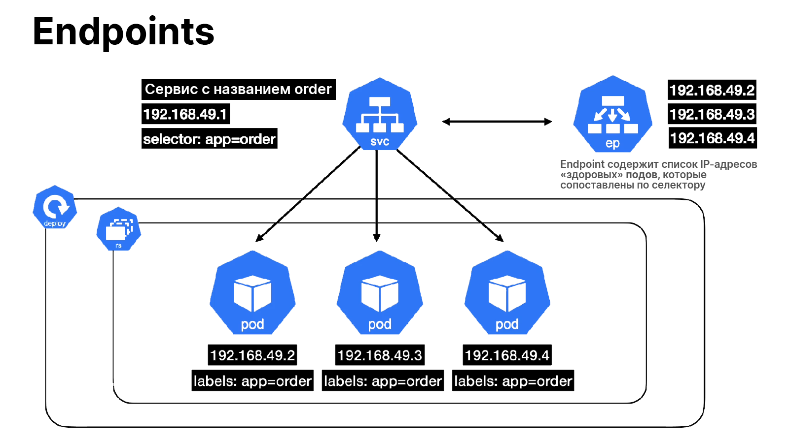

#### **KubeProxy**

**KubeProxy** – это сетевой прокси, запускающийся на каждой ноде. Реализует 
часть сервиса **Kubernetes**.

**KubeProxy** утверждает правила для разрешения коммуникации **подов** изнутри 
и снаружи кластера.

Реализует контроллер, который смотрит за новыми сервисами и эндпоинтами 
(Endpoint) через **API Server** 

Создаёт локальные **IPVS** правила, которые сообщают ноде, чтобы она 
перехватывала трафик, направленный к **ClusterIP** сервиса.

> **IPVS** (**IP** **V**irtual **S**erver) – виртуальный IP-сервер, построенный 
> поверх [netfilter](https://ru.wikipedia.org/wiki/Netfilter) и реализующий 
> транспортный уровень балансировки нагрузки как часть ядра Linux.

**KubeProxy** перенаправляет трафик к **подам**, которые совпадают по *Label 
selectors*.

#### Storage (хранилища) и Volumes (тома)

Т.к. **поды** недолговечны и эфемерны, вся информация удаляется, когда 
контейнер **пода** перезагружается.

Иногда нам нужно сохранять данные: разделять их между **подами** или оставлять 
на диске.

##### Volume: EmptyDir

**Volume: EmptyDir** – это временная директория, существующая на протяжении 
времени жизни **пода**.

Сразу после инициализации они пустые.

Используются, чтобы делиться данными между контейнерами в **поде**.

В каталоге `microservices-yamls` существует файл `empty-dir-volume.yml` со 
следующим содержимым:

```yaml
apiVersion: apps/v1
kind: Deployment
metadata:
  name: emptydir-volume
spec:
  selector:
    matchLabels:
      app: emptydir-volume
  template:
    metadata:
      labels:
        app: emptydir-volume
    spec:
      volumes:
        - name: cache
          emptyDir: {}
      containers:
      - name: one
        image: busybox
        command:
          - "/bin/sh"
        args:
          - "-c"
          - "touch /foo/bar.txt && sleep 3600"
        resources:
          limits:
            memory: "128Mi"
            cpu: "500m"
        volumeMounts:
          - name: cache
            mountPath: /foo
      - name: two
        image: busybox
        command:
          - "sleep"
          - "3600"
        resources:
          limits:
            memory: "128Mi"
            cpu: "500m"
        volumeMounts:
          - name: cache
            mountPath: /foo
```

Эта конфигурация создаёт два контейнера, которые будут жить по одному часу 
(`sleep 3600`, иначе **Deployment** уйдёт в `CrashLoopBackOff`) и **EmptyDir** 
для них. Применим эту конфигурации с помощью следующей команды:

```bash
kubectl apply -f empty-dir-volume.yml
```

Результат `kubectl get pods`:

```diff
NAME                               READY   STATUS    RESTARTS      AGE
...
+ emptydir-volume-65fd6c589d-zwljn   2/2     Running   0             6m8s
...
```

Зайдём в `sh`-оболочку контейнера `one` с помощью команды 
`kubectl exec -it emptydir-volume-65fd6c589d-zwljn -c one -- sh` и выполним там 
следующую команду:

```bash
ls /foo
```

Результат:

```
bar.txt
```

То же самое сделаем для контейнера `two` и убедимся, что файл `bar.txt` тоже 
присутствует в директории `foo` – это один и тот же файл, доступ к которому 
имеют оба контейнера. Изменения, осуществлённые в одном контейнера, будут 
отображаться в другом.

Но если мы удалим **под** `emptydir-volume-65fd6c589d-zwljn` 
(НЕ **Deployment**, а именно `pod/emptydir-volume-65fd6c589d-zwljn`), то новый  
**под** создастся и все изменения в **EmptyDir** исчезнут.

##### Volume: HostPath

**Volume: HostPath** используется, когда нужно, чтобы приложение имело доступ 
к файловой системе хоста.

Это очень *опасно* и рекомендуется создавать такой Volume *только для чтения*.

- Кейс использования:

  `minikube ssh`:

  ```
  cd /var/log/
  ```

  Мы хотим смонтировать директорию `/var/log/` с логами в файловую систему 
  хоста.

  В директории `microservices-yamls` существует конфигурация 
  [`host-path-volume.yml`](microservices-yamls/host-path-volume.yml):

  ```yaml
  apiVersion: apps/v1
  kind: Deployment
  metadata:
    name: hostpath
  spec:
    selector:
      matchLabels:
        app: hostpath
    template:
      metadata:
        labels:
          app: hostpath
      spec:
        volumes:
        - name: var-log
          hostPath:
            path: /var/log
        containers:
        - name: hostpath
          volumeMounts:
            - mountPath: /var/log
              name: var-log
          image: busybox
          resources:
            limits:
              memory: "128Mi"
              cpu: "500m"
          command:
            - "sleep"
            - "3600"
  ```

  > В конфигурацию в `spec`->`containers`->`volumeMounts` можно добавить флаг 
  > `readOnly: true` для режима "только для чтения".

  Применим её с помощью следующей команды:

  ```bash
  kubectl apply -f host-path-volume.yml
  ```

##### Другие Volumes

[Подробнее о Volumes на сайте **Kubernetes**](https://kubernetes.io/docs/concepts/storage/volumes/).

##### Персистентные тома (Persistent Volumes)

**Персистентные Volumes** позволяют хранить данные вне жизненного цикла 
**пода**.

Это означает, что если **под** падает, умирает, перемещается в другую ноду, это 
не влияет на хранимые данные.

**Kubernetes** поддерживает различные персистентные Volumes такие как:

- **NFS**
- **Local**
- **Cloud Network Storage** (если мы запускаем на облаке)

Типы **PersistentVolume** реализуются как плагины. **Kubernetes** на текущий 
момент поддерживает следующие плагины: 
[подробнее на сайте **Kubernetes**.](https://kubernetes.io/docs/concepts/storage/persistent-volumes/#types-of-persistent-volumes)

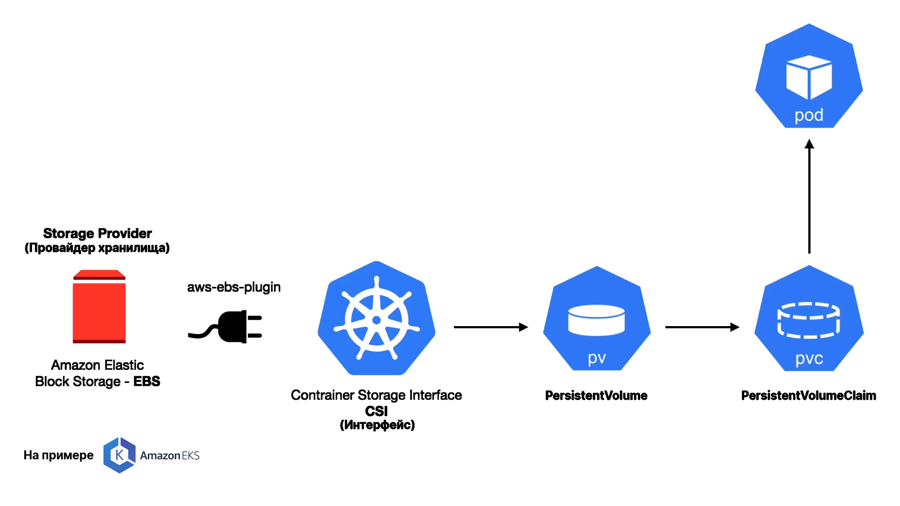

##### PersistentVolume Subsystem

**PersistentVolume subsystem** предоставляет API для пользователей и 
администраторов, которые абстрагируют детали о том, как хранилище 
предоставляется, от того, как оно используется. Используются 
**PersistentVolume** и **PersistentVolumeClaim**.

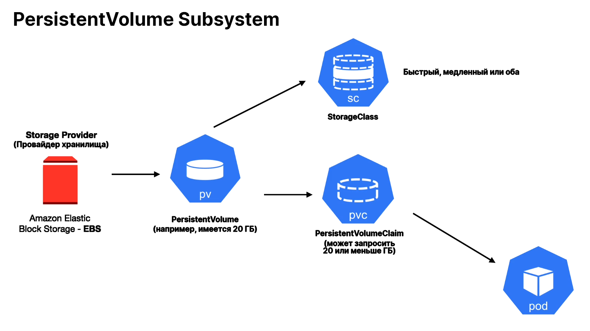

**PersistentVolume** — это ресурс хранилища, обеспеченный администратором.

**PersistentVolumeClaim** — это запрос пользователя и требования к 
персистентному Volume.

**StorageClass** описывает параметры для класса хранилища, которыми 
**PersistentVolume** может быть динамически обеспечен.

- Пример:

  - `minikube ssh`:

    ```bash
    sudo mkdir /mnt/data
    ```

    ```bash
    sudo sh -c "echo 'Hello PV & PVC - Kubernetes' > /mnt/data/index.html"
    ```

  - `minikube ssh -n minikube-m02`:

    ```bash
    sudo mkdir /mnt/data
    ```

    ```bash
    sudo sh -c "echo 'Hello PV & PVC - Kubernetes' > /mnt/data/index.html"
    ```

  В директории `microservices-yamls` существует конфигурация 
  [`pv-pvc.yml`](microservices-yamls/pv-pvc.yml):

  ```yaml
  apiVersion: v1
  kind: PersistentVolume
  metadata:
    name: mypv
  spec:
    capacity:
      storage: "100Mi"
    volumeMode: Filesystem
    accessModes:
      - ReadWriteOnce
    persistentVolumeReclaimPolicy: Recycle
    storageClassName: manual
    hostPath:
      path: "/mnt/data"

  ---

  apiVersion: v1
  kind: PersistentVolumeClaim
  metadata:
    name: mypvc
  spec:
    resources:
      requests:
        storage: "100Mi"
    volumeMode: Filesystem
    storageClassName: "manual"
    accessModes:
      - ReadWriteOnce

  ---

  apiVersion: apps/v1
  kind: Deployment
  metadata:
    name: pv-pvc
  spec:
    selector:
      matchLabels:
        app: pv-pvc
    template:
      metadata:
        labels:
          app: pv-pvc
      spec:
        volumes:
          - name: data
            persistentVolumeClaim:
              claimName: mypvc
        containers:
        - name: pv-pvc
          image: nginx
          volumeMounts:
            - mountPath: "/usr/share/nginx/html"
              name: data
          resources:
            limits:
              memory: "128Mi"
              cpu: "500m"
          ports:
          - containerPort: 80

  ---

  apiVersion: v1
  kind: Service
  metadata:
    name: pv-pvc
  spec:
    type: LoadBalancer
    selector:
      app: pv-pvc
    ports:
    - port: 80
      targetPort: 80
  ```

  Применим эту конфигурацию с помощью следующей команды:

  ```bash
  kubectl apply -f pv-pvc.yml
  ```

  - `kubectl get pv`:

    ```
    NAME   CAPACITY   ACCESS MODES   RECLAIM POLICY   STATUS   CLAIM           STORAGECLASS   REASON   AGE
    mypv   100Mi      RWO            Recycle          Bound    default/mypvc   manual                  2m33s
    ```

  - `kubectl describe pv mypv`:

    ```
    Name:            mypv
    Labels:          <none>
    Annotations:     pv.kubernetes.io/bound-by-controller: yes
    Finalizers:      [kubernetes.io/pv-protection]
    StorageClass:    manual
    Status:          Bound
    Claim:           default/mypvc
    Reclaim Policy:  Recycle
    Access Modes:    RWO
    VolumeMode:      Filesystem
    Capacity:        100Mi
    Node Affinity:   <none>
    Message:
    Source:
        Type:          HostPath (bare host directory volume)
        Path:          /mnt/data
        HostPathType:
    Events:            <none>
    ```

  - `kubectl get pvc`:

    ```
    NAME    STATUS   VOLUME   CAPACITY   ACCESS MODES   STORAGECLASS   AGE
    mypvc   Bound    mypv     100Mi      RWO            manual         2m51s
    ```

  - `kubectl describe pvc mypvc`:

    ```
    Name:          mypvc
    Namespace:     default
    StorageClass:  manual
    Status:        Bound
    Volume:        mypv
    Labels:        <none>
    Annotations:   pv.kubernetes.io/bind-completed: yes
                  pv.kubernetes.io/bound-by-controller: yes
    Finalizers:    [kubernetes.io/pvc-protection]
    Capacity:      100Mi
    Access Modes:  RWO
    VolumeMode:    Filesystem
    Used By:       pv-pvc-6cbd59d977-pf4sn
    Events:
      Type     Reason              Age   From                         Message
      ----     ------              ----  ----                         -------
      Warning  ProvisioningFailed  5m1s  persistentvolume-controller  storageclass.storage.k8s.io "manual" not found
    ```

    > `// TODO:`
    > - [ ] Разобраться с `Warning` в `Events`.

  ---

  `kubectl get pods`:

  ```diff
  NAME                               READY   STATUS    RESTARTS        AGE
  ...
  + pv-pvc-6cbd59d977-pf4sn            1/1     Running   0               7m6s
  ...
  ```

  `kubectl exec -it pv-pvc-6cbd59d977-pf4sn  -- sh`,
  `cat /usr/share/nginx/html/index.html`:

  ```
  Hello PV & PVC - Kubernetes
  ```

  Выполним `minikube tunnel`, откроем в браузере 
  [`http://localhost:80](http://localhost:80) и увидим следующее:

  ```
  Hello PV & PVC - Kubernetes
  ```

#### **ConfigMaps**

Образы контейнеров должны поддерживать повторное использование.

Один и тот же образ следует использовать для разработки, тестирования, 
стейджинга и продакшена.

**ConfigMaps**:

- Позволяет хранить конфигурацию
- Представляет собой набор пар "*ключ-значение*".

В директории `microservices-yamls` существует конфигурация 
[`config-maps.yml`](microservices-yamls/config-maps.yml):

```yaml
apiVersion: v1
kind: ConfigMap
metadata:
  name: app-properties
data:
  app-name: order
  app-version: 1.0.0
  team: engineering

---

apiVersion: v1
kind: ConfigMap
metadata:
  name: nginx-conf
data:
  default.conf: |
    server {
      listen 80;
      server_name localhost;

      location / {
        root /usr/share/nginx/html;
        index index.html index.htm;
      }

      error_page 500 502 503 504 /50x.html;
      location - /50x.html {
        root /usr/share/nginx/html;
      }

      location /health {
        access_log off;
        return 200 "healthy\n";
      }
    }
```

Применим эту конфигурацию с помощью следующей команды:

```bash
kubectl apply -f config-maps.yml
```

`kubectl get cm`:

```
NAME               DATA   AGE
app-properties     3      7s
kube-root-ca.crt   1      25d
nginx-conf         1      7s
```

Для каждого **ConfigMap** можно сделать `describe`.

##### Инъекция **ConfigMaps** в **поды**

Общие способы это сделать:

- переменные окружения
- Volumes

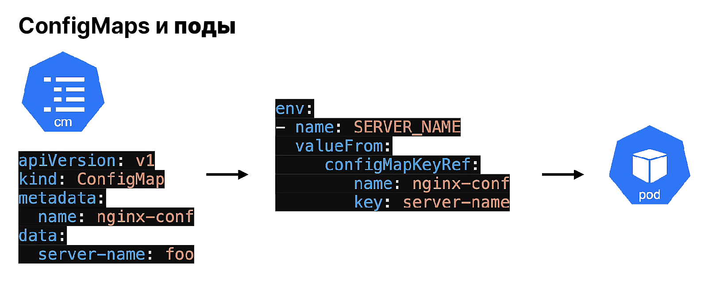

> `// TODO:`
> - [ ] Поменять надпись на рисунке ("**поды**" -> "и **поды** через переменные 
> окружения").

- переменные окружения

  **Недостаток**: Изменения, сделанные в **ConfigMap** не будут отражаться на 
  контейнере.

  В директории `microservices-yamls` существует конфигурация 
  [`config-maps-envs.yml`](microservices-yamls/config-maps-envs.yml):

  ```yaml
  apiVersion: v1
  kind: ConfigMap
  metadata:
    name: app-properties
  data:
    app-name: order
    app-version: 1.0.0
    team: engineering

  ---

  apiVersion: v1
  kind: ConfigMap
  metadata:
    name: nginx-conf
  data:
    default.conf: |
      server {
        listen 80;
        server_name localhost;

        location / {
          root /usr/share/nginx/html;
          index index.html index.htm;
        }

        error_page 500 502 503 504 /50x.html;
        location - /50x.html {
          root /usr/share/nginx/html;
        }

        location /health {
          access_log off;
          return 200 "healthy\n";
        }
      }

  ---

  apiVersion: apps/v1
  kind: Deployment
  metadata:
    name: config-map
  spec:
    selector:
      matchLabels:
        app: config-map
    template:
      metadata:
        labels:
          app: config-map
      spec:
        containers:
        - name: config-map
          image: busybox
          resources:
            limits:
              memory: "128Mi"
              cpu: "500m"
          command:
            - "/bin/sh"
            - "-c"
          args:
            - "env & sleep 3600"
          env:
            - name: APP_VERSION
              valueFrom:
                configMapKeyRef:
                  name: app-properties
                  key: app-version
                  env:
            - name: APP_NAME
              valueFrom:
                configMapKeyRef:
                  name: app-properties
                  key: app-name
            - name: TEAM
              valueFrom:
                configMapKeyRef:
                  name: app-properties
                  key: team
  ```

  Применим эту конфигурацию:

  ```bash
  kubectl apply -f config-maps-and-envs.yml
  ```

  Результат `kubectl get pods`:

  ```diff
  NAME                               READY   STATUS    RESTARTS       AGE
  ...
  + config-map-7568989b5f-9k5zz        1/1     Running   0              66s
  ...
  ```

  Результат `kubectl logs config-map-7568989b5f-9k5zz`:

  ```diff
  ...
  + TEAM=engineering
  ...
  + APP_NAME=order
  ...
  + APP_VERSION=1.0.0
  ...
  ```

  > В директории `microservices-yamls` также существует конфигурация 
  > [`config-maps-envs-nginx.yml`](microservices-yamls/config-maps-envs-nginx.yml) с 
  > конфигурацией **nginx** в **ConfigMap**.

- Volumes:

  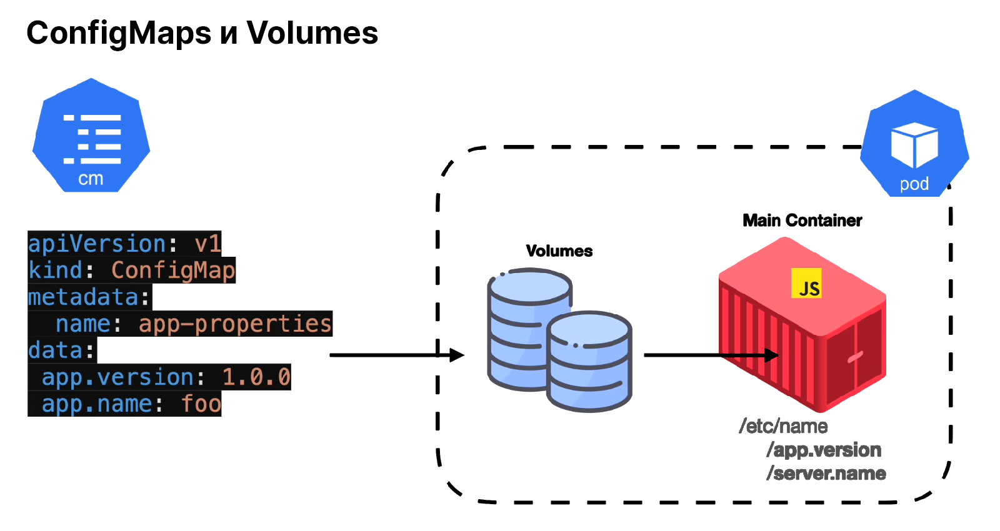

  В директории `microservices-yamls` существует конфигурация 
  [`config-maps-volumes.yml`](microservices-yamls/config-maps-volumes.yml):

  ```yaml
  apiVersion: v1
  kind: ConfigMap
  metadata:
    name: app-properties
  data:
    app-name: order
    app-version: 1.0.0
    team: engineering

  ---

  apiVersion: v1
  kind: ConfigMap
  metadata:
    name: nginx-conf
  data:
    nginx.conf: |
      server {
        listen 80;
        server_name localhost;

        location / {
          root /usr/share/nginx/html;
          index index.html index.htm;
        }

        error_page 500 502 503 504 /50x.html;
        location - /50x.html {
          root /usr/share/nginx/html;
        }

        location /health {
          access_log off;
          return 200 "healthy\n";
        }
      }

  ---

  apiVersion: apps/v1
  kind: Deployment
  metadata:
    name: config-map
  spec:
    selector:
      matchLabels:
        app: config-map
    template:
      metadata:
        labels:
          app: config-map
      spec:
        volumes:
          - name: nginx-conf
            configMap:
              name: nginx-conf
          - name: app-properties
            configMap:
              name: app-properties
        containers:
        - name: config-map-volume
          volumeMounts:
            - mountPath: /etc/order/nginx
              name: nginx-conf
            - mountPath: /etc/order/properties
              name: app-properties
          image: busybox
          resources:
            limits:
              memory: "128Mi"
              cpu: "500m"
          command:
            - "/bin/sh"
            - "-c"
          args:
            - "env & sleep 3600"
        - name: config-map-env
          image: busybox
          resources:
            limits:
              memory: "128Mi"
              cpu: "500m"
          command:
            - "/bin/sh"
            - "-c"
          args:
            - "env & sleep 3600"
          env:
            - name: APP_VERSION
              valueFrom:
                configMapKeyRef:
                  name: app-properties
                  key: app-version
                  env:
            - name: APP_NAME
              valueFrom:
                configMapKeyRef:
                  name: app-properties
                  key: app-name
            - name: TEAM
              valueFrom:
                configMapKeyRef:
                  name: app-properties
                  key: team
            - name: NGINX_CONF
              valueFrom:
                configMapKeyRef:
                  name: nginx-conf
                  key: nginx.conf
  ```

  Применим эту конфигурацию:

  ```bash
  kubectl apply -f config-maps-volumes.yml
  ```

  Результат `kubectl get pods`:

  ```diff
  NAME                          READY   STATUS    RESTARTS   AGE
  ...
  + config-map-5596bc847d-kfmzn   2/2     Running   0          8m18s
  ...
  ```

  Войдём в `sh`-оболочку:

  ```bash
  kubectl exec -it config-map-5596bc847d-kfmzn -c config-map-volume -- sh
  ```

  `cd /etc/order/`->`ls`:

  ```
  nginx       properties
  ```

  `cd properties`->`ls`:

  ```
  app-name     app-version  team
  ```

  `cat team`:

  ```
  engineering
  ```

- Volumes в одной директории

  В директории `microservices-yamls` существует конфигурация 
  [`config-maps-volumes-one-dir.yml`](microservices-yamls/config-maps-volumes-one-dir.yml):

  ```yaml
  apiVersion: v1
  kind: ConfigMap
  metadata:
    name: app-properties
  data:
    app-name: order
    app-version: 1.0.0
    team: engineering

  ---

  apiVersion: v1
  kind: ConfigMap
  metadata:
    name: nginx-conf
  data:
    nginx.conf: |
      server {
        listen 80;
        server_name localhost;

        location / {
          root /usr/share/nginx/html;
          index index.html index.htm;
        }

        error_page 500 502 503 504 /50x.html;
        location - /50x.html {
          root /usr/share/nginx/html;
        }

        location /health {
          access_log off;
          return 200 "healthy\n";
        }
      }

  ---

  apiVersion: apps/v1
  kind: Deployment
  metadata:
    name: config-map
  spec:
    selector:
      matchLabels:
        app: config-map
    template:
      metadata:
        labels:
          app: config-map
      spec:
        volumes:
          - name: nginx-conf
            configMap:
              name: nginx-conf
          - name: app-properties
            configMap:
              name: app-properties
          - name: config
            projected:
              sources:
                - configMap:
                    name: nginx-conf
                - configMap:
                    name: app-properties
        containers:
        - name: config-map-volume
          volumeMounts:
            - mountPath: /etc/order/nginx
              name: nginx-conf
            - mountPath: /etc/order/properties
              name: app-properties
            - mountPath: /etc/order/config
              name: config
          image: busybox
          resources:
            limits:
              memory: "128Mi"
              cpu: "500m"
          command:
            - "/bin/sh"
            - "-c"
          args:
            - "env & sleep 3600"
        - name: config-map-env
          image: busybox
          resources:
            limits:
              memory: "128Mi"
              cpu: "500m"
          command:
            - "/bin/sh"
            - "-c"
          args:
            - "env & sleep 3600"
          env:
            - name: APP_VERSION
              valueFrom:
                configMapKeyRef:
                  name: app-properties
                  key: app-version
                  env:
            - name: APP_NAME
              valueFrom:
                configMapKeyRef:
                  name: app-properties
                  key: app-name
            - name: TEAM
              valueFrom:
                configMapKeyRef:
                  name: app-properties
                  key: team
            - name: NGINX_CONF
              valueFrom:
                configMapKeyRef:
                  name: nginx-conf
                  key: nginx.conf
  ```

  Применим эту конфигурацию:

  ```bash
  kubectl apply -f config-maps-volumes-one-dir.yml
  ```

  Результат `kubectl get pods`:

  ```diff
  NAME                          READY   STATUS    RESTARTS   AGE
  ...
  + config-map-5f755c6675-zxgg6   2/2     Running   0          44s
  ...
  ```

  Зайдём в `sh`-оболочку контейнера `config-map-volume` с помощью команды 
  `kubectl exec -it config-map-5f755c6675-zxgg6 -c config-map-volume -- sh` и 
  выполним там следующую команду:

  ```bash
  cd /etc/order/config/
  ```

  Затем следующую:

  ```
  ls
  ```

  Результат:

  ```
  app-name     app-version  nginx.conf   team
  ```

#### **Secrets** (**Секреты**)

**Secrets** хранят и управляют чувствительной (sensitive) информацией.

> **ConfigMaps** используются только для хранения конфигурационных файлов. 
> Чувствительная (sensitive) информация **не должна** храниться, используя 
> **ConfigMaps**.

> Но и не стоит хранить очень чувствительную (sensitive) информацию, такую как 
> пароли БД и т.д. Для таких целей следует использовать инструменты вроде 
> [Vault](https://www.vaultproject.io/).

В директории `microservices-yamls` существует конфигурация 
[`secrets.yml`](microservices-yamls/secrets.yml):

```yaml
apiVersion: apps/v1
kind: Deployment
metadata:
  name: secrets
spec:
  selector:
    matchLabels:
      app: secrets
  template:
    metadata:
      labels:
        app: secrets
    spec:
      volumes:
        - name: secret-1
          secret:
            secretName: mysecret
      containers:
      - name: secrets
        image: busybox
        volumeMounts:
          - mountPath: /etc/secrets
            name: secret-1
        env:
          - name: SECRET
            valueFrom:
              secretKeyRef:
                key: secret
                name: mysecret-from-file
        command:
          - "sleep"
          - "3600"
        resources:
          limits:
            memory: "128Mi"
            cpu: "500m"
```

Применим эту конфигурацию:

```bash
kubectl apply -f secrets.yml
```

Результат `kubectl get pods`:

```diff
NAME                          READY   STATUS    RESTARTS   AGE
...
+ secrets-5dd579b445-fxjp5      1/1     Running   0          22s
...
```

Зайдём в `sh`-оболочку с помощью команды 
`kubectl exec -it secrets-5dd579b445-fxjp5 -- sh` и выполним там следующие 
команды:

```bash
env
```

Результат:

```diff
...
+ SECRET=another-secret
...
```

Затем:

```bash
cd /etc/secrets/
```

```bash
ls
```

Результат:

```
api-token    db-password
```

Результат `cat db-password`:

```
123
```

##### Типы **Secrets**

[Types of Secret on Kubernetes website](https://kubernetes.io/docs/concepts/configuration/secret/#secret-types).

##### Пуллинг приватного образа Docker

Если пуллить приватный образ, например, с **Docker Hub**, можно в `kubectl get 
pods` можно увидеть ошибку `ErrImagePull` в поле `STATUS`.

Чтобы **Kubernetes** получил доступ, нужно создать следующий **Secret**:

```bash
kubectl create secret docker-registry docker-hub-private \
--docker-username=<имя_пользователя> \
--docker-password=<пароль> \
--docker-email=<email> \
```

Далее в конфигурационный файл в `spec`->`template`->`spec` нужно добавить 
следующее:

```yaml
imagePullSecrets:
  - name: docker-hub-private
```
