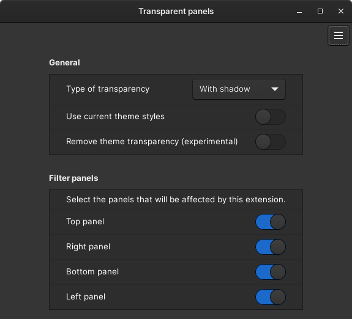
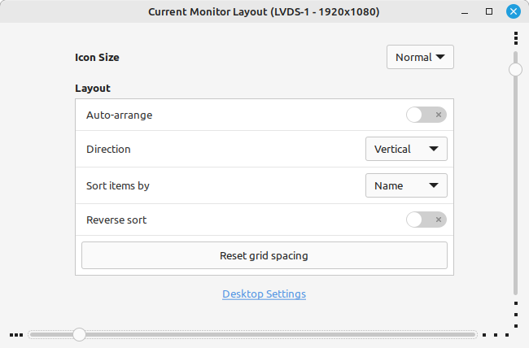
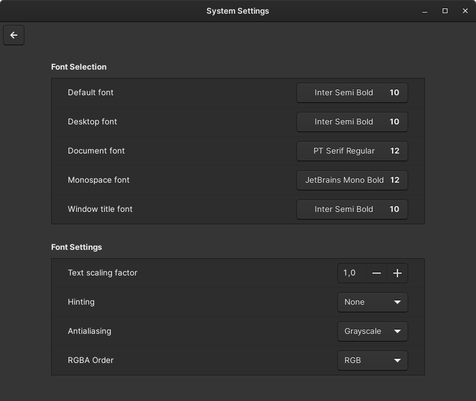
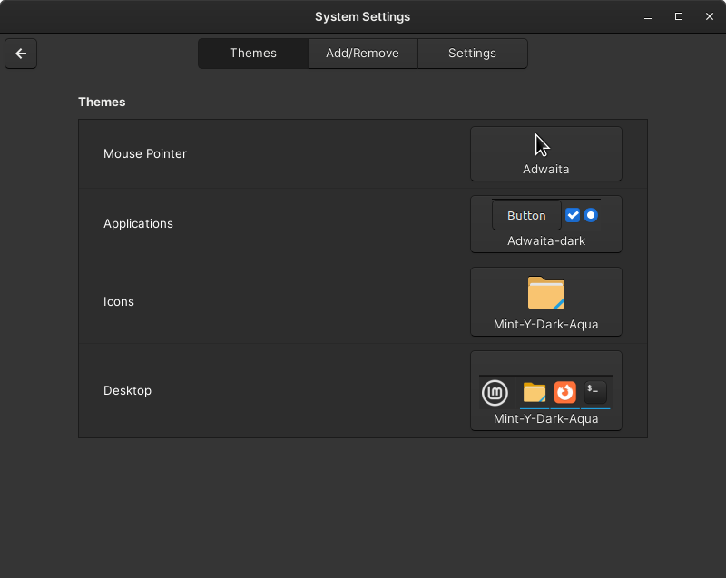
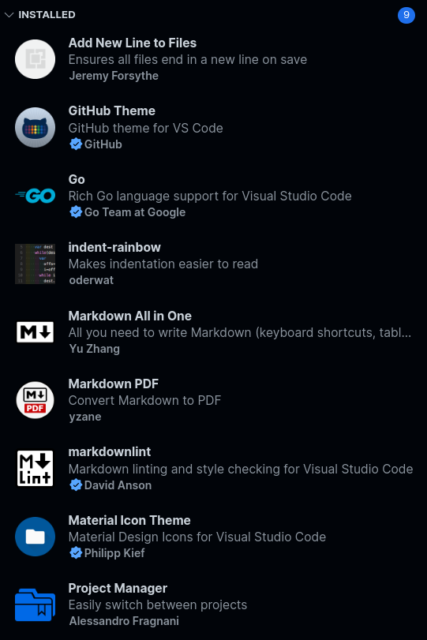

# Linux Mint

## Содержание

- [Linux Mint](#linux-mint)
  - [Содержание](#содержание)
  - [Alt + Shift для переключения раскладки клавиатуры](#alt--shift-для-переключения-раскладки-клавиатуры)
  - [Обновление пакетов](#обновление-пакетов)
  - [Установка и настройка git](#установка-и-настройка-git)
  - [Создание ключей для GitHub](#создание-ключей-для-github)
    - [SSH-ключи](#ssh-ключи)
    - [GPG-ключи](#gpg-ключи)
  - [Настройка терминала и оболочки zsh](#настройка-терминала-и-оболочки-zsh)
  - [Настройка панели](#настройка-панели)
    - [Transparent panels](#transparent-panels)
  - [Установка flameshot](#установка-flameshot)
  - [Настройка рабочего стола](#настройка-рабочего-стола)
  - [Рекомендуемые шрифты и их использование](#рекомендуемые-шрифты-и-их-использование)
  - [Настройка темы Cinnamon](#настройка-темы-cinnamon)
  - [Установка драйвера видеокарты Nvidia](#установка-драйвера-видеокарты-nvidia)
  - [Разрешение и установка snapd](#разрешение-и-установка-snapd)
  - [Установка и настройка Chromium](#установка-и-настройка-chromium)
    - [Установка браузером по умолчанию](#установка-браузером-по-умолчанию)
    - [Внешний вид](#внешний-вид)
    - [Стартовая страница](#стартовая-страница)
    - [Поисковые движки](#поисковые-движки)
    - [Цветовая схема](#цветовая-схема)
  - [Приложения для разработки и программирования](#приложения-для-разработки-и-программирования)
    - [build-essential (gcc, g++, ...)](#build-essential-gcc-g-)
    - [Go](#go)
    - [Visual Studio Code](#visual-studio-code)
      - [Установка](#установка)
      - [Must-have плагины](#must-have-плагины)
      - [`settings.json`](#settingsjson)
  - [Установка wine](#установка-wine)
  - [Установить и забыть](#установить-и-забыть)
    - [Midnight Commander](#midnight-commander)

## Alt + Shift для переключения раскладки клавиатуры

`System Settings` -> `Keyboard` -> `Layouts` -> `Options...` ->
`Switching to another layout` -> `Alt+Space`.

## Обновление пакетов

```bash
sudo apt update
```

```bash
sudo apt upgrade
```

## Установка и настройка git

```bash
sudo apt install git
```

Базовая конфигурация git:

- `git config --global user.name "Alexander Konovalov"`;
- `git config --global user.email shuryak@protonmail.com`;
- `git config --global init.defaultBranch main`;
- `git config --global core.fileMode false`.

## Создание ключей для GitHub

### SSH-ключи

> [Гайд от GitHub](https://docs.github.com/en/authentication/connecting-to-github-with-ssh/generating-a-new-ssh-key-and-adding-it-to-the-ssh-agent).

```bash
ssh-keygen -t ed25519 -C "shuryak@protonmail.com"
```

(Желательно не менять расположение ключей по умолчанию).

Проверяем, запущен ли ssh-agent:

```bash
eval "$(ssh-agent -s)"
```

(Должен вернуться Process ID).

Добавление приватных SSH-ключей в ssh-agent:

```bash
ssh-add ~/.ssh/id_ed25519
```

Вывод публичного ключа:

```bash
cat ~/.ssh/id_ed25519.pub
```

### GPG-ключи

> [Гайд от CodeX](https://codex.so/gpg-verification).

```bash
gpg --full-generate-key
```

Следует выбрать `RSA and RSA`. Размер ключа установить `4096`.

(Вводимый email должен совпадать с email на GitHub).

Выводим список ключей:

```bash
gpg --list-secret-keys --keyid-format LONG
```

Нас интересует ID PGP-ключа в поле `sec`.

Выполняем экспорт ключа в формате ASCII по его ID:

```bash
gpg --armor --export ID_КЛЮЧА
```

Настройка Git для подписи всех коммитов этим ключом:

```bash
git config --global commit.gpgsign true
```

```bash
git config --global user.signingkey ID_КЛЮЧА
```

## Настройка терминала и оболочки zsh

```bash
sudo apt install zsh
```

Установка [Oh My Zsh](https://github.com/ohmyzsh/ohmyzsh):

```bash
sh -c "$(curl -fsSL https://raw.githubusercontent.com/ohmyzsh/ohmyzsh/master/tools/install.sh)"
```

```bash
Do you want to change your default shell to zsh? [Y/n] Y
```

Переключение оболочки по умолчанию на zsh вручную:

```bash
chsh -s $(which zsh)
```

Теперь необходимо перезайти в пользователя.

Настройка темы для zsh:

```bash
nano ~/.zshrc
```

- `ZSH_THEME="af-magic"`

Настройка GNOME Terminal:

`Edit` -> `Preferences` -> `General`:

- [ ] `Show menubar by default in new terminals`

## Настройка панели

ПКМ по панели -> `Panel edit mode` -> ПКМ по `Grouped window list` ->
`Configure...` -> `General`:

- [ ] `Group windows by application`

... -> `Panel`:

- `Button label` -> `Window title`

### Transparent panels

`System Settings` -> `Extensions` -> `Download` -> `Transparent Panels`.

Далее необходимо перейти на вкладку `Manage`, нажать `+` для
`Transparent Panels`, затем перейти в настройки расширения.



## Установка flameshot

```bash
sudo apt install flameshot
```

Далее необходимо открыть flameshot и в трее нажать `Configuration`. Выбрать
предпочитаемый цвет. В `Configuration` -> `General` сделать:

- [ ] `Show help message`;
- [ ] `Show the side panel button`;
- [ ] `Show desktop notification`;
- [ ] `Show tray icon`.

В системе: `System Settings` -> `Keyboard` -> `Shortcuts` -> `System` ->
`Screenshots and Recording`:

- `Take a screenshot of an area` -> `unassigned`;
- `Copy a screenshot of an area to clipboard` -> `unassigned`;
- `Take a screenshot` -> `unassigned`;
- `Copy a screenshot to clipboard` -> `unassigned`;
- `Take a screenshot of a window` -> `unassigned`;
- `Copy a screenshot of a window to clipboard` -> `Alt+Print`.

Для того, чтобы установить `Alt+Print`, необходимо **сначала** зажать `Print` и
только затем нажать **левый** `Alt`.

Перейти в `Custom Shortcuts` -> `Add custom shortcut`:

- `Name` -> `flameshot`;
- `Command` -> `flameshot gui`.

Установить комбинацию `Print` для `flameshot` в `Keyboard bindings`.

## Настройка рабочего стола

ПКМ по рабочему столу -> `Customize`:

- [ ] `Auto-arrange`.

... -> `Desktop Settings`:

- [x] `Computer`;
- [ ] `Home`;
- [x] `Trash`;
- [ ] `Mounted Drives`;
- [ ] `Network`.

Настройка сетки:



## Рекомендуемые шрифты и их использование

Рекомендуемые шрифты:

- [Inter](https://github.com/rsms/inter/releases);
- [JetBrains Mono](https://github.com/JetBrains/JetBrainsMono/releases);
- [Cascadia Code](https://github.com/microsoft/cascadia-code/releases);
- [Paratype Public Pack](https://www.paratype.ru/collections/pt/44157).

> Для установки перечисленных выше шрифтов желательно установить Font Manager:
>
> ```bash
> sudo apt install font-manager
> ```

Установка базовых шрифтов Microsoft:

```bash
sudo add-apt-repository multiverse
```

```bash
sudo apt update
```

```bash
sudo apt install ttf-mscorefonts-installer
```

При установке данного пакета в терминале необходимо нажать `<OK>` (переключиться
на кнопку с помощью клавиши Tab и нажать Enter), а затем `<Yes>`.

Далее необходимо обновить кеш шрифтов:

```bash
sudo fc-cache -f -v
```

Применение шрифтов и настройка сглаживания:

`System Settings` -> `Font Selection`:



## Настройка темы Cinnamon

`System Settings` -> `Themes`:



## Установка драйвера видеокарты Nvidia

`Driver Manager` -> выбрать `(recommended)` драйвер -> `Apply Changes`.

## Разрешение и установка snapd

```bash
sudo mv /etc/apt/preferences.d/nosnap.pref ~/Documents/nosnap.backup
```

```bash
sudo apt update
```

```bash
sudo apt install snapd
```

## Установка и настройка Chromium

```bash
sudo apt install chromium
```

### Установка браузером по умолчанию

- `Settings` -> `Default Browser` -> `Make default`.

### Внешний вид

- `Settings` -> `Appearance` -> `Use Classic`;
- [ ] `Settings`  -> `Appearance` -> `Show home button`;
- [x] `Settings` -> `Appearance` -> `Show bookmarks bar`;
- [ ] `Settings` -> `Appearance` -> `Use system title bar and borders`;
- `Settings` -> `Appearance` -> `Customize fonts`:
  
  

### Стартовая страница

- `Settings` -> `On startup` -> `Open the New Tab page`.

### Поисковые движки

- `Settings` -> `Search engine` -> `Manage search engines and site search`:

  Яндекс:

  - `Search engine`: `Яндекс`
  - `Shortcut`: `@ya`
  - `URL with %s in place of query`: `https://yandex.ru/search?text=%s`

  Google:

  - `Search engine`: `Google`
  - `Shortcut`: `google.com`
  - `URL with %s in place of query`:
    `{google:baseURL}search?q=%s&{google:RLZ}{google:originalQueryForSuggestion}{google:assistedQueryStats}{google:searchFieldtrialParameter}{google:iOSSearchLanguage}{google:searchClient}{google:sourceId}{google:contextualSearchVersion}ie={inputEncoding}`

### Цветовая схема

Новая вкладка -> `Customize Chromium` -> `Color and theme`.

## Приложения для разработки и программирования

### build-essential (gcc, g++, ...)

```bash
sudo apt install build-essential
```

### Go

Для установки Go я рекомендую использовать утилиту
[GVM](https://github.com/moovweb/gvm).

Установка GVM:

```bash
zsh < <(curl -s -S -L https://raw.githubusercontent.com/moovweb/gvm/master/binscripts/gvm-installer)
```

(`zsh` можно заменить на `bash`).

После выполнения команды нужно перезапустить сессию терминала.

В первую очередь необходимо установить Go 1.4 из бинарников для компиляции
новой версии Go:

```bash
gvm install go1.4 -B
```

```bash
gvm use go1.4
```

```bash
export GOROOT_BOOTSTRAP=$GOROOT
```

Установим, например, Go 1.17.13 (она на момент написания этой статьи является
минимальной для компиляции Go 1.20.1):

```bash
gvm install go1.17.13
```

```bash
gvm use go1.17.13
```

Далее удалим Go 1.4:

```bash
gvm uninstall go1.4
```

Установим версию Go 1.17.13 по умолчанию:

```bash
gvm use go1.17.13 --default
```

### Visual Studio Code

#### Установка

[Инструкция по установке от Microsoft](https://code.visualstudio.com/docs/setup/linux#_debian-and-ubuntu-based-distributions).

```bash
wget -qO- https://packages.microsoft.com/keys/microsoft.asc | gpg --dearmor > packages.microsoft.gpg
```

```bash
sudo install -D -o root -g root -m 644 packages.microsoft.gpg /etc/apt/keyrings/packages.microsoft.gpg
```

```bash
sudo sh -c 'echo "deb [arch=amd64,arm64,armhf signed-by=/etc/apt/keyrings/packages.microsoft.gpg] https://packages.microsoft.com/repos/code stable main" > /etc/apt/sources.list.d/vscode.list'
```

```bash
rm -f packages.microsoft.gpg
```

```bash
sudo apt install apt-transport-https
```

```bash
sudo apt update
```

```bash
sudo apt install code
```

#### Must-have плагины



#### `settings.json`

```json
{
  "editor.fontFamily": "JetBrains Mono",
  "editor.fontSize": 16,
  "editor.fontWeight": 600,
  "editor.minimap.enabled": false,
  "editor.rulers": [80, 120],
  "editor.wordWrap": "off",
  "editor.bracketPairColorization.enabled": true,
  "editor.guides.bracketPairs":"active",
  "editor.fontLigatures": true,
  "terminal.integrated.fontFamily": "JetBrains Mono",
  "terminal.integrated.fontSize": 16,
  "terminal.integrated.fontWeight": 700,
  "explorer.compactFolders": false,
  "workbench.iconTheme": "material-icon-theme",
  "workbench.colorTheme": "GitHub Dark Default",
  "security.workspace.trust.untrustedFiles": "open",
}
```

## Установка wine

```bash
sudo apt install wine
```

Для запуска `.exe`-файлов теперь необходимо выбрать любой `.exe`-файл, нажать по
нему ПКМ, `Open With` -> `Other Application...` -> в поле ввести `wine` и нажать
`Add to list` -> `OK`.

## Установить и забыть

### Midnight Commander

```bash
sudo apt install mc
```
