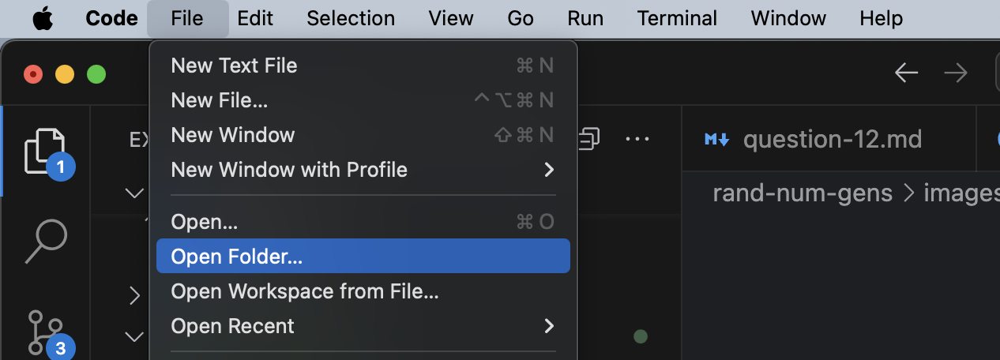
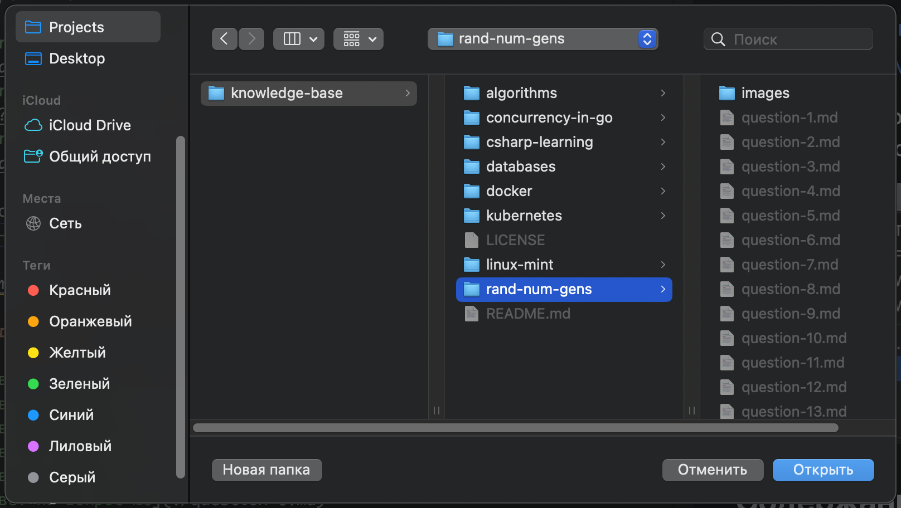

# Ответы на вопросы зачёта по дисциплине «Генераторы случайных чисел»

## Просмотр

Для просмотра рекомендуется использовать
[Visual Studio Code](https://code.visualstudio.com/) со следующими расширениями:

- [Markdown All in One](https://marketplace.visualstudio.com/items?itemName=yzhang.markdown-all-in-one)
- [Markdown Preview Github Styling](https://marketplace.visualstudio.com/items?itemName=bierner.markdown-preview-github-styles)
- [Markdown+Math](https://marketplace.visualstudio.com/items?itemName=goessner.mdmath)

Для корректного отображения математических формул нужно открыть директорию
`rand-num-gens` в Visual Studio Code:

<table><tbody><tr>
<td>

Открытие директории <code>rand-num-gens</code>

  
  

</td>
</tr></tbody></table>

## Содержание

- [Ответ на вопрос №1](./question-1.md)
- [Ответ на вопрос №2](./question-2.md)
- [Ответ на вопрос №3](./question-3.md)
- [Ответ на вопрос №4](./question-4.md)
- [Ответ на вопрос №5](./question-5.md)
- [Ответ на вопрос №6](./question-6.md)
- [Ответ на вопрос №7](./question-7.md)
- [Ответ на вопрос №8](./question-8.md)
- [Ответ на вопрос №9](./question-9.md)
- [Ответ на вопрос №10](./question-10.md)
- [Ответ на вопрос №11](./question-11.md)
- [Ответ на вопрос №12](./question-12.md)
- [Ответ на вопрос №13](./question-13.md)
- [Ответ на вопрос №14](./question-14.md)
- [Ответ на вопрос №15](./question-15.md)
- [Ответ на вопрос №16](./question-16.md)
- [Ответ на вопрос №17](./question-17.md)
- [Ответ на вопрос №18](./question-18.md)
