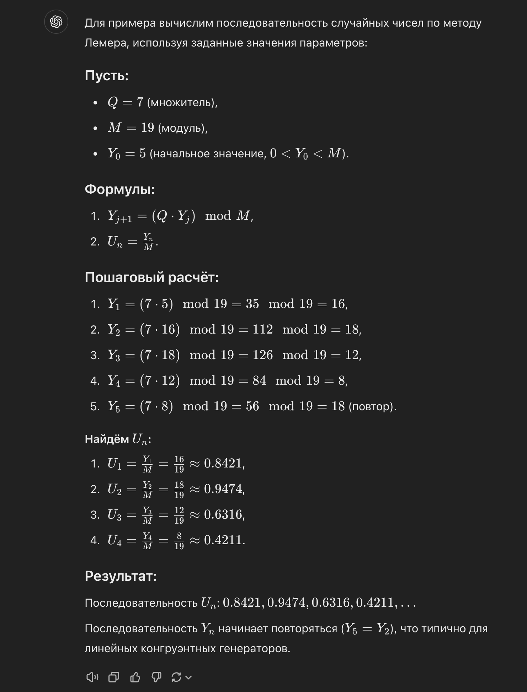
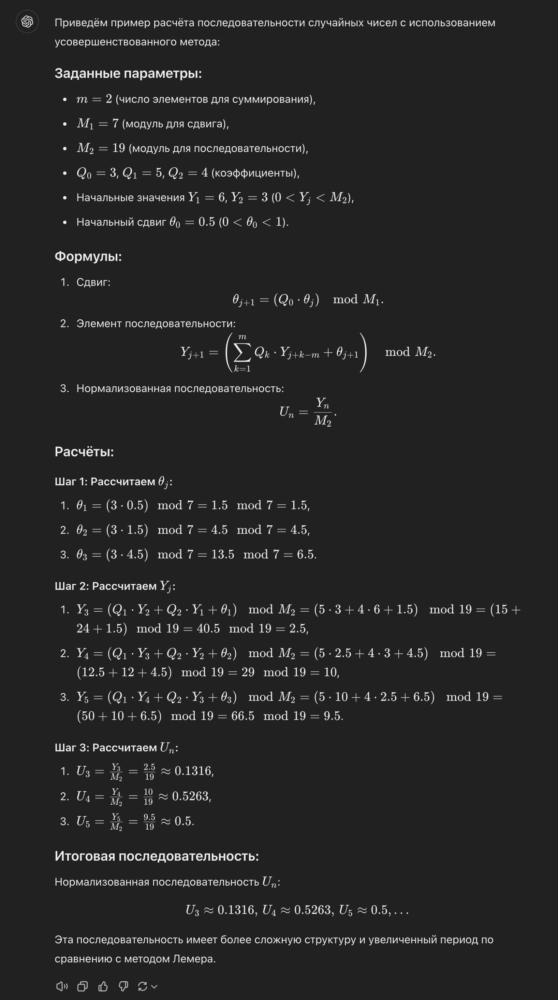

# Вопрос №1. Генерация случайной величины, равномерно распределённой в $\left[0, 1\right]$.

## Базовый способ

Д. Лемер в 1951 г. предложил метод сравнения для получения последовательности
случайных чисел, равномерно распределённых на $\left[0, 1\right]$:

1. Выбираются целые положительные числа $Q$, $M$ и $Y_0$ ($0 < Y_0 < M$).
2. Последовательность случайных чисел вычисляется по рекуррентной формуле:
   $Y_{j+1} = Q \cdot Y_j \pmod M$, $j = 0, 1, \ldots, n$.
3. Необходимая последовательность вычисляется из соотношения $U_n = Y_n / M$.

> [!NOTE] Примечание
>
> Для ускорения вычислений выбирают число $M$, равное размеру машинного слова.

> [!NOTE] Примечание
>
> Такой генератор называется мультипликативным.

## Усовершенствованный способ

Этот способ используется для получения более совершенных последовательностей —
они имеют существенно больший период повторения.

1. Выбираются целые положительные числа
   $m, M_1, M_2, Q_0, Q_1, Q_2, \ldots, Q_m$.
2. Выбираются $m$ начальных целых значений последовательности $Y_j$ из
   $\left(0; M_2\right)$.
3. Выбирается число $\uptheta_0$ ($0 < \uptheta_0 < 1$).
4. Рассчитывается сдвиг $\uptheta_{j+1} = Q_0 \cdot \uptheta_j \pmod{M_1}$ от
   $j = 0$ до $j = m$.
5. Рассчитывается случайное число
   $Y_{j+1} = \left(\sum\limits_{k=1}^{m} Q_k \cdot Y_{j+k-m} + \uptheta_{j+1}\right) \pmod{M_2}$,
   $j = m, m+1, \ldots$.
6. Необходимая последовательность вычисляется из соотношения $U_n = Y_n / M_2$.

> [!NOTE] Примечание
>
> В пунктах №4 и №5 используется формула из [Базового способа](#базовый-способ).

> [!NOTE] Примечание
>
> Сдвиг $\uptheta_{m+1}$, необходимый для формулы из пункта №5, получают
> последовательным применением формулы из [Базового способа](#базовый-способ) от
> $j = 0$ до $j = m$.

> [!NOTE] Примечание
>
> Получаемые таким способом последовательности называются _линейными
> конгруэнтными последовательностями_.

