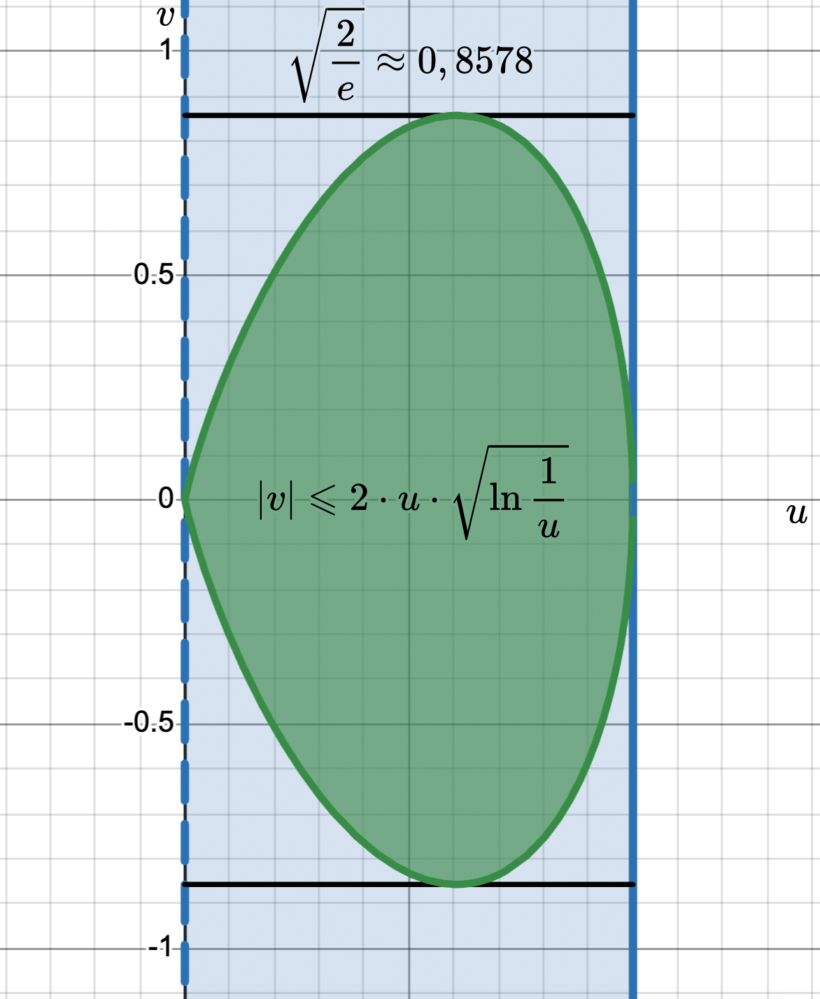
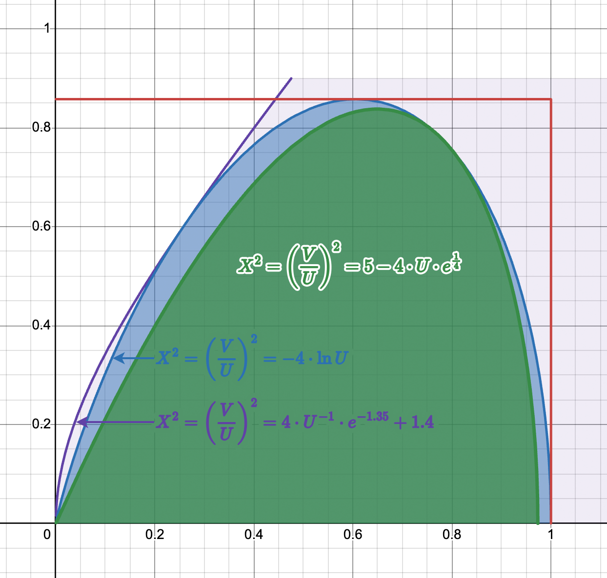

# Вопрос №19. Генерация нормально распределённых случайных величин — метод отношений

> Метод отношений для генерации нормальных случайных величин был предложен в
> 1976 г. А. Дж. Киндерманом (Kinderman A.J.) и Дж. Ф. Монаханом (Monahan J.F.)

Метод заключается в следующем:

Двумерная случайная величина $\left(U, V\right)$ равномерно распределена в
области плоскости
$\sigma = \left\{u > 0; u^2 \leqslant g\left(\dfrac{v}{u}\right)\right\}$.

> Предполагается, что $g$ — неотрицательная интегрируемая функция.

Определяется случайная величина $X = \dfrac{V}{U}$. Её функция распределения
$F\left(x\right) = \mathrm{P}\left(X < x\right)$. Вероятность находим, используя
геометрический подход к определению вероятности:

$$\mathrm{P}\left(X < x\right) = \dfrac{\iint\limits_{\sigma_x} \mathrm{d}u\mathrm{d}v}{\iint\limits_\sigma \mathrm{d}u\mathrm{d}v}$$

, где область
$\sigma_x = \left\{u > 0; \, u^2 \leqslant g\left(\dfrac{v}{u}\right); \, \dfrac{v}{u} < x\right\}$.

Для вычисления интегралов сделаем замену
$v = z \cdot u \Rightarrow \mathrm{d}v = u\mathrm{d}z$. Тогда

- $\iint\limits_{\sigma_x} \mathrm{d}u\mathrm{d}v = \int\limits_{-\infty}^x \mathrm{d}z \int\limits_{0}^{\sqrt{g\left(z\right)}} u\mathrm{d}u = \dfrac{1}{2} \cdot \int\limits_{-\infty}^x g\left(z\right) \mathrm{d}z$
- $\iint\limits_{\sigma} \mathrm{d}u\mathrm{d}v = \int\limits_{-\infty}^{+\infty} \mathrm{d}z \int\limits_{0}^{\sqrt{g\left(z\right)}} u\mathrm{d}u = \dfrac{1}{2} \cdot \int\limits_{-\infty}^{+\infty} g\left(z\right) \mathrm{d}z$

Если взять $g\left(z\right) = e^{-\dfrac{z^2}{2}}$, то, учитывая интеграл
Пуассона
$\int\limits_{-\infty}^{+\infty} e^{-\dfrac{z^2}{2}} \mathrm{d}z = \sqrt{2 \cdot \pi}$,
получим

$$\mathrm{P}\left(X < x\right) = \dfrac{1}{\sqrt{2 \cdot \pi}} \cdot \int\limits_{-\infty}^{x} e^{-\dfrac{z^2}{2}} \mathrm{d}z = \mathrm{N}_0\left(x\right)$$

Это означает, что $X = \dfrac{V}{U}$ является нормированной нормальной случайной
величиной.

Область
$\sigma = \left\{u > 0; \, u^2 \leqslant g\left(\dfrac{v}{u}\right)\right\}$
превращается в область
$\sigma = \left\{0 < u \leqslant 1; \, \left|v\right| \leqslant 2 \cdot u \cdot \sqrt{\ln{\dfrac{1}{u}}}\right\}$,
рисунок:

Это вытекает из преобразования неравенства
$u^2 \leqslant g\left(\dfrac{v}{u}\right) \Leftrightarrow u^2 \leqslant e^{-\dfrac{v^2}{2 \cdot u^2}} \Leftrightarrow 2 \cdot \ln{u} \leqslant -\dfrac{v^2}{2 \cdot u^2} \Leftrightarrow v^2 \leqslant -4 \cdot u^2 \cdot \ln{u} \Leftrightarrow$

$\Leftrightarrow v^2 \leqslant 4 \cdot u^2 \cdot \ln{\dfrac{1}{u}} \Leftrightarrow \left|v\right| \leqslant 2 \cdot u \cdot \sqrt{\ln{\dfrac{1}{u}}}$.

Следует отметить, что
<mark>$v^2 \leqslant -4 \cdot u^2 \cdot \ln{u} \Leftrightarrow \left(\dfrac{v}{u}\right)^2 \leqslant -4 \cdot \ln{u}$</mark>.

Ограничение сверху для $u$ необходимо для существования корня, так как
$0 < u \leqslant 1 \Rightarrow \ln{\dfrac{1}{u}} \geqslant 0$. Ордината верхней
точки области равна $\sqrt{\dfrac{2}{e}} \approx 0.8578$.

Чтобы вычислять логарифм только в крайнем случае, для ускорения генерации
предложен следующий алгоритм:

1. [Генерируются](./question-1.md) равномерно распределённые в
   $\left[0, \, 1\right)$ числа $U \neq 0$ и $Z$. По ним вычисляется величина
   $X = \dfrac{\sqrt{\dfrac{8}{e}} \cdot \left(Z - \dfrac{1}{2}\right)}{U}$.
2. Проверяется верхняя грань. Если
   $X^2 \leqslant 5 - 4 \cdot U \cdot e^{\frac{1}{4}}$, то получено нужное $X$
3. Проверка нижней грани. Если
   $X^2 \geqslant \dfrac{4 \cdot e^{-1.35}}{U} + 1.4$, то возврат к шагу 1.
4. Если $X^2 \leqslant -4 \cdot \ln{U}$, то получено нужное $X$. Иначе возврат к
   шагу 1. При генерации случайной величины $Z \in \left[0, \,1\right)$,
   величина
   $V = \sqrt{\dfrac{8}{e}} \cdot \left(Z - \dfrac{1}{2}\right) \in \left(-\sqrt{\dfrac{2}{e}}, \, \sqrt{\dfrac{2}{e}}\right)$.
   Это означает, что на первом шаге генерируется двумерная случайная величина
   $\left(U, \, V\right)$, равномерно распределённая в прямоугольнике,
   окаймляющем границу области $\sigma$. При этом $X = \dfrac{V}{U}$.

---

На втором и третьем шагах проверяется попадание $X$ в область $\sigma$. Границы
неравенств получены из известного неравенства
$e^x \geqslant 1 + x \Leftrightarrow x \geqslant \ln{\left(1 + x\right)}$.
Сделаем замену $x = U - 1$.

Тогда $U - 1 \geqslant \ln{U} \Leftrightarrow 1 - U \leqslant -\ln{U}$. В первом
неравенстве заменим $U$ на $\dfrac{1}{c \cdot U}$, а во втором — $U$ на
$c \cdot U$. Учитывая равенство $\ln{\dfrac{1}{U}} = -\ln{U}$, получим
неравенство

$$1 - c \cdot U \leqslant \ln{\dfrac{1}{c \cdot U}} \leqslant \dfrac{1}{c \cdot U} - 1 \Leftrightarrow 1 - c \cdot U + \ln{c} \leqslant \ln{\dfrac{1}{c \cdot U}} + \ln{c} \leqslant \dfrac{1}{c \cdot U} - 1 + \ln{c} \Leftrightarrow$$

$$\Leftrightarrow 1 - c \cdot U + \ln{c} \leqslant \ln{\dfrac{1}{U}} \leqslant \dfrac{1}{c \cdot U} - 1 + \ln{c}$$.

Домножая на $4$, получим:

$$4 - 4 \cdot c \cdot U + 4 \cdot \ln{c} \leqslant 4 \cdot \ln{\dfrac{1}{U}} \leqslant \dfrac{4}{c \cdot U} - 4 + 4 \cdot \ln{c}$$

Для каждого неравенства найдены соответствующие значения констант. Для левого —
$c = e^{\frac{1}{4}}$, для правого — $c = e^{1.35}$.

Левое неравенство примет вид:

$$4 - 4 \cdot e^{\frac{1}{4}} \cdot U + 4 \cdot \ln{e^{\frac{1}{4}}} \leqslant 4 \cdot \ln{\dfrac{1}{U}} \Leftrightarrow 5 - 4 \cdot U \cdot e^{\frac{1}{4}} \leqslant -4 \cdot \ln{U}$$

Если выполнен второй шаг и
$X^2 = \left(\dfrac{V}{U}\right)^2 \leqslant 5 - 4 \cdot U \cdot e^{\frac{1}{4}} \leqslant -4 \cdot \ln{U}$,
то точка $\left(U, \, V\right)$ точно находится в области $\sigma$. Это следует
из <mark>соотношения</mark>.

Правое неравенство примет вид:

$$4 \cdot \ln{\dfrac{1}{U}} \leqslant \dfrac{4}{e^{1.35} \cdot U} - 4 + 4 \cdot \ln{e^{1.35}} \Leftrightarrow -4 \cdot \ln{U} \leqslant 4 \cdot U^{-1} \cdot e^{-1.35} + 1.4$$

Если выполнен третий шаг и
$-4 \cdot \ln{U} \leqslant 4 \cdot U^{-1} \cdot e^{-1.35} + 1.4 \leqslant X^2$,
то точка $\left(U, \, V\right)$ не попадает в область $\sigma$. Вероятность
перехода к четвёртому шагу очень мала. Она равна вероятности попадания точки
$\left(U, \, V\right)$ в незаштрихованные области на рисунке:

<!-- TODO: "незаштрихованные" не подходит к рисунку -->

