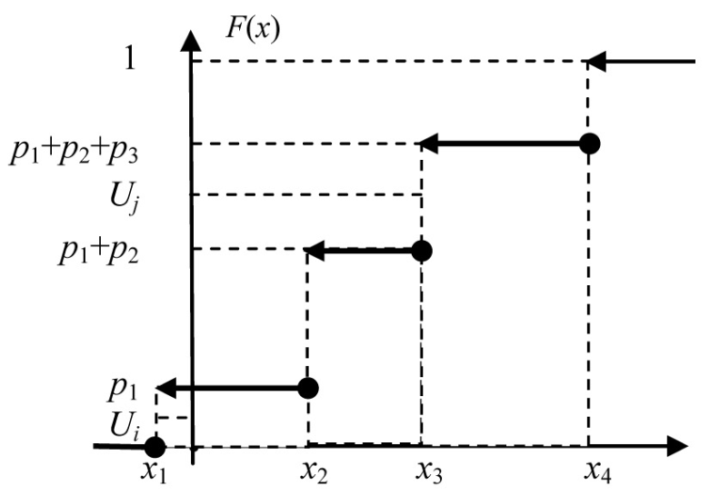

# Вопрос №2. Метод обращения для генерации дискретной случайной величины

Пусть дискретная случайная величина $X$ задана законом распределения

| $X$ | $x_1$ | $x_2$ | $\dots$ | $x_n$ |
| --- | ----- | ----- | ------- | ----- |
| $P$ | $p_1$ | $p_2$ | $\dots$ | $p_n$ |

> Все значения дискретной случайной величины $X$, стоящие в первой строке,
> различны и расположены в порядке возрастания.

Метод обращения для генерации дискретной случайной величины:

Интервал $\left[0, \, 1\right)$ разбивается на подынтервалы.

- Первый интервал $\left[0, \, p_1\right)$
- Второй интервал $\left[p_1, \, p_1+p_2\right)$
- Третий интервал $\left[p_1+p_2, \, p_1+p_2+p_3\right)$
- $\ldots$
- $k$-й интервал
  $\left[p_1+p_2+\ldots+p_{k-1}, \, p_1+p_2+\ldots+p_{k-1}+p_k\right)$
- $\ldots$
- $n$-й интервал $\left[p_1+p_2+\ldots+p_{n-1}, \, 1\right)$.

> Длина каждого $k$-го интервала равна вероятности появления $k$-го значения
> случайной величины $x_k$.

Из геометрического подхода к определению вероятности следует, что случайная
точка, брошенная в интервал $\left[0, \, 1\right)$, попадает в $k$-й
подыинтервал с вероятностью равной $p_k$.

$F\left(x\right)$ — функция распределения дискретной случайной величины $X$:

<!--  -->

На рисунке:

- Значение $U_i$ попало в $\left[0, \, p_1\right)$, поэтому $X_i$ примет
  значение $x_1$
- Значение $U_j$ попало в $\left[p_1+p_2, \, p_1+p_2+p_3\right)$, поэтому $X_j$
  примет значение $x_3$.

Генерируемое значение $X$ находится под той ступенькой графика
$F\left(x\right)$, которую пересекает горизонталь от очередного значения $U$.

Алгоритм генерации дискретной случайной величины:

1. [Генерируется](./question-1.md) последовательность чисел
   $U_1, U_2, \ldots, U_n$, равномерно распределённых в интервале
   $\left[0, \, 1\right)$.
2. Если $U_i \in \left[0, p_1\right)$, т.е. $U_i$ попадает в первый интервал, то
   $i$-е значение дискретной случайной величины равно $x_1$.
3. Если $U_i \in \left[p_1+\ldots+p_{k-1}, \, p_1+\ldots+p_{k-1}+p_k\right)$,
   т.е. $U_i$ попадает в $k$-й интервал, то $i$-е значение случайной величины
   равно $x_k$.
