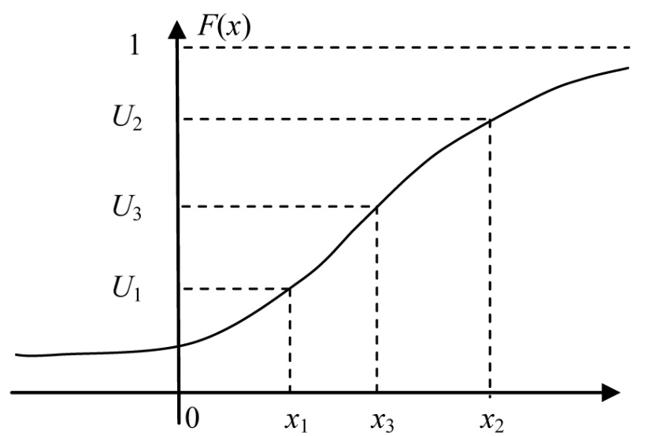

# Вопрос №3. Метод обращения для генерации непрерывной случайной величины

Пусть плотность распределения вероятности непрерывной случайной величины $X$
задаётся функцией $p_X\left(x\right)$, а функция распределения вероятностей
$F_X\left(x\right) = \int\limits_{-\infty}^x p_X\left(x\right) \, \mathrm{d}x$.

Метод обращения для генерации случайной величины $X$ базируется на следующем
утверждении:

> Если случайная величина $U$ подчинена равномерному закону распределения
> вероятностей своих значений на интервале $\left[0, \, 1\right)$, то величина
> $\arc{X} = F_X^{-1}\left(U\right)$ подчинена закону распределения вероятностей
> с функцией распределения $F_X\left(x\right)$.
>
> Действительно, так как функция распределения вероятности любой случайной
> величины является неубывающей, то
>
> $F_{\arc{X}} \left(x\right) \overset{\mathrm{def}}{=} \mathrm{P}\left(\arc{X} < x\right) = \mathrm{P}\left(F_X^{-1}\left(U\right) < x\right) = \mathrm{P}\left(U < F_X\left(x\right)\right) = U_0\left(F_X\left(x\right)\right) = F_X\left(x\right)$.

Функция распределения $F_X\left(x\right)$ непрерывной случайной величины:

Алгоритм генерации непрерывной случайной величины:

1. [Генерируется](./question-1.md) последовательность чисел
   $U_1, U_2, \ldots, U_n$, равномерно распределённых в интервале
   $\left[0, \, 1\right)$.
2. Последовательность значений непрерывной случайной величины, подчинённой
   закону распределения с функцией распределения $F_X\left(x\right)$:
   - $X_1 = F_X^{-1}\left(U_1\right)$
   - $X_2 = F_X^{-1}\left(U_2\right)$
   - $\ldots$
   - $X_n = F_X^{-1}\left(U_n\right)$.

> [!NOTE] Замечание
>
> Для многих законов распределений вычисление значения $F_X^{-1}\left(U\right)$
> (обратной функции) связано со значительными трудностями. Например, обратная
> функция к функции распределения вероятности не выражается через элементарные
> функции или вычисление её значений очень трудоёмко и затратно по времени.
>
> Для таких случаем часто применят различные «хитрые» алгоритмы.
>
> Пусть, например, случайная величина $X$ имеет функцию распределения
> вероятностей:
>
> $$F\left(x\right) =\begin{cases}1, \, x > 1 \\ x^2, \, x \in \left[0, \, 1\right] \\ 0, \, x < 0\end{cases}$$
>
> Тогда, используя метод обратного преобразования, генерация $X$ сводится к
> вычислению $X = \sqrt{U}$.
>
> Пусть случайные величины $X_1$ и $X_2$ имеют функции распределения
> вероятностей $F_1\left(x\right)$ и $F_2\left(x\right)$ соответственно.
>
> Известно, что случайные величины $Y = \max\left(X_1, \, X_2\right)$ и
> $Z = \min\left(X_1, \,X_2\right)$ имеют функции распределения вероятностей
> $F_Y\left(x\right) = F_1\left(x\right) \cdot F_2\left(x\right)$ и
> $F_Z\left(x\right) = F_1\left(x\right) + F_2\left(x\right) - F_1\left(x\right) \cdot F_2\left(x\right)$
> соответственно. Это значит, что случайные величины $X = \sqrt{U_j}$ и
> $Y = \max\left(U_{2i-1}, \, U_{2i}\right)$ имеют одинаковые функции
> распределения. Очевидно, вычисление максимального значений двух чисел более
> быстрая операция, чем вычисление квадратного корня.
>
> Это замечание, в частности, касается нормального закона распределения.
> Вычисление обратной функции для него достаточно трудоёмко и затратно по
> времени.
